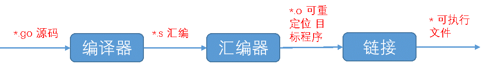
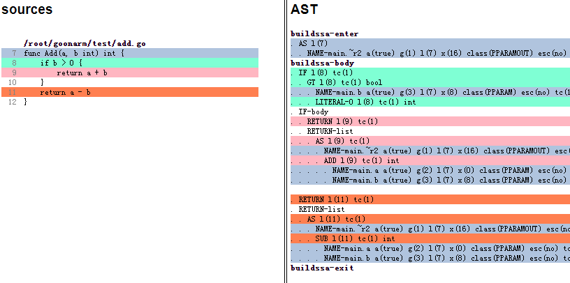
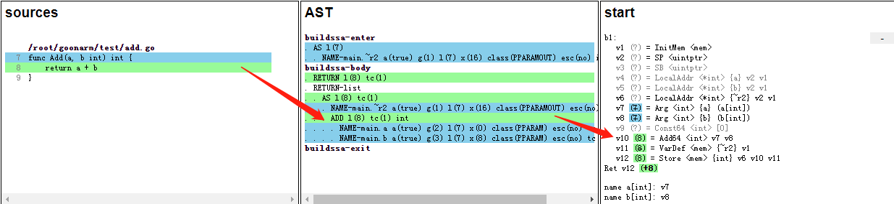
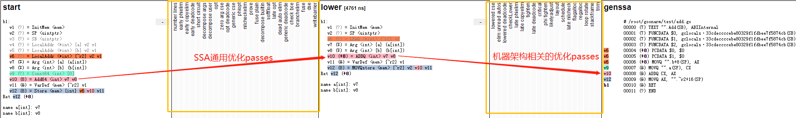
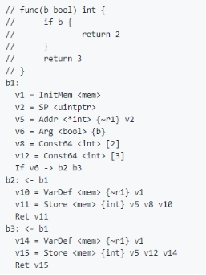

# Go程序编译过程

##	概述
Go源码程序首先经过go编译器生成plan9汇编，再由汇编器和链接处理得到最终的可执行程序。   

 
##	编译器
编译器对go源码的处理过程主要包含以下三个过程：词法语法分析、类型检查和AST转换、SSA优化和降级转换，最终go源码生成对应的plan9汇编。  


Go程序的编译入口是 [compile/internal/gc/main.go](https://github.com/golang/go/blob/master/src/cmd/compile/internal/gc/main.go)文件的Main函数，Main函数获取命令行参数并更新编译选项和配置，
然后运行parseFiles函数对输入的所有文件进行词法和语法分析，得到对应的AST抽象语法树。这是编译的第一个阶段。  
```go
func Main(archInit func(*Arch)) {
    // 获取命令行参数、更新编译器选项和配置
	...
    
	timings.Start("fe", "parse")
	lines := parseFiles(flag.Args()) // 词法语法解析go文件，得到AST
	timings.Stop()

	// 处理AST，类型检查、AST转换、编译等
	...
}
```
	
###	词法语法分析
> 词法分析：分析go源代码文本，将文本中的字符序列转换为标记序列。 比如说go源码中的关键字package 会转换为 _package 标记，func转换为_func标记，`(`转换为 _Lparen标记 等等

[compile/internal/syntax/tokens.go](https://github.com/golang/go/blob/master/src/cmd/compile/internal/syntax/tokens.go) 文件定义了Go语言支持的的全部token类型，
比如说名称和文本、操作符、定界符、关键字等，下面列出了部分token对应关系。

```go
const (
	_    token = iota
	_EOF       // EOF

	// names and literals
	_Name    // name
	_Literal // literal

	// operators and operations
	// _Operator is excluding '*' (_Star)
	_Operator // op
	...

	// delimiters
	_Lparen    // (
	_Lbrack    // [
	_Lbrace    // { 
	...

	// keywords
	_Break       // break
	_Case        // case
	_Chan        // chan
    ...

	// empty line comment to exclude it from .String
	tokenCount //
)
```

[compile/internal/syntax/scanner.go](https://github.com/golang/go/blob/master/src/cmd/compile/internal/syntax/scanner.go) 文件实现了词法解析器主要部分，
使用scanner结构体的next方法实现go文件的扫描并转换为token序列，next方法获取文件中未被解析的字符，进入switch/case分支进行词法解析。scanner结构和next主体代码如下：

```go
// scanner 结构体
type scanner struct {
	source // 数据源文件
	mode   uint
	nlsemi bool // if set '\n' and EOF translate to ';'

	// current token, valid after calling next()
	line, col uint
	tok       token 
	lit       string   // valid if tok is _Name, _Literal, or _Semi ("semicolon", "newline", or "EOF")
	kind      LitKind  // valid if tok is _Literal
	op        Operator // valid if tok is _Operator, _AssignOp, or _IncOp
	prec      int      // valid if tok is _Operator, _AssignOp, or _IncOp
}

// 扫描转换文本为token序列
func (s *scanner) next() {
	nlsemi := s.nlsemi
	s.nlsemi = false

redo:
	// skip white space
	c := s.getr() // 获取当前文本未解析的字符串
	for c == ' ' || c == '\t' || c == '\n' && !nlsemi || c == '\r' {
		c = s.getr()
	}

	...// token start
	
	switch c { // switch case 根据字符进入不同的case，做token转换。
	case -1:
		if nlsemi {
			s.lit = "EOF"
			s.tok = _Semi
			break
		}
		s.tok = _EOF

	case '\n':
		s.lit = "newline"
		s.tok = _Semi

	case '0', '1', '2', '3', '4', '5', '6', '7', '8', '9':
		s.number(c)
		
	......	
	}
	......
}
```

> 语法分析：通过文法分析，构建输入的Token序列的语法结构，得到对应的语法树。

下图示例的左边是go源码，右边是对应的AST表示。buildssa-body是AST的主体，里面包含一个IF-body 和 一个RETURN- body。
IF-body对应源码的if 语句块，包含一个RETURN节点和ADD子操作节点，ADD子节点包含a和b两个变量节点；
RETURN- body包含一个SUB操作节点，以及左子节点a和右子节点b。 


		
[compile/internal/syntax/parser.go](https://github.com/golang/go/blob/master/src/cmd/compile/internal/syntax/parser.go) 文件实现了语法分析器主要部分，通过创建parse对象调用fileOrNil方法，来解析go文件进行语法分析，解析得到的AST存储在File结构中并返回。感兴趣的兄弟可以深入源码研究，这里不做过多阐述。

### 类型检查和AST转换

上面提到的编译器入口[Main](https://github.com/golang/go/blob/master/src/cmd/compile/internal/gc/main.go)函数，在经过语法词法分析得到AST后，会遍历AST所有节点，对AST节点进行类型检查和更新转换。相关主体代码如下：
```go
func Main(archInit func(*Arch)) {
    // 词法语法分析 得到AST
	...

	// AST 类型检查和更新转换
	// Process top-level declarations in phases.

	// Phase 1: const, type, and names and types of funcs.
	//   This will gather all the information about types
	//   and methods but doesn't depend on any of it.
	//
	//   We also defer type alias declarations until phase 2
	//   to avoid cycles like #18640.
	//   TODO(gri) Remove this again once we have a fix for #25838.
	defercheckwidth()

	// Don't use range--typecheck can add closures to xtop.
	timings.Start("fe", "typecheck", "top1")
	for i := 0; i < len(xtop); i++ {
		n := xtop[i]
		if op := n.Op; op != ODCL && op != OAS && op != OAS2 && (op != ODCLTYPE || !n.Left.Name.Param.Alias) {
			xtop[i] = typecheck(n, ctxStmt)
		}
	}

    ...// 阶段1-7 完成了AST的类型检查和更新转换

	// Phase 7: Transform closure bodies to properly reference captured variables.
	// This needs to happen before walk, because closures must be transformed
	// before walk reaches a call of a closure.
	timings.Start("fe", "xclosures")
	for _, n := range xtop {
		if n.Op == ODCLFUNC && n.Func.Closure != nil {
			Curfn = n
			transformclosure(n)
		}
	}

	//AST转换为SSA，编译SSA，生成汇编、机器码、可执行程序
	...
}
```
编译器针对AST的类型检查和AST转换，对应上述代码的Phase 1->Phase 7，主要包括以下处理过程 
-	常量、类型、函数名称和类型的检查
-	变量赋值的检查
-	函数主体的类型检查（哈希键值对的检查）
-	捕获变量
-	内联函数检查和展开
-   转义分析
-   闭包主体转换成捕获变量  

感兴趣的朋友可以继续深入研究每个处理阶段的源码


###	SSA优化和降级转换
[SSA](https://en.wikipedia.org/wiki/Static_single_assignment_form)是Go编译器使用的中间表示语言。编译器使用[compileSSA](https://github.com/golang/go/blob/master/src/cmd/compile/internal/gc/pgen.go)函数将输入抽象语法树转换为SSA中间代码，compileSSA函数主体代码如下：
```go
func compileSSA(fn *Node, worker int) {
	f := buildssa(fn, worker) // SSA编译AST
    ...
	pp := newProgs(fn, worker)//创建一个prog结构
	defer pp.Free()
	genssa(f, pp)//生成ssa的prog指令
	...

	pp.Flush() //调用汇编器转换为机器码
	...
}
```
[buildssa](https://github.com/golang/go/blob/master/src/cmd/compile/internal/gc/ssa.go)调用stmtList完成AST中间表示到SSA中间表示的转换，调用ssa.Compile完成ssa的优化处理和降级转换，buildssa主体代码如下：
```go
func buildssa(fn *Node, worker int) *ssa.Func {
	...
	var s state
	s.pushLine(fn.Pos)
	defer s.popLine()
	...
	s.curfn = fn
		
	s.f = ssa.NewFunc(&fe)
	s.config = ssaConfig // ssaConfig包含CPU架构相关的配置
	s.f.Type = fn.Type
	s.f.Config = ssaConfig // ssaConfig包含CPU架构相关的配置
	...
	
	// Convert the AST-based IR to the SSA-based IR
	s.stmtList(fn.Func.Enter)  // AST—>SSA
	s.stmtList(fn.Nbody)
    ...
	
	// Main call to ssa package to compile function
	ssa.Compile(s.f) // 编译ssa
	return s.f
}
```
ssa.Compile对SSA中间代码进行多轮优化转换和降级，多轮处理存储在passes数组中，每个pass变量存储了每轮转换的名称、函数以及required字段。
其中lower表示降级过程，lower之前是通用优化转换，与CPU架构无关，比如说消除无效代码、删除不需要的nil检查以及删除未使用的分支等。
lower之后是跟CPU架构相关的优化转换，涉及架构的指令选择和寄存器分配。下面列出了部分passes：
```go
var passes = [...]pass{
	// TODO: combine phielim and copyelim into a single pass?
	{name: "number lines", fn: numberLines, required: true}, //ssa多轮优化转换
	{name: "early phielim", fn: phielim},
	{name: "early copyelim", fn: copyelim},
     ...//省略中间转换轮次
	{name: "lower", fn: lower, required: true},// 降级处理阶段
	{name: "lowered cse", fn: cse},
     ...//省略中间转换轮次
	{name: "stackframe", fn: stackframe, required: true},
	{name: "trim", fn: trim}, // remove empty blocks
}
```
使用GOSSAFUN环境变量构建go源码可以获得SSA多轮次转换的表示，下面以add.go函数为例展开ssa优化过程。  
   
source,ast,start分别表示go源码，AST，SSA初级状态。
source->AST过程上文有详细介绍，不再追溯；
AST->start 从go的AST节点表示转换为SSA特性的语法表示，比如说上图绿色部分AST的ADD操作节点及子节点转换为SSA语句`v10 (8) = Add64 <int> v7 v8`  

  
start，lower，genssa分别表示ssa的初始状态、降级表示、最终指令表示。
start->lower经过了ssa的通用优化处理, 到lower阶段应用了机器架构相关ADDQ指令；
lower->genssa经过了机器架构的优化转换处理，使用AX、CX寄存器和相关指令生成汇编。
最终生成obj.Prog指令如下: 
```
TEXT "".Add(SB), ABIInternal
FUNCDATA $0, gclocals·33cdeccccebe80329f1fdbee7f5874cb(SB)
FUNCDATA $1, gclocals·33cdeccccebe80329f1fdbee7f5874cb(SB)
FUNCDATA $2, gclocals·33cdeccccebe80329f1fdbee7f5874cb(SB)
PCDATA $0, $0
PCDATA $1, $0
MOVQ "".b+8(SP), AX
MOVQ "".a(SP), CX
ADDQ CX, AX
MOVQ AX, "".~r2+16(SP)
RET
END
```

## 汇编器
go汇编器将编译器生成的汇编语言转换为机器代码，并写出最终的目标程序。[src/cmd/internal/obj](https://github.com/golang/go/tree/master/src/cmd/internal/obj)包实现了go汇编器。   
    
ssa编译转换后，compileSSA调用`pp.Flush`函数，
Flush函数调用src/cmd/internal/obj包的Flushplist函数生成对应机器码。
感兴趣的朋友可以继续深入[src/cmd/internal/obj](https://github.com/golang/go/tree/master/src/cmd/internal/obj)包研究go汇编器源码。
```go
// Flush converts from pp to machine code.
func (pp *Progs) Flush() {
	plist := &obj.Plist{Firstpc: pp.Text, Curfn: pp.curfn}
	obj.Flushplist(Ctxt, plist, pp.NewProg, myimportpath) //调用Flushplist函数生成机器码
}
```

## 链接
链接过程将汇编器生成的一个个目标文件链接成最终的可执行程序。
[src/cmd/link/internal/ld](https://github.com/golang/go/tree/master/src/cmd/link/internal/ld)包实现了链接器的主体代码，感兴趣的朋友可以继续深入研究源码。

## 附录
### SSA概念解释
> SSA表示（Signal Single Assigment）静态单一分配形式，编译器设计中的概念，它要求每个变量只复制一次，每个变量使用前必须定义。简单来说SSA表示就是满足静态单赋值特征的代码表示。SSA表示的优点是可以通过简化变量的特征，来简化及优化编译器处理。
 
通过使用SSA中间表示，编译器可以实现以下优化改进：
-	常数传播 （constant propagation）
-	值域传播（value range propagation）
-	稀疏有条件的常数传播 （sparse conditional constant propagation）
-	消除无用的程式码 （dead code elimination）
-	全域数值编号 （global value numbering）
-	消除部分的冗余 （partial redundancy elimination）
-	强度折减 （strength reduction）
-	暂存器配置 （register allocation）
 
Go的SSA中间代码主要由变量值、存储类型、块、函数4部分组成。Value变量只能定义一次，可以被多次使用；存储类型表示全局内存状态；块表示功能控制流程图中的基本块；函数包含函数声明和主体。   

   

样例表示Go函数源码和对应的SSA中间表示。SSA中间代码有三个块b1, b2, b3。b1初始化内存为v1, 定义v6 为bool类型的b, v8为整数2，v12为整数3。B1的if判断 如果v6 为 true，执行b2块，如果v6为False，指令b3块。b2 块对应函数中的return 2操作，将v8的值整数2存储到内存中返回。B3类似。

## 参考
[wiki-ssa](https://en.wikipedia.org/wiki/Static_single_assignment_form)

[go-compiler](https://github.com/golang/go/blob/master/src/cmd/compile/README.md)

[go-compiler-ssa](https://github.com/golang/go/blob/master/src/cmd/compile/internal/ssa/README.md)
