# 压缩算法介绍 - LZW算法原理

[LZW](https://baike.baidu.com/item/LZW%E7%AE%97%E6%B3%95)是一种基于“字典”的数据压缩算法，该算法是由Abraham Lempel，Jacob Ziv和Terry Welch在1978年创建的通用无损数据压缩算法，即通过建立字典对数据进行编码。并且在对数据进行处理的过程中会对字典进行扩充。

此算法整体压缩流程为，建立初始模型，然后逐字节的读取数据并编码，在读取数据的过程中更新模型，是一种动态的压缩算法。

在对文件处理前，建立256个字符的字典作为标准字符集。在处理文件数据时，首先读取一个字符（比如字符"a"，8位表示），继续处理下一个字符（比如字符"c"，8位表示）。这时会在字典中匹配字符串"ac"，如果字典中不存在这个字符串，将这个字符"a"用字典中使用的编码进行表示，并将字符串"ac"加入字典中，同时更新字符"c"继续下一次循环；如果字典中存在这个字符串，将字符串"ac"看做一个字符，继续读取下一个字符进行匹配处理。如此一直循环，在处理的同时不断扩展字典大小，直至结束。

下图为LZW压缩算法执行流程。

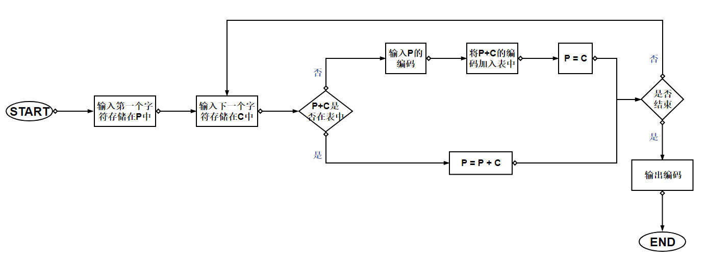

为对算法进行直观感受，我们使用字符串"ABCBCDADBCDABCBB"为例进行说明。

首先，我们建立初始字典与原始数据表。

字典：

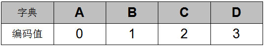

数据：

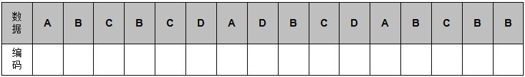

第一步，读取字符，此时 P=A，C=B，字符串"AB"在字典中吗？没有，所以此时编码A的结果为0，字典进行扩展 AB=4， 同时P更新为P=B；此时字典结果以及原数据编码结果如下表所示：

字典：

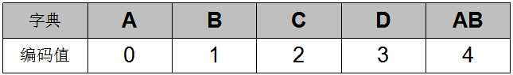

数据以及编码后的表示：

然后读取下一个字符，C = C，字符串"BC"不在字典中，将字符串"BC"加入字典，并输出P的编码，更新P=C；结果为：

字典：

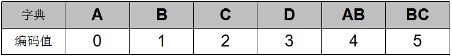

数据以及编码后的表示：

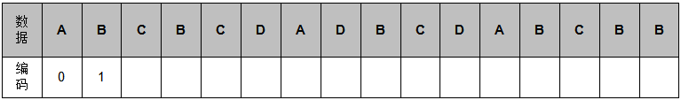

然后处理下一个字符，如果在字典中找到对应的字符串，那么就可以用对应的编码代替。得到最终的结果，如下图所示：

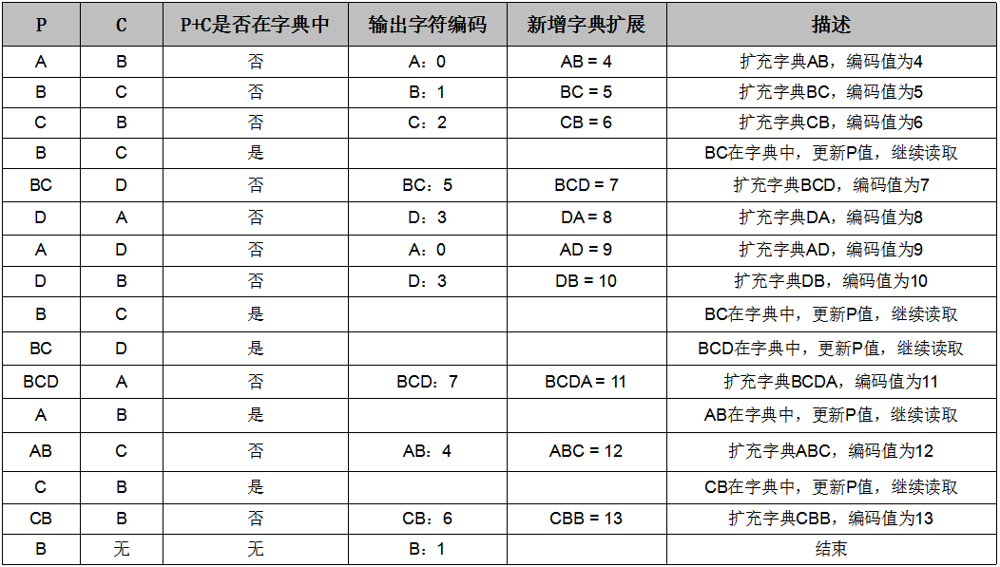

最终的字典：

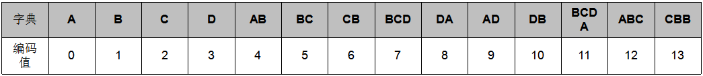

最终的数据以及编码后的表示：

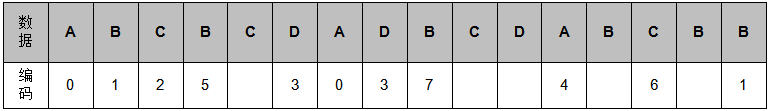

在编码前，原数据一共有16个字符，经过LZW算法编码，可以用11个字符进行表示，数据量减少即进行了压缩。压缩数据后，不需要保存字典，在恢复数据时就像数据压缩一样动态的建立字典即可。我们看一下恢复数据时字典的建立以及数据的恢复。

数据的恢复是压缩过程的逆过程，恢复数据使用的字典必须与压缩数据使用的字典是一个。

LZW解码器首先读取数据，在字典中查找对应的值，然后输出与数据关联的字符。并在这个过程中结合前一个字符与当前字符的首字母扩展新的字典，该字典值作为元素用于下一次的匹配查找。然后不断的重复此过程，下图为解码流程图。

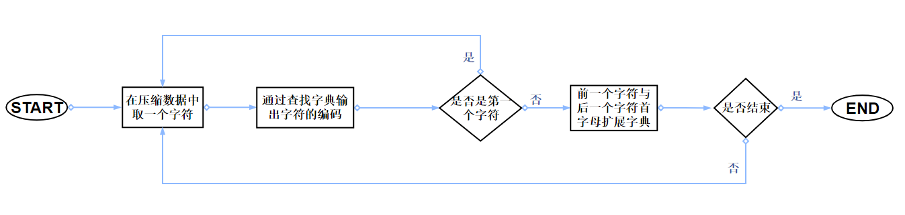

为直观的理解算法执行流程，我们将上一个例子进行数据恢复。

已知压缩后的数据为：0，1，2，5，3，0，3，7，4，6，1。

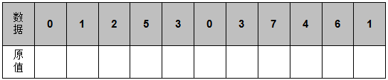

初始字典为：

`注：`

`其实在字典一般为0-255个字符的ACII值，比如26个字母的字典值为A：41， B：42， C：43...，这里为了方便演示，使用了A：0， B：1， C：2...`

看到数据第一个值为0，那么通过查字典可以发现对应的数据为A，第二个值为1，对应的值为B：

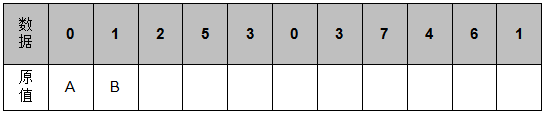

然后与前一个字符建立字典值AB = 4；

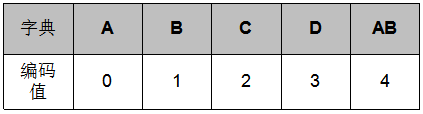

第三个值为2，通过查字典可以发现对应的数据为C，与前一个字符建立字典值BC = 5；

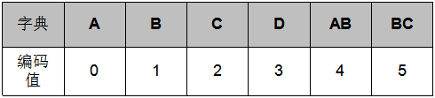

下一个值为5，在字典中有对应的值，那么返回原值为BC：

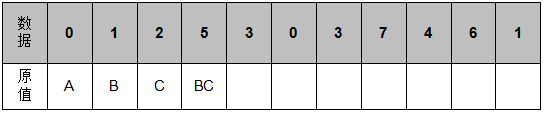

以此类推，便可得到最后的结果：

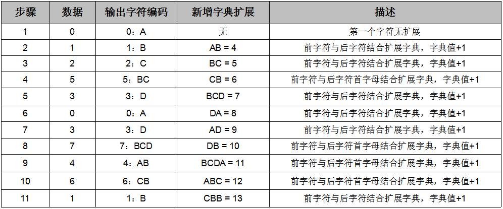

此时字典得到了还原，数据得到了恢复。
