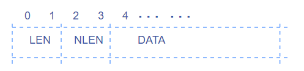
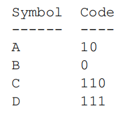

### flate算法分析

#### （1）LZ77算法介绍

​	LZ77算法由Jacob Ziv 和 Abraham Lempel 于 1977 年提出，所以命名为 LZ77。

​	LZ77的算法压缩原理为：如果文件中有两块内容相同的话，那么只要知道前一块的位置和大小，我们就可以确定后一块的内容。所以我们可以用（两者之间的距离，相同内容的长度）这样一对信息，来替换后一块内容。如果替换之后的内容小于替换之前的内容那么就进行了压缩。

​	示例：

```
http://www.google.com  http://www.baidu.com
```

​	压缩为：

```
http://www.google.com  (23,11)baidu(39,4)
```

​	这里，(23,11)表示的是内容：http://www.。23表示两个相同块的距离为23， 11表示两个相同块的相同的内容的长度为11。（39,4）同理。


​	LZ77从文件的开始处开始，一个字节一个字节的向后进行处理。一个固定大小的窗口（在当前处理字节之前，并且紧挨着当前处理字节），随着处理的字节不断的向后滑动。对于文件中的每个字节，用当前处理字节开始的串，和窗口中的每个串进行匹配，寻找最长的匹配串。如果当前处理字节开始的串在窗口中有匹配串，就用(匹配距离，匹配长度) 这样一对信息，来替换当前串，然后从刚才处理完的串之后的下一个字节，继续处理。如果当前处理字节开始的串在窗口中没有匹配串，就不做改动的输出当前处理字节。

​	在实际的应用中，我们会固定“匹配距离”和“匹配长度”的位数表示，如果要固定匹配距离，就需要使用固定的窗口的大小，就如本文中的golang压缩库中的窗口限定为32K大小，也就是15位表示。那么用15位就可以表示0-32K范围内的任何一个值。此外还需要限定最大的匹配长度，这样，“匹配长度” 的位数也就固定了。另外，还需要定义最小匹配长度，因为如果如果匹配的字符串太小的话，可能用(匹配距离，匹配长度) 表示后的位数会更大这样就得不偿失了。在一个32K的窗口中表示“匹配距离”需要15位进行表示，所以最小匹配长度为3个字节。3 * 8 = 24。如果最小为2个字节，2 * 8 = 16, name 表示“匹配长度”只有一个字节，这样是表示不够的。

​	从文件的开始到文件结束，一个字节一个字节的向后进行处理。用当前处理字节开始的串，和滑动窗口中的每个串进行匹配，寻找最长的匹配串。如果当前处理字节开始的串在窗口中有匹配串，就先输出一个标志位，表明下面是一个(匹配距离，匹配长度) 对，然后输出(匹配距离，匹配长度) 对，然后从刚才处理完的串之后的下一个字节，继续处理。如果当前处理字节开始的串在窗口中没有匹配串，就先输出一个标志位，表明下面是一个没有改动的字节，然后不做改动的输出当前处理字节，然后继续处理当前处理字节的下一个字节。

​	注：

*`为了在解压缩时，可以区分“没有匹配的字节”和“（之间的距离，匹配长度）对”，我们还需要在每个“没有匹配的字节”或者“（之间的距离，匹配长度）对”之前，放上一位，来指明是“没有匹配的字节”，还是“（之间的距离，匹配长度）对”。我们用0表示“没有匹配的字节”，用1表示“（之间的距离，匹配长度）对”。`*

#### （2）Huffman编码介绍

​	哈夫曼编码(Huffman Coding)，又称霍夫曼编码，是一种编码方式。Huffman于1952年提出一种编码方法，该方法依据字符出现概率来构造异字头的平均长度最短的码字。

​	该编码方法通过构造哈夫曼树把文件中的内容看作是符号。我们根据这些符号在文件中出现的频率对符号进行重新编码。对于出现次数非常多的，我们用较少的位来表示，对于出现次数非常少的，我们用较多的位来表示。这样一来，文件的一些部分位数变少了，一些部分位数变多了，由于变小的部分比变大的部分多，所以整个文件的大小还是会减小，所以文件得到了压缩。

​	建立哈夫曼树是进行哈夫曼编码的关键，首先对文件进行频率统计出现的次数，根据次数建立哈夫曼树，通过哈夫曼树得到哈夫曼编码。

​	示例：

​	例如通过对文件中的符号（256）中进行统计，发现文件中的符号a,b,c,d,e,f出现的频率分别为8,2,6,4,5,1。那么就可以建立哈夫曼树，方法如下;

​	首先选取出现频率最低的两个符号，b(2), f(1)，父节点就是两者的频率之和，如图所示：


​	然后选取除了这两个符号的最小频率d(4)，与上面树的频率进行比较，较小的值放在左边，较大的值放在右边，再次进行搭建，如图所示：


​	重复这个过程，就可以得到最终的哈夫曼树：


​	在树上定义左支上为0， 右支上为1。如图：


​	这样我们就得到了对各个字符的哈夫曼编码：


​	树的建立方法保证了两点：1，频率大的符号所用的编码位数少；2，由于所有符号都是在树上是的叶子节点，所以，各符号之间的编码没有包含关系，不会发生歧义。

​	在对文件内容进行压缩的时候，把符号替换为编码的形式；在解压缩时，将编码替换为符号的形式。

​	注：

*``在动态生成哈夫曼树的时候：为了在解压缩的时候，得到压缩时所使用的Huffman树，我们需要在压缩文件中，保存树的信息，也就是保存每个符号的出现次数的信息。``*

#### （3）flate算法实现详解

​	flate算法是LZ77和哈夫曼编码的结合使用，他有三种压缩形式;

​	1，不压缩数据。

​	2，压缩数据，先使用LZ77，然后进行哈弗曼编码。但是哈弗曼编码的时候，符号的编码值是定义好的。

​	3，压缩数据，先使用LZ77，然后进行哈弗曼编码。哈弗曼编码生成的时候，符号编码是动态生成的。

​	在golang语言库中，定义了几种不同级别的压缩级别：

```go
const(	
	NoCompression      = 0       // 不压缩
	BestSpeed          = 1       // 最快压缩速度
	BestCompression    = 9       // 最佳压缩比
    DefaultCompression = -1		 // 默认压缩
	HuffmanOnly = -2			// 仅执行哈夫曼编码
)
```

​	在库中的针对不同情况下的初始化函数定义了不同情况的执行函数：

```go
func (d *compressor) init(w io.Writer, level int) (err error) {
	d.w = newHuffmanBitWriter(w)

	switch {
	case level == NoCompression:                      // 0
		d.window = make([]byte, maxStoreBlockSize)	 // maxStoreBlockSize = 65535
		d.fill = (*compressor).fillStore    // 这个函数负责将数组写在窗口的空间上
         d.step = (*compressor).store		// 这个函数负责判断将数据存入块中，然后窗口归零
	case level == HuffmanOnly:						// -2
		d.window = make([]byte, maxStoreBlockSize)
		d.fill = (*compressor).fillStore	// 这个函数负责将数组写在窗口的空间上
		d.step = (*compressor).storeHuff	// storeHuff压缩并存储当前添加的数据。
	case level == BestSpeed:						// 1
		d.compressionLevel = levels[level]
		d.window = make([]byte, maxStoreBlockSize)
		d.fill = (*compressor).fillStore	// 这个函数负责将数组写在窗口的空间上
		d.step = (*compressor).encSpeed		// 如果已经积累了足够的数据，或者在流的末尾，encSpeed将压缩并存储当前添加的数据
		d.bestSpeed = newDeflateFast()
		d.tokens = make([]token, maxStoreBlockSize)  
	case level == DefaultCompression:				 // -1
		level = 6
		fallthrough
	case 2 <= level && level <= 9:
		d.compressionLevel = levels[level]
		d.initDeflate()						// 执行初始化
		d.fill = (*compressor).fillDeflate
		d.step = (*compressor).deflate
	default:
		return fmt.Errorf("flate: invalid compression level %d: want value in range [-2, 9]", level)
	}
	return nil
}
```

​	执行的流程是：首先读入要处理的字节数组b，然后进行循环处理，直到要处理的数据长度为0，然后返回处理的数据的长度。其中step、fill为不同情况下的调用函数。

```go
func (d *compressor) write(b []byte) (n int, err error) {
	if d.err != nil {
		return 0, d.err
	}
	n = len(b)
	for len(b) > 0 {
		d.step(d)
		b = b[d.fill(d, b):]
		if d.err != nil {
			return 0, d.err
		}
	}
	return n, nil
}
```

##### 1）不压缩的情况

​	先看一下当 *level == NoCompression* 的情况，也就是不压缩时候的执行：

​	当不压缩的时候，先建立一个压缩用的窗口，大小是65535个字节也就是32K。

​	当窗口无数据的时候，使用函数fillstore对窗口的数据进行填充。

```go
func (d *compressor) fillStore(b []byte) int {
	// 把byte添加到窗口的末尾，windowEnd指向末尾
	n := copy(d.window[d.windowEnd:], b)
	d.windowEnd += n
	return n
}
```

​	这时窗口中充满了数据，当窗口中的数据未写满或者不要写入的时候返回，否则将window内的数据写入块中。

```go
func (d *compressor) store() {
	// 未写满 && 不需要同步或者没有数据，直接退出
	if d.windowEnd > 0 && (d.windowEnd == maxStoreBlockSize || d.sync) {    
		d.err = d.writeStoredBlock(d.window[:d.windowEnd])
		d.windowEnd = 0
	}
}
```

​	但是写入的时候，需要按照一定的格式写入，否则在进行解压缩的时候就会发生错误。首先是利用函数*writeStoredHeader*写入存储块的头部，用于对于接下来哈夫曼数据块的描述。之后，进行数据的写入，调用的函数*writeBytes*。

```go
func (d *compressor) writeStoredBlock(buf []byte) error {
	if d.w.writeStoredHeader(len(buf), false); d.w.err != nil {
		return d.w.err
	}
	d.w.writeBytes(buf)
	return d.w.err
}

func (w *huffmanBitWriter) writeBytes(bytes []byte) {
	if w.err != nil {
		return
	}
	n := w.nbytes                    // 等待写入的数据是bytes [0：nbytes]，
	if w.nbits&7 != 0 {              
		w.err = InternalError("writeBytes with unfinished bits")
		return
	}
	for w.nbits != 0 {
		w.bytes[n] = byte(w.bits)
		w.bits >>= 8
		w.nbits -= 8
		n++
	}
	if n != 0 {
		w.write(w.bytes[:n])
	}
	w.nbytes = 0
	w.write(bytes)
}
```

​	重复这个过程一直到完成整个文件内容的写入。每个块包括两个部分：一部分是写入的数据的描述，一部分是写入的数据。因为我们的每个的窗口的大小为32K，所以需要16位进行表示，也就是2个字节的长度。所以我们对于数据的描述采用2个字节的表示。如图所示：



​	其中，LEN是块中数据字节的数量。 NLEN是LEN的补充。

##### 2）仅执行哈夫曼熵编码的情况

​	当*level == HuffmanOnly*时仅仅执行哈夫曼熵编码。同样声明一个window用于处理数据。填充窗口所用的函数是一样的，关键在于处理函数*storeHuff()*。

```go
	case level == HuffmanOnly:						// -2
		d.window = make([]byte, maxStoreBlockSize)
		d.fill = (*compressor).fillStore	// 这个函数负责将数组写在窗口的空间上
		d.step = (*compressor).storeHuff	// storeHuff压缩并存储当前添加的数据。
```

​	在*storeHuff()*函数中，如果在窗口中的数据未满或者没有提示需要保存的话就返回继续装填。否则调用函数*writeBlockHuff()*对窗口中的数据进行写入块中，写入之后将window重用，重置数据末尾位置的值。

```go 
func (d *compressor) storeHuff() {
	if d.windowEnd < len(d.window) && !d.sync || d.windowEnd == 0 {           
		return
	}
	d.w.writeBlockHuff(false, d.window[:d.windowEnd])           // 将字节块编码为霍夫曼编码的文字或未压缩的字节
	d.err = d.w.err
	d.windowEnd = 0
}
```

​	在写入块哈夫曼的时候对输入的数据进行统计，统计各个字符出现的频率，根据频率编码字符。编码以比特序列（代码）表示先验已知字母表中的符号，每个符号一个代码，其方式使得不同的符号可以由长度不同的比特序列表示。我们以二叉树的形式定义代码，其中从每个非叶节点下降的两个边缘分别标记为0和1，并且叶节点一对一地对应于字母;那么符号的代码就是从根到标有该符号的叶子的边缘上的0和1的顺序。但是解析器始终可以清晰地解析编码的逐个符号。另外需要注意一点，每一个字符的编码表示长度不得超过特定的最大的代码长度。例如，在该代码中的多处地方，设定了最长代码长度为15或者是7。

​	下面简单描述一下函数*writeBlockHuff*所做的工作。首先统计了输入字符的频率，然后根据字符的不同以及不同的频率产生了不同的编码。

```go
histogram(input, w.literalFreq)

w.literalEncoding.generate(w.literalFreq, 15)
```

​	然后，通过生成*codegen*和*codegenFrequency*，它们指示如何对*literalEncoding*和*offsetEncoding*进行编码。

```go
	w.generateCodegen(numLiterals, numOffsets, w.literalEncoding, huffOffset)
	w.codegenEncoding.generate(w.codegenFreq[:], 7)
	size, numCodegens := w.dynamicSize(w.literalEncoding, huffOffset, 0)
```

​	如果我们没有经过哈夫曼编码之后没有得到想要得到的提升就对字符进行写入。

```go
if ssize, storable := w.storedSize(input); storable && ssize < (size+size>>4) {
		w.writeStoredHeader(len(input), eof)
		w.writeBytes(input)
		return
	}
```

​	其中，函数*writeStoredHeader*负责一些标志位的输出，因为在解码的时候，你并不知道现在这个是编码之后的字符还是未编码的字符，所以需要在特殊的位置进行提示，告诉解码的时候这个时候该怎么解决。这个时候的对头部的编码包括字符数的编码和偏移数的编码。然后输出就可以了。

​	接下来对剩下的字符进行编码写入就完成了。

##### 3）最快速度压缩

​	当压缩级别*level == BestSpeed*时进行最快压缩。

```go
	case level == BestSpeed:						// 1
		d.compressionLevel = levels[level]
		d.window = make([]byte, maxStoreBlockSize)
		d.fill = (*compressor).fillStore	// 这个函数负责将数组写在窗口的空间上
		d.step = (*compressor).encSpeed		// 如果已经积累了足够的数据，或者在流的末尾，encSpeed将压缩并存储当前添加的数据
		d.bestSpeed = newDeflateFast()
```

​	最快压缩也就是压缩级别为1，这时同样需要创建窗口。填充函数是一样的，处理函数不同*encSpeed*。在最快速压缩中，优先考虑压缩速度，所以在下面的程序中有小尺寸的数据进行了处理，如果数据小于16，就直接写入即可。如果大于16但是小于128就执行*writeBlockHuff*进行块的哈夫曼写入。

```go
		if d.windowEnd < 128 {
			switch {
			case d.windowEnd == 0:
				return
			case d.windowEnd <= 16:
				d.err = d.writeStoredBlock(d.window[:d.windowEnd])
			default:
				d.w.writeBlockHuff(false, d.window[:d.windowEnd])
				d.err = d.w.err
			}
			d.windowEnd = 0
			d.bestSpeed.reset()
			return
		}
```

​	如果数据大于128那么对窗口中的数据进行编码，生成的编码放在*token*数组中，

```go
d.tokens = d.bestSpeed.encode(d.tokens[:0], d.window[:d.windowEnd])
```

​	让我们进入这个函数中对这个关键的函数进行简单地分析一下。

​	在这个函数中，首先进行当前处理的位置判断，如果已经处理完了就调用*resetAll*进行重置*deflateFast*结构，在极少的情况下调用，防止溢出。

```go
if e.cur > 1<<30 {
		e.resetAll()
	}
```

​	如果输入的字符小于最小非字符块的尺寸，就将输入字符按照一定的格式写入目标数组中

```go
	if len(src) < minNonLiteralBlockSize {		// 17
		e.cur += maxStoreBlockSize
		e.prev = e.prev[:0]
		return emitLiteral(dst, src)
	}
```

​	然后对块进行了编码，之所以在这里压缩速度快，就是因为，这里采用了一种启发式的跳过，当程序扫描了32个字节之后，没有找到匹配项，那么继续执行扫描下一个32K的数据，这时查看的就是每三个字节的查看，如果找到匹配项，再返回查看每一个字节，这样来说，在性能上会有一定的压缩性能的损失，但是对于一些不可压缩的数据会有更好的压缩性能。在这里的程序中，使用了一个新的变量：*skip*。这个变量负责跟踪自上次匹配以来有多少字节； 将其除以32（即右移五）可得出每次迭代要前进的字节数。其实在查找匹配项的时候需要用到哈希算法，这样能够快速查找匹配项。这个细节我们将在后面的地方进行补充。

​	咱们接着之前的程序往下看。在获得token之后，会计算获得token之后的长度与原长度的大小，如果编码之后的长度大于原来的15/16那么我们就进行*writeBlockHuff*。这个函数我们在之前已经接触过了，这里就不再进行探讨了。当编码之后的长度小于原来的15/16，我们就进行*writeBlockDynamic*操作。这个函数做了什么工作呢？我们进入看一下。

```go
if len(d.tokens) > d.windowEnd-(d.windowEnd>>4) {
		d.w.writeBlockHuff(false, d.window[:d.windowEnd])
	} else {
		d.w.writeBlockDynamic(d.tokens, false, d.window[:d.windowEnd])
	}
d.err = d.w.err
d.windowEnd = 0
```

* writeBlockDynamic*这个函数使用动态哈夫曼表对块进行编码。在这个函数中，首先在token数组的末尾加上块的结束符256。

```go
tokens = append(tokens, endBlockMarker)    // endBlockMarker = 256
```

​	然后，函数*indexTokens*对*token*切片进行索引，并更新*literalFreq*和*offsetFreq*，并生成*literalEncoding*和*offsetEncoding*。返回文字和偏移量标记的数量。

```go
numLiterals, numOffsets := w.indexTokens(tokens)
```

​	然后，生成codegen和codegenFrequency，它们指示如何对*literalEncoding*和*offsetEncoding*进行编码。

```go
w.generateCodegen(numLiterals, numOffsets, w.literalEncoding, w.offsetEncoding)
w.codegenEncoding.generate(w.codegenFreq[:], 7)			// 参数7表示最大的位数表示为7位
size, numCodegens := w.dynamicSize(w.literalEncoding, w.offsetEncoding, 0)
```

​	第一个函数，其实是在哈夫曼编码的基础上再次应用编码的思想，这里使用的是游程编码。在文件RFC 1951中指定了一种特殊的游程长度编码，用来指定文字和偏移长度数组，这个方法就是生成游程编码。关于什么是游程编码，这里不做过多叙述，我们将在之后的文章中补充。第二个函数的作用是更新哈夫曼代码的对象，使其成为指定频率技术的最小代码，返回一个数组*array*,这个数组的表示是以i位编码的文字数。*dynamicSize*这个函数的参数是字符编码和偏移编码的结构体，第三个参数是额外的位，这个细节在补充细节1处有详细介绍。函数返回一个以位为单位的动态编码的数据的大小。在这个函数中有几个地方需要补充一下。

```go 
header := 3 + 5 + 5 + 4 + (3 * numCodegens) +
		w.codegenEncoding.bitLength(w.codegenFreq[:]) +
		int(w.codegenFreq[16])*2 +
		int(w.codegenFreq[17])*3 +
		int(w.codegenFreq[18])*7
```

​	在函数中有大量的魔鬼数字，这里的数字大家可能不太理解，我们这里稍作解释，这其实是定义的deflate的压缩格式：

​	Header：3个比特，第一个比特如果是1，表示此部分为最后一个压缩数据块；否则表示这是文件的某个中间压缩数据块，但后面还有其他数据块。这是分块压缩的标志之一；第2、3比特表示3个选择：压缩数据中没有使用Huffman、使用静态Huffman、使用动态Huffman，这是对LZ77编码后的*literal/length/distance*进行进一步编码的标志。我们前面分析的都是动态Huffman，其实Deflate也支持静态Huffman编码，静态Huffman编码原理更为简单，无需记录码表（因为PK自己定义了一个固定的码表），但压缩率不高，所以大多数情况下都是动态Huffman。

​	HLIT：5比特，记录literal/length码树中码长序列个数的一个变量。后面个数等于HLIT+257（因为至少有0-255总共256个literal，还有一个256表示解码结束，但length的个数不定）。

​	HDIST：5比特，记录distance码树中码长序列个数的一个变量。后面个数等于HDIST+1。哪怕没有1个重复字符串，distance都为0也是一个代码长度。

​	HCLEN：4比特，记录Huffman码表3中码长序列个数的一个变量。后面个数等于HCLEN+4。

​	然后回到之前，如果没有得到合理的提升，我们就存储字节，否则就写入哈夫曼表用于解码时使用以及写入编码。程序见下：

```go
if ssize, storable := w.storedSize(input); storable && ssize < (size+size>>4) {
	w.writeStoredHeader(len(input), eof)
	w.writeBytes(input)
	return
}

// Write Huffman table.
w.writeDynamicHeader(numLiterals, numOffsets, numCodegens, eof)

// Write the tokens.
w.writeTokens(tokens, w.literalEncoding.codes, w.offsetEncoding.codes)
```

​	程序到这里就结束了，最后就是重置窗口数据末尾位置，用于重用内存和下次循环。

```go
d.windowEnd = 0
```

##### 4）默认压缩

​	在算法中定义了一个默认的压缩级别，其实这里就是压缩级别为6 的时候的情况。我们这里不做分析，具体的分析在下面我们合在一起分析。

```go
case level == DefaultCompression:				 // -1
	level = 6
	fallthrough
```

##### 5）不同压缩等级

```go
case 2 <= level && level <= 9:
	d.compressionLevel = levels[level]
	d.initDeflate()						// 执行初始化
	d.fill = (*compressor).fillDeflate
	d.step = (*compressor).deflate
```

​	在不同的压缩等级下，进行了统一的初始化。初始化内容包括，创建窗口。

```go
func (d *compressor) initDeflate() {
	d.window = make([]byte, 2*windowSize)    // windowSize = 1 << 15， 也就是65535
	d.hashOffset = 1
	d.tokens = make([]token, 0, maxFlateBlockTokens+1)   // maxFlateBlockTokens = 1 << 14，最后加的一位用于放置结束符
	d.length = minMatchLength - 1		    // minMatchLength = 4
	d.offset = 0
	d.byteAvailable = false
	d.index = 0
	d.hash = 0
	d.chainHead = -1
	d.bulkHasher = bulkHash4
}
```

​	剩下的填充函数是与上面一样的，他的处理函数是*deflate*。我们看一下这个处理函数是如何进行工作的。

​	首先对数据长度进行判断，如果不符合匹配长度原则，就返回。然后确定最大的插入位置，确保输入哈希算法的长度大于4，然后利用哈希算法提供前四个字节的哈希表示。为什么会需要用到哈希算法进行字符串的计算？因为对一个串寻找匹配串需要进行大量的匹配工作，而且我们还需要为很多很多个串寻找匹配串，如果对每一个串进行匹配计算将消耗大量的计算资源。所以在寻找匹配串的实现中使用哈希表来提高速度。对遇到的每一个串，首先会把它插入到一个“字典”中。这样当以后有和它匹配的串，可以直接从“字典”中查出这个串。

​	关于匹配串的找法，插入的时候，使用这个插入串的前三个字节，计算出插入的“字典”位置，然后把插入串的开始位置保存在这个“字典”位置中。查出的时候，使用查出串的前三个字节，计算出“字典”位置，由于插入和查出使用的是同一种计算方法，所以如果两个串的前三个字节相同的话，计算出的“字典”位置肯定是相同的，所以就可以直接在该“字典”位置中，取出以前插入时，保存进去的那个串的开始位置。于是查出串，就找到了一个串，而这个串的前三个字节和自己的一样，所以就找到了一个匹配串。

​	然后的处理程序是一个大循环，在这个120行左右的循环函数里边，进行了不同压缩等级下的关键操作。首先判断索引是否超出了数据最后的位置，如果超出那么就会引发panic。

```go
if d.index > d.windowEnd {
		panic("index > windowEnd")
	}
```

​	如果数据最后的位置减去当前位置的差值（也就是剩余处理的数据的大小）小于*minMatchLength**+**maxMatchLength*，如果需要进行存储就跳出循环进行存储，否则继续往下进行，当lookhead为0时，判断token是否需要调用函数writeBlock将token按照索引写入块中，之后跳出循环。

```go
if lookahead == 0 {
	// Flush current output block if any.
	if d.byteAvailable {
		// There is still one pending token that needs to be flushed
		d.tokens = append(d.tokens, literalToken(uint32(d.window[d.index-1])))
		d.byteAvailable = false
	}
	if len(d.tokens) > 0 {
		if d.err = d.writeBlock(d.tokens, d.index); d.err != nil {
			return
		}
		d.tokens = d.tokens[:0]
	}
	break Loop
}
```

​	然后判断索引位置与最大插入位置的大小，如果满足条件。再计算哈希值，将计算得到的哈希值放入表链中。如果有多个串，他们的前三个字节都相同，那么他们的“字典”位置，也都是相同的，他们将被链成一条链，放在那个“字典”位置上。所以，如果一个串，查到了一个“字典”位置，也就查到了一个链，所有和它前三个字节相同的串，都在这个链上。

```go
if d.chainHead-d.hashOffset >= minIndex && (d.fastSkipHashing != skipNever && lookahead > minMatchLength-1 ||
				d.fastSkipHashing == skipNever && lookahead > prevLength && prevLength < d.lazy) {
		if newLength, newOffset, ok := d.findMatch(d.index, d.chainHead-d.hashOffset, minMatchLength-1, lookahead); ok {
			d.length = newLength
			d.offset = newOffset
		}
}
```

​	关于判断是否有匹配：当前串的前三个字节，使用哈希函数算出哈希值，这时如果当前数组的哈希值对应的值不为空的话，那么这个数组]中的值，便是之前保存在这里的另一个串的位置，并且这个串的前三个字节算出的哈希值，和当前串的前三个字节算出的哈希值相同。也就是说有可能有匹配。如果当前数组的哈希值对应的值为空的话，那么肯定没有匹配。

​	在不同的压缩等级里边，造成压缩效果的不同的一个关键是懒惰匹配的应用（lazy match）。对于当前字节开始的串，寻找到了最长匹配之后，算法并不立即决定使用这个串进行替换。而是看看这个匹配长度是否满意，如果匹配长度不满意，而下一个字节开始的串也有匹配串的话，那么就找到下一个字节开始的串的最长匹配，看看是不是比现在这个长。这叫懒惰匹配。如果比现在这个长的话，将不使用现在的这个匹配。如果比现在这个短的话，将确定使用现在的这个匹配。

​	在不同的压缩等级中的懒惰的值也不同。对于2-3级不会进行懒惰匹配。在4-9级会进行懒惰匹配，会进行越来越严格的条件来获得足够好的压缩效果。4-9级的懒惰值分别为：4，16，16，32，128，258。

​	我们不用源码来分析，我们使用一个例子在说明懒惰匹配的用法。

​	如果有一个字符串：

```
0abcbcdeabcde
```

​	当进行到处理到第10字节时，也就是"abcde"的a时，找到最长匹配的情况如下，[]所括部分。

```
0[abc]bcde[abc]de
```

​	继续往下看下一个匹配，发现有另外一个匹配的情况：

```
0abc[bcde]a[bcde]
```

​	发现第二次匹配的匹配长度大，就不使用第一次的匹配串。我们也看到了如果使用第一次匹配的话，将错过更长的匹配串。

##### 补充细节1

​	哈夫曼编码细节详解


​	但是会有一个问题，当你经过LZ77之后，会在字符中引入匹配距离这个值，这个值得范围为0 — 32768。那么这个值该怎么合理的表示？

​	其实在上面的图中，0和1的位置互换是完全可以的，不会影响编码的长度。那么这个树就会有不同的形式，那么采用什么样的形式是最合理的情况呢？在deflate中选择了最特殊的一棵树，成为deflate树。如图所示：


​	相比于一般的哈夫曼树，这里多了两条附加条件：

1. 给定位长的所有代码在字典上具有连续的值，其顺序与所代表的符号相同；

2. 在字典上，较短的代码在较长的代码之前。

   这时，符号的编码发生了变化：



​	那么定义了这棵树带来了什么改变吗？就是可以用长度进行表示。比如上图中，就可以表示A - 2. B - 1. C - 3， D - 3。这样我们记录这个对应关系就可以了。在解压的时候，按照上述这棵树的形式就可以进行解码。这是这个算法的最核心的一点：这棵码树用码字长度序列记录下来。当然，只把1、2、3、3这个序列记录下来还不行，比如不知道111对应C还是对应D。所以，构造出树来只是知道了有哪些码字了，但是这些码字到底对应哪些整数还是不知道。记录1、2、3、3还是记录1、3、2、3，或者3、3、2、1，其实都能构造出这棵树来，那么，为什么不按照一个特殊的顺序记录呢？这个顺序就是整数的大小顺序，比如上面的A、B、C、D是大小顺序排列的，那么，记录的顺序就是2、1、3、3。而不是1、2、3、3。

​	还有一个问题，距离的编码怎么办？distance可能的值很多（32768个），对一个大些的文件进行LZ77编码，distance上千还是很正常的，所以这棵树很大，计算量、消耗的内存都很大，怎么办？在算法中，distance划分成了多个区间，每个区间都当做一个整数来看待，这个这个整数称为Distance Code。当一个distance落到某个区间，则相当于是出现了那个Code，多个distance对应于一个Distance Code，Distance虽然很多，但Distance Code可以划分得很少，只要我们对Code进行Huffman编码，得到Code的编码后，Distance Code再根据一定规则扩展出来。那么，划分多少个区间？怎么划分区间呢？我们分析过，越小的距离，出现的越多；越大的距离，出现的越少，所以这种区间划分不是等间隔的，而是越来越稀疏的。类似于下面的划分：


​	1、2、3、4这四个特殊distance不划分，或者说1个Distance就是1个区间；5,6作为一个区间；7、8作为一个区间等等，基本上，区间的大小都是1、2、4、8、16、32这么递增的，越往后，涵盖的距离越多。为什么这么分呢？首先自然是距离越小出现频率越高，所以距离值小的时候，划分密一些，这样相当于一个放大镜，可以对小的距离进行更精细地编码，使得其编码长度与其出现次数尽量匹配；对于距离较大那些，因为出现频率低，所以可以适当放宽一些。另一个原因是，只要知道这个区间Code的码字，那么对于这个区间里面的所有distance，后面追加相应的多个比特即可，比如，17-24这个区间的Huffman码字是110，因为17-24这个区间有8个整数，于是按照下面的规则即可获得其distance对应的码字：


​	在算法中，将32768这个范围内切割成一下30种区间。这是算法本身的格式所定义的。这里的extra位为在哈夫曼编码位数后面的添加的位数。2位可以表示4个数，3位可以表示8个数。


​	关于distance我们解释完了，然后我们说一下剩下的字符和长度，字符的出现有256中可能，而且由于需要记录的有距离和长度，那么你就必须指定最小的匹配符长度是3个字节，而且也同时指定了匹配的最长长度是256。在deflate算法中，这两个整数是共用一套哈夫曼码表的，此外，还定义了30个额外的位。字符用255个字节表示，如果解码遇到了256.则表示解码结束。从257开始表示length，257表示length = 3； 258表示 length = 4；以此类推。但是同理，这个也不是一一对应的。在这里也将这几种值划分了30个不同的区间，具体情况如下图所示。


​	其中的含义和distance类似，不再赘述，所以literal/length这个Huffman编码的输入元素一共285个，其中256表示解码结束标志。为什么要把二者合二为一呢？因为当解码器接收到一个比特流的时候，首先可以按照literal/length这个码表来解码，如果解出来是0-255，就表示未匹配字符，如果是256，那自然就结束，如果是257-285之间，则表示length，把后面扩展比特加上形成length后，后面的比特流肯定就表示distance，因此，实际上通过一个Huffman码表，对各类情况进行了统一，而不是通过加一个什么标志来区分到底是literal还是重复字符串。


##### 补充细节2

​	关于使用哈希算法进行匹配项的加速细节分析。

​	之间说了因为字符串匹配的时候，最小的匹配长度是3个字节。如果每次寻找匹配串的时候都要和之前的每一个串的至少3个字节进行匹配的话，那么比较量是非常大的，为了提高匹配速度，使用了哈希。首先建立一个哈希表。然后对每一个串中的头三个字节，进行哈希算法计算。得到的值就是插入位置ins_hash.简单地说就是用三个字节确定一个插入位置。在表head中保存三个字节的开始地址head[ins_hash]。然后在往下进行。

​	当你计算的时候，遇到了另外的三个字节，这三个字节与之前的三个字节是一样的。同样的哈希算法，同样的字节，得到的哈希值也是一样的。在往哈希表中插入的时候，可以发现，当前的表中的值不为0 ，那么就说明当前的三个字符在之前有相同的，那么就回到之前的位置进行匹配，看一下到底是多长的匹配。

​	还有一个问题需要考虑，那就是：不同的三个字节经过相同的哈希算法会不会得到相同的哈希值？会的。那怎么办？如果是不相同的三个字节得到了相同的哈希值。那么我们就在这个哈希值处，用一个链表将他们链在一起。

​	我们需要建立一个数组prev[]用来存放哈希值相同的串的位置。head[ins_hash] 中的值，有两个作用。一个作用，是一个前三个字节计算结果为ins_hash的串的位置。另一个作用，是一个在prev[]数组中的索引，用这个索引在prev[]中，将找到前一个前三个字节计算结果为ins_hash的串的位置。即prev[head[ins_hash]]的值（不为空的话）为前一个前三个字节计算结果为ins_hash的串的位置。prev[]的值，也有两个作用。一个作用，是一个前三个字节计算结果为ins_hash的串的位置。另一个作用，是一个在prev[]数组中的索引，用这个索引在prev[]中，将找到前一个前三个字节计算结果为ins_hash的串的位子。即prev[]的值（不为空的话）为前一个三个字节计算结果为ins_h的串的位置。

举一个简单的例子。有一个简单的字符串：

```go 
0xyz xyza xyzab xyzabc
```

​	当处理到xyzabc的时候，计算出xyz的哈希值ins_hash；

​	这时head[ins_hash]的值为15，也是就是字符串xyzabc的位置；

​	这时的prev[15]的值为9，也是就是字符串xyzab xyzabc的位置；

​	这时的prev[9]的值为4，也是就是字符串xyza xyzab xyzabc的位置；

​	这时的prev[4]的值为1，也是就是字符串xyz xyza xyzab xyzabc的位置；

​	这时的prev[1]的值为0，也是就是表示链表结束了；

​	在这个例子中，我们看到，前三个字符为xyz的字符串被连接到了一块。

注：

​	对于第0个字符，有特殊性。他的位置是0，所以在这个位置之后的三个字符计算出的ins_hash，在head[ins_hash]中保存的位置为0,。对于是否有可能有匹配的判断，就是通过head[ins_hash]不为0，并且head[ins_hash]的值为一个串的开始位置。所以第0字节开始的串，由于其特殊性，将不会被用来匹配，不过这种情况只会出现在第0个字节，所以通常不会造成影响，即使影响，也会极小。

​	所以在匹配的时候，不会对第一个字符进行匹配。

​	例如。有字符串：

```
abcdefg abcdefgh
```

​	找到的匹配就是(括号中的就是找到的匹配项)：

```
abcdefg a[bcdefg]h
```


