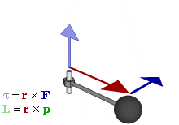

# 双四元数中螺旋位移

## 1. 力矩

在[物理学](https://zh.wikipedia.org/wiki/物理学)里，[作用力](https://zh.wikipedia.org/wiki/作用力)促使物体绕着[转动轴](https://zh.wikipedia.org/wiki/欧拉角#旋轉矩陣)或[支点](https://zh.wikipedia.org/wiki/槓桿)转动的趋向，称为**力矩**[[1\]](https://zh.wikipedia.org/wiki/力矩#cite_note-1)（torque或moment）。

力矩$\tau$等于作用于杠杆的作用力乘以支点到力的垂直距离。

代表可以影响转动的量。

例如，3 [牛顿](https://zh.wikipedia.org/wiki/牛顿)的作用力，施加于离支点2 [米](https://zh.wikipedia.org/wiki/米)处，所产生的力矩，等于1牛顿的作用力，施加于离支点6米处，所产生的力矩。

## 2. 线力矩

一条在空间中的线，经过点P，其方向为`l`, 则可以通过一个六元组去表示这条线`(l,m)`, 其中`m`被称为线力矩，被定义为
$$
m = p \times l
$$
线力矩垂直于经过点和线的平面，其大小等于点到线的距离。因为我们限制定义$||l||=1$。线力矩的值
$$
||m||=||p||\cdot||l||\cdot \sin(\theta)=||p||\sin(\theta)
$$
就是线到原点的距离。

### 2.1 为什么这个六元组可以代表一条直线

如第一节中所示，3牛顿两米和1牛顿六米所产生的力矩是一样的。因此当给定一个力矩$\tau$的时候是不可以确定F的，即在哪里施加了多少力，只有当力F的大小给定了，才可以确定这个力在距离原点多远处施加。才能确定这个F。

对于上述的六元组也类似，六元组被定义为$(l,m)$，倘若只有线力矩（到原点的距离），则无法确定$p$和$l$，但是当$l$给定，我们就可以确定线的方向，就可以确定线的方向。

### 2.2 线旋转

确定一条线段的六元组$(l,m)$可以被一个双四元数$l = \hat{l} + \epsilon m$来表示. 

假设一条直线$l_1$先通过一个旋转后通过一个平移转变为直线$l_2$，则有
$$
l_2 = \sigma * l_1 * \sigma^*
$$
证明：

一方面：先通过直接计算，算出旋转后的直线$l_2$, 首先是方向$\hat{l}_2$, 方向不会因为平移而改变，比如方向为$(0,0,1)$的一个向量，经过平移t之后还是$(0,0,1)$。因此可以直接先计算
$$
\hat{l}_2=r\hat{l_1}r^*
$$
旋转之后的方向$\hat{l}_2$, 然后再计算线力矩$m_2$
$$
m_2= p'\times \hat{l}_2
$$
其中$p'$是$\hat{l}_2$上的一个点，$p'$可以通过在$\hat{l}_1$上的一点p得到，$p'=rpr^* + t$,  然后整合为
$$
l_2 = \hat{l}_2+\epsilon m_2 \tag{2.2.1}
$$

另一方面：可以直接计算$\sigma * l_1 * \sigma^*$的取值
$$
l_2=(r+\frac{\epsilon}{2}tr)(\hat{l}_1+\epsilon m_1)(r^*+\frac{\epsilon}{2}r^*t^*)\tag{2.2.2}
$$
可以证明得到他们(2.2.1)==(2.2.2)相等。

注意，一个点的变换是
$$
1+\epsilon \boldsymbol{v}_2=\sigma(1+\epsilon\boldsymbol{v}_1)\sigma^{◊}
$$
这里$\sigma^{◊}=r^*-\frac{\epsilon}{2}r^*t^*$.

不同于一条线的变换
$$
l_2 = \sigma * l_1 * \sigma^*
$$
这里 $\sigma^*=r^*+\frac{\epsilon}{2}r^*t^*$

\sigma(\tau)=\sigma_1产生线和点的变换使用的共轭不同的原因是，描述线和点的双四元数形式不同

## 3.螺旋位移

螺旋位移是旋转和平移的一个组合操作，绕着一个轴（螺旋轴）旋转，沿着这条螺旋轴进行平移，平移的距离为d，
$$
\begin{equation}
\begin{split}
d &= t \cdot \hat{l}\\
&=(2qp^*)\cdot\hat{l}
\end{split}
\end{equation}
$$

另一方面，双四元数的dual部分为：
$$
\begin{equation}
\begin{split}
    \frac{1}{2}tr &= \frac{1}{2}t\left(\cos\frac{\theta}{2} + \hat{l}\sin\frac{\theta}{2}\right)\\
    &= \frac{1}{2}t\cos\frac{\theta}{2} + \frac{1}{2}[0,\boldsymbol{t}][0,\boldsymbol{\hat{l}}]\sin\frac{\theta}{2}\\
    &= \frac{1}{2}t\cos\frac{\theta}{2} + \frac{1}{2}[0*0 - \boldsymbol{t} \cdot \boldsymbol{\hat{l}},0*\boldsymbol{t}+0*\boldsymbol{\hat{l}}+\boldsymbol{t} \times\boldsymbol{\hat{l}}]\sin\frac{\theta}{2} \\
&=\frac{1}{2}t\cos\frac{\theta}{2} +\frac{1}{2}(-t\cdot\hat{l})\sin\frac{\theta}{2}+\frac{1}{2}t\times\hat{l}\sin\frac{\theta}{2}\\
\end{split}
\end{equation}
$$

因为$t$和$l$ 都是纯四元数，因此他俩的叉积刚好就是$[0,\boldsymbol{t}][0,\boldsymbol{\hat{l}}]$的向量部分。
$$
\begin{equation}
\begin{split}
    \frac{1}{2}tr &= \frac{1}{2}t\cos\frac{\theta}{2} +\frac{1}{2}(-t\cdot\hat{l})\sin\frac{\theta}{2}+\frac{1}{2}t\times\hat{l}\sin\frac{\theta}{2}\\
    &= -\frac{d}{2}\sin\frac{\theta}{2}+\sin\frac{\theta}{2}m+\frac{d}{2}\cos\frac{\theta}{2}\hat{l}
    \end{split}
\end{equation}\tag{3.1}
$$
这一步可以通过论文[1]中m的推导间接的得到
$$
\begin{equation}
\begin{split}
m &=\frac{1}{2}\left(t\times\hat{l}+\hat{l}\times(t\times\hat{l})\cot\frac{\theta}{2}\right)\\
&=\frac{1}{2}\left( t\times\hat{l} +(t-d\hat{l})
\cot\frac{\theta}{2}\right)
    \end{split}
\end{equation}
$$
因为$t$和$l$ 都是纯四元数，因此$t\times\hat{l}=[0,\boldsymbol{t}\times\boldsymbol{\hat{l}}]=t*\hat{l}-t\cdot\hat{l}$

因此
$$
\begin{equation}
\begin{split}
\hat{l}\times(t\times\hat{l})&=\hat{l}\times(t*\hat{l}-t\cdot\hat{l})\\
&=t-d\hat{l}
    \end{split}
\end{equation}
$$
通过式子（3.1），可以重写双四元数为以下形式
$$
\begin{equation}
\begin{split}
\sigma &= r + \frac{\epsilon}{2}tr\\
&=\cos\frac{\theta}{2}+\hat{l}\sin{\frac{\theta}{2}}+\epsilon\left(-\frac{d}{2}\sin\frac{\theta}{2}+\sin\frac{\theta}{2}m+\frac{d}{2}\cos\frac{\theta}{2}\hat{l}\right)\\
&=\cos\frac{\theta}{2}-\epsilon\frac{d}{2}\sin\frac{\theta}{2}+\left(\hat{l}\sin{\frac{\theta}{2}}+\epsilon\left(\sin\frac{\theta}{2}m+\frac{d}{2}\cos\frac{\theta}{2}\hat{l}\right)\right)
\end{split}
\end{equation}\tag{3.2}
$$
又有
$$
\cos\frac{\theta+\epsilon d}{2}=\cos\frac{\theta}{2}-\epsilon\frac{d}{2}\sin\frac{\theta}{2},\\
\sin\frac{\theta+\epsilon d}{2}=\sin\frac{\theta}{2}+\epsilon\frac{d}{2}\cos\frac{\theta}{2},\\
$$
因此，（3.2）可以被写为
$$
\sigma=\cos\frac{\theta+\epsilon d}{2}+\sin\frac{\theta+\epsilon d}{2}(\hat{l}+\epsilon m)
$$
引入变量$\hat{\theta}=\theta+\epsilon d,\overline{l}=\hat{l}+\epsilon m$, 我们可以得到
$$
\sigma = \cos\frac{\hat{\theta}}{2}+\sin\frac{\hat{\theta}}{2}\overline{l}
$$
这就可以引入一个幂计算：
$$
\sigma^\tau= \cos\frac{\tau\hat{\theta}}{2}+\sin\frac{\tau\hat{\theta}}{2}\overline{l}
$$
容易发现，这个计算不影响螺旋轴$(\hat{l},m)$, 只是按照比例的改变了旋转角和位移。因此可以任意一个在原位置到$\sigma$之间的任何一个位置。

## 4.插值

### 4.1 Sclerp

假设有两个变换，$\sigma_1, \sigma_2$ 对他们俩进行插值，使用的方法是Sclerp, 它是slerp的一个扩展，也有着常数的旋转和平移
$$
\sigma(\tau)=\sigma_1*(\sigma_1^{-1}*\sigma_2)^\tau,\tau\in[0,1]
$$

当$\tau=0$的时候，$\sigma(\tau)=\sigma_1$, 当$\tau=1$的时候,$\sigma(\tau)=\sigma_2$。这里我们将其化为可计算的形式

$$
\begin{equation}
\begin{split}
\sigma^{-1}_1*\sigma_2&=(r^*_1+\frac{\epsilon}{2}r_1^*t^*_1)(r_2+\frac{\epsilon}{2}t_2r_2)\\
&=(r^*_1-\frac{\epsilon}{2}r_1^*t_1)(r_2+\frac{\epsilon}{2}t_2r_2)\\
&=r_1^*r_2+\frac{\epsilon}{2}(r_1^*t_2r_2-r_1^*t_1r_2)\\
&=r_1^*r_2+\frac{\epsilon}{2}r_1^*(t_2-t_1)r_2)
\end{split}
\end{equation}\tag{3.2}
$$

一样的，可以得到他的螺旋坐标的参数进行任何位置的计算。

[1].K. Daniilidis. Hand-eye calibration using dual quaternions. International Journal of Robotics Research, 18(3):286–298, 1999.

