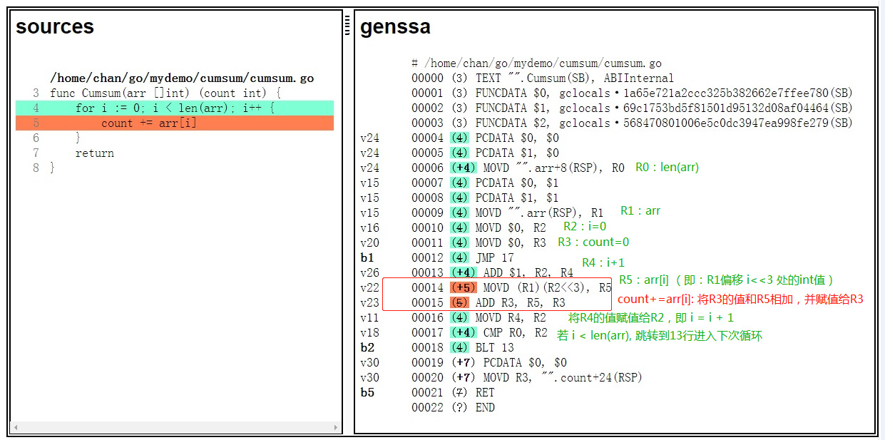

# 使用流水线思想进行性能优化

### 引言

在一些场景下，每执行一次操作，需要不同的部分分别完成各自的动作。如果将执行的操作分割为若干个子过程，然后每一个子过程并行执行，那么他的执行效率将会提高。由于这种思想与工厂中生产流水线相似，这个优化的技术称为流水线技术。流水线技术是一种在程序执行时多条指令重叠操作的一种准并行处理技术。在很多使用场景下，通过使用流水线技术可以使程序的性能更好。

### 环境要求

我们进行的测试计算是在鲲鹏服务器下进行的：有关服务器的配置参数、型号等信息可以参考链接：https://e.huawei.com/cn/products/servers/taishan-server/taishan-2280e

### 1，数组求和的性能分析

在某些场景下需要对一个内存中的所有数据进行计算，每次完成一个数据的操作。如果这个数据的数量很大，那么逐个数据进行计算必然会造成效率低下。那么我们能不能在一次的操作中完成多个数据计算？相信大家刚学习编程的时候会见过一道编程练习题，给定一个切片求切片内元素的和。在Go语言下，你可能会这样写：

```go
// 求切片arr中所有元素的和
func Cumsum(arr []int) (count int) {
	for i := 0; i < len(arr); i++ {
		count += arr[i]     
	}
	return
}
```

### 2，性能问题以及优化方案分析

在上面的程序中，通过遍历切片元素，每次循环将一个元素累加到count，循环结束得到最终结果。每次遍历求和的运算都对上一次的结果（count）产生依赖，整个运算过程成链条状态，环环相扣，指令无法并行，整体耗时则为所有运算时间和。当数据很大时，执行效率会很低。

如果通过减少数据依赖，增加寄存器的利用率，那么就可以进行流水线层面的性能优化。流水线指的是程序在执行的过程中，多条指令重叠进行操作的一种准并行处理的技术，通过多个功能部件并行工作来缩短程序的执行时间。所以，可以利用多个寄存器进行计算操作，一次完成多个数据的读取、计算、写入。

由上面的性能问题分析以及流水线技术学习我们可以得出，通过利用多个功能部件并行工作来缩短程序的执行时间。当切片长度大于8时，可以选择每次计算8个数值的和，批量处理数据；当切片长度大于4且小于8时，每次处理4个数值的操作，以此类推。

### 3，优化代码

按照优化思路，可以使用Go语言写出以下优化之后的代码。

   ```go
   func CumsumChunk8(arr []int) (count int) {
	if len(arr) == 0 {
		return
	}

    // len >= 8 时，每 8 个元素一次循环，分成 4 组相加，减少依赖；
    // 使用 4 个变量暂存计算结果，促使更多的寄存器被使用
	for len(arr) >= 8 {
		a := arr[0] + arr[1]
		b := arr[2] + arr[3]
		c := arr[4] + arr[5]
		d := arr[6] + arr[7]
		a += c
		b += d
		count += a + b
		arr = arr[8:]
	}

    // 4 <= len < 8 ，取 4 个元素，分成 2 组相加
	if len(arr) >= 4 {
		a := arr[0] + arr[1]
		b := arr[2] + arr[3]
		count += a + b
		arr = arr[4:]
	}

    // 2 <= len < 4, 取 2 个元素
	if len(arr) >= 2 {
		count += arr[0] + arr[1]
		arr = arr[2:]
	}

    // len == 1, 直接相加
	if len(arr) == 1 {
		count += arr[0]
	}
	return
   }
   ```

除了在Go语言的层面，往下继续探究在ARM汇编层面的指令变化。将优化前代码进行编译得到汇编程序，如下所示：

   

可以看到，在优化前一共使用了5个寄存器，在循环中仅使用了R3和R5两个寄存器，并且在每次的循环中需要使用R3寄存器中的数据，对R3的数据强依赖。然后我们将优化后的程序进行编译得到汇编程序，看一下经过优化的汇编程序对于数据依赖以及寄存器的处理。

   

在上图的汇编程序中，一共使用了9个寄存器，其中左边的循环对应的汇编程序中，使用了R4，R5，R6，R7，R8共5个寄存器，值之间相加的结果写入了不同的寄存器，减少了数据依赖。

### 4，优化结果

我们对比优化前后的性能，使用[benchstat工具](https://godoc.org/golang.org/x/perf/cmd/benchstat)进行性能对比：

   ```bash
   name            old time/op    new time/op    delta
   Cumsum/0-8        5.01ns ± 0%    3.86ns ± 0%  -22.95%  (p=0.002 n=8+10)
   Cumsum/1-8        5.40ns ± 0%    5.40ns ± 0%     ~     (all equal)
   Cumsum/7-8        10.6ns ± 0%     7.1ns ± 0%  -33.44%  (p=0.000 n=7+10)
   Cumsum/8-8        11.4ns ± 0%     7.7ns ± 0%  -32.25%  (p=0.000 n=9+10)
   Cumsum/15-8       16.7ns ± 0%    10.4ns ± 0%  -37.43%  (p=0.000 n=10+10)
   Cumsum/16-8       17.4ns ± 0%    10.7ns ± 1%  -38.33%  (p=0.000 n=10+10)
   Cumsum/127-8      88.8ns ± 0%    45.4ns ± 0%  -48.86%  (p=0.000 n=9+8)
   Cumsum/4095-8     3.17µs ± 0%    1.28µs ± 0%  -59.66%  (p=0.000 n=10+9)
   Cumsum/99999-8    86.3µs ± 3%    53.4µs ±15%  -38.11%  (p=0.000 n=10+10)
   ```

注：

[^Cumsum/0-8]: Cumsum表示测试的项目，8表示计算所用的核数
[^ns]: 每次操作的耗时平均值（纳秒）
[^x%]: 样本离散值
[^(p=...   n=...]: p表示结果的可信程度，p值越大可信程度越低；n表示样本数量

优化后的代码性能提升高了 **30% +**，经过优化之后，性能得到提升，很显然，这和我们的预期是一致的。

