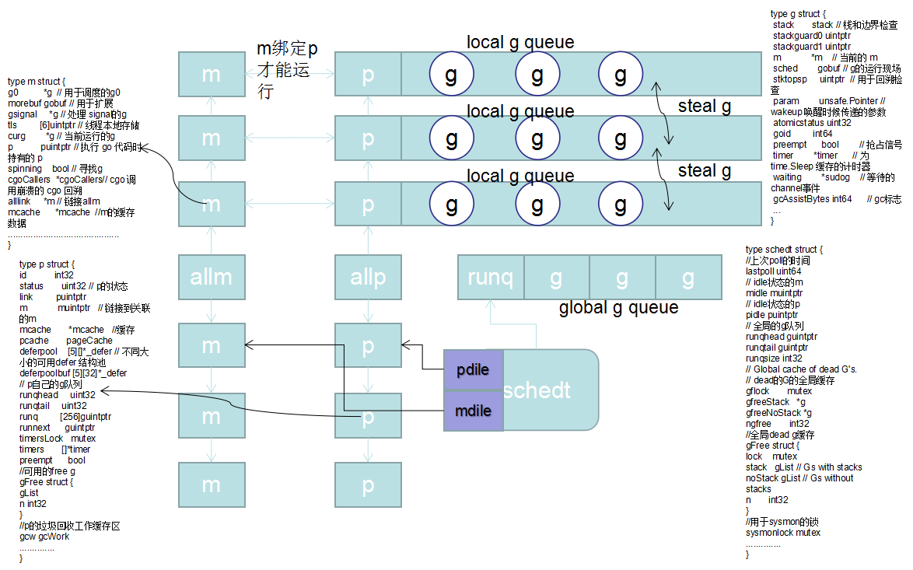
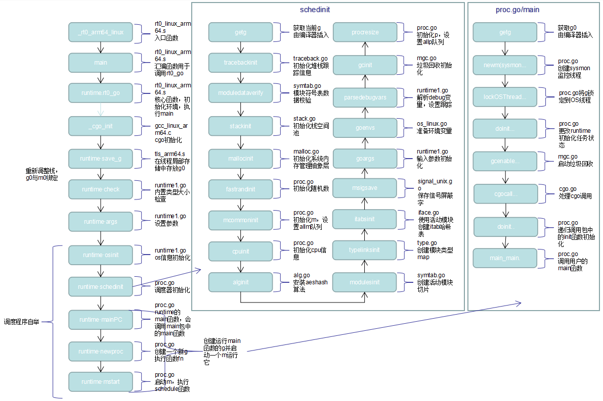

# 基于ARM64的runtime GMP模型浅析
### 安装包和硬件配置
- [Golang发行版安装 >= 1.14](https://golang.org/dl/)
- 硬件配置：鲲鹏(ARM64)服务器
- 源码下载：git clone https://go.googlesource.com/go
### 1. golang的GMP模型
golang的GMP是指g(goroutine协程)、p(执行资源，持有g队列，通常与CPU核心数一致)、m(代表系统线程)，m获取p后才可以执行g，schedt调度器保存M和空闲g、defer池等资源，负责调度执行g：
- g：表示goroutine，是一个具有栈空间和运行现场的任务执行体
- p：与处理器数相对应，表示执行所需的资源，m获取p后才能运行g
- m：表示系统线程的结构体，与p绑定后，不断执行g
- schedt：全局调度程序

- GMP模型：
 

### 2. 调度程序
golang程序调度入口在rt0_(architecture)_(osinf).s文件中，使用golang汇编编写，比如本文基于Arm64平台，linux系统，入口函数是rt0_linux_arm64.s
文件中的_rt0_arm64_linux，这个函数完成了调度器的初始化，创建了p结构链表，创建并启动了m，绑定m与p，创建了用于执行runtime的g0，开始golang runtime的运行，创建用于执行package main中main函数的g，调用顺序和各函数的作用如图中所示：


go代码部分原理可参考[2]：

### 3. 部分代码详解

rt0_linux_arm64.s
```assembly
TEXT _rt0_arm64_linux(SB),NOSPLIT|NOFRAME,$0
  MOVD  0(RSP), R0                 // 将argc放入R0
  ADD  $8, RSP, R1                 // 将argv地址放入R1
  BL  main(SB)                     // 跳转到main函数


TEXT main(SB),NOSPLIT|NOFRAME,$0
  MOVD  $runtime·rt0_go(SB), R2    // 把rt0_go地址放入R2
  BL  (R2)                         // 执行rt0_go
exit:
  MOVD $0, R0                      
  MOVD  $94, R8                    // R8存放系统调用号，sys_exit退出
  SVC                              // 陷入异常、CPU从el0切换到el1、执行系统调用
  B  exit
```

asm_arm64.go
```assembly
TEXT runtime·rt0_go(SB),NOSPLIT,$0
  // SP = stack; R0 = argc; R1 = argv
  
  SUB  $32, RSP                           // 扩大栈空间
  MOVW  R0, 8(RSP)                        // argc存放到栈上
  MOVD  R1, 16(RSP)                       // argv地址存放到栈上

    // 在操作系统栈上创建istack
    //需注意 执行cgo_init之后可能改变栈边界哨兵stackguard
  MOVD  $runtime·g0(SB), g
  MOVD  RSP, R7
  MOVD  $(-64*1024)(R7), R0               // 栈大小
  MOVD  R0, g_stackguard0(g)              // 栈边界哨兵 RSP - 64*1024
  MOVD  R0, g_stackguard1(g)              // 栈边界哨兵 RSP - 64*1024 
  MOVD  R0, (g_stack+stack_lo)(g)
  MOVD  R7, (g_stack+stack_hi)(g)

  // if there is a _cgo_init, call it using the gcc ABI.
  MOVD  _cgo_init(SB), R12               
  CBZ  R12, nocgo                         // 如果无cgo_init跳到nocgo标签

  MRS_TPIDR_R0                            // 加载线程局部存储(TLS)基指针
  MOVD  R0, R3                            // 放入R3寄存器
#ifdef TLSG_IS_VARIABLE
  MOVD  $runtime·tls_g(SB), R2            // 如果tls_g是变量放入R2
#else
  MOVD  $0, R2                            // 如果使用平台的TLS则将R2置0
#endif
  MOVD  $setg_gcc<>(SB), R1               // 第二个参数是setg
  MOVD  g, R0                             // 将g放入R0作为第一个参数
  SUB  $16, RSP                           // 由于sp-8可能存放fp，保留16个字节
  BL  (R12)                               // 调用cgo_init
  ADD  $16, RSP                           // 调用结束后，恢复栈空间

nocgo:
  BL  runtime·save_g(SB)                  // 执行tls_arm64.s中的save_g 在线程局部存储存放g0
  // _cgo_init后更新stackguard
  MOVD  (g_stack+stack_lo)(g), R0
  ADD  $const__StackGuard, R0
  MOVD  R0, g_stackguard0(g)
  MOVD  R0, g_stackguard1(g)

  // set the per-goroutine and per-mach "registers"
  MOVD  $runtime·m0(SB), R0
  // 绑定m0和g0
  
  MOVD  g, m_g0(R0)                      // 将g0存到m->g0
  MOVD  R0, g_m(g)                       // 将m0存到g0->m
  BL  runtime·check(SB)                  // 位于runtime1.go中，执行内置类型大小检查

  MOVW  8(RSP), R0                       // 将argc放到R0
  MOVW  R0, -8(RSP)                      // 将argc放到栈RSP-8位置
  MOVD  16(RSP), R0                      // 将argv地址放到R0
  MOVD  R0, 0(RSP)                       // 将argv地址放到栈RSP位置
  BL  runtime·args(SB)                   // 位于runtime1.go，设置参数
  BL  runtime·osinit(SB)                 // 位于runtime1.go，执行os信息初始化
  BL  runtime·schedinit(SB)              // 位于 proc.go，调度器初始化

  // 创建一个新的goroutine执行用户程序
  MOVD  $runtime·mainPC(SB), R0          // main函数入口
  MOVD  RSP, R7
  MOVD.W  $0, -8(R7)
  MOVD.W  R0, -8(R7)
  MOVD.W  $0, -8(R7)
  MOVD.W  $0, -8(R7)
  MOVD  R7, RSP
  BL  runtime·newproc(SB)                // 位于proc.go，g初始化
  ADD  $32, RSP                          // 调用结束后，恢复栈

  BL  runtime·mstart(SB)                 // 开启一个m执行g           

  MOVD  $0, R0
  MOVD  R0, (R0)                         // 将0复制到地址为0处，引发异常退出
  UNDEF

DATA  runtime·mainPC+0(SB)/8,$runtime·main(SB)    // 实际执行的是proc.go 中的main
GLOBL  runtime·mainPC(SB),RODATA,$8

```

核心代码proc.go中的shecdinit调度器初始化函数
```go
// The bootstrap sequence is:
//
//	call osinit
//	call schedinit
//	make & queue new G
//	call runtime·mstart
//
// The new G calls runtime·main.
func schedinit() {
    // 锁初始化
    lockInit(&sched.lock, lockRankSched)
    lockInit(&sched.sysmonlock, lockRankSysmon)
    lockInit(&sched.deferlock, lockRankDefer)
    lockInit(&sched.sudoglock, lockRankSudog)
    lockInit(&deadlock, lockRankDeadlock)
    lockInit(&paniclk, lockRankPanic)
    lockInit(&allglock, lockRankAllg)
    lockInit(&allpLock, lockRankAllp)
    lockInit(&reflectOffs.lock, lockRankReflectOffs)
    lockInit(&finlock, lockRankFin)
    lockInit(&trace.bufLock, lockRankTraceBuf)
    lockInit(&trace.stringsLock, lockRankTraceStrings)
    lockInit(&trace.lock, lockRankTrace)
    lockInit(&cpuprof.lock, lockRankCpuprof)
    lockInit(&trace.stackTab.lock, lockRankTraceStackTab)

    // raceinit必须在竞争检测中第一个调用
    // 他必须在下面函数mallocinit调用racemapshadow之前完成。
    _g_ := getg()                               // 由编译器插入，获得当前的g
    if raceenabled {                            // 如果允许竞争检测
        _g_.racectx, raceprocctx0 = raceinit()  // 位于race.go，初始化竞争检测器
    }

    sched.maxmcount = 10000                     // 线程数量最大10000

    tracebackinit()                             // 位于traceback.go，初始化堆栈跟踪信息

    moduledataverify()                          // 位于symtab.go，模块符号表数据校验
    stackinit()                                 // 位于stack.go，初始化栈空间池
    mallocinit()                                // 位于malloc.go，初始化系统内存管理抽象层
    fastrandinit()                              // 位于proc.go，初始化随机数，必须在mcommoninit函数之前调用
    mcommoninit(_g_.m)                          // 位于proc.go，初始化m，设置allm队列
    cpuinit()                                   // 位于proc.go，初始化cpu信息，必须在alginit之前调用
    alginit()                                   // 位于alg.go，安装aeshash算法，这个函数调用之后才能使用maps
    modulesinit()                               // 位于symtab.go，从所有加载的模块中创建活动模块切片。
    typelinksinit()                             // 位于type.go，创建模块类型map，用于消除重复类型指针。
    itabsinit()                                 // 位于iface.go，使用活动模块创建itab哈希表
    msigsave(_g_.m)                             // 位于signal_unix.go，保存信号屏蔽字
    initSigmask = _g_.m.sigmask

    goargs()                                    // 位于runtime1.go，输入参数初始化
    goenvs()                                    // 位于os_linux.go，准备环境变量
    parsedebugvars()                            // 位于runtime1.go，解析debug变量，设置跟踪
    gcinit()                                    // 位于mgc.go，垃圾回收初始化

    sched.lastpoll = uint64(nanotime())
    procs := ncpu
    if n, ok := atoi32(gogetenv("GOMAXPROCS")); ok && n > 0 {
        procs = n
    }
    if procresize(procs) != nil {               // 位于proc.go，初始化P，设置allp队列
        throw("unknown runnable goroutine during bootstrap")
    }

    // 对于cgocheck > 1, 使用打开写屏障和检查所有的指针写操作
    // 由于写屏障需一个P因此必须在procresize调用之后
    if debug.cgocheck > 1 {
        writeBarrier.cgo = true
        writeBarrier.enabled = true
        for _, p := range allp {
            p.wbBuf.reset()
        }
    }

    if buildVersion == "" {
        buildVersion = "unknown"
    }
    if len(modinfo) == 1 {
        modinfo = ""
    }
}
```

调度器代码分析持续补充.....


参考资料：

[1] [golang的M:N模型](http://timetobleed.com/threading-models-so-many-different-ways-to-get-stuff-done/)

[2] [Go语言原本](https://changkun.de/golang/zh-cn/part2runtime/ch06sched/basic/)

[3] [调度器初始化](https://qcrao.com/ishare/go-scheduler/#true%E8%B0%83%E5%BA%A6%E5%99%A8%E5%88%9D%E5%A7%8B%E5%8C%96)

[4] [聊聊 g0](https://qcrao.com/2020/04/03/talk-about-g0/)