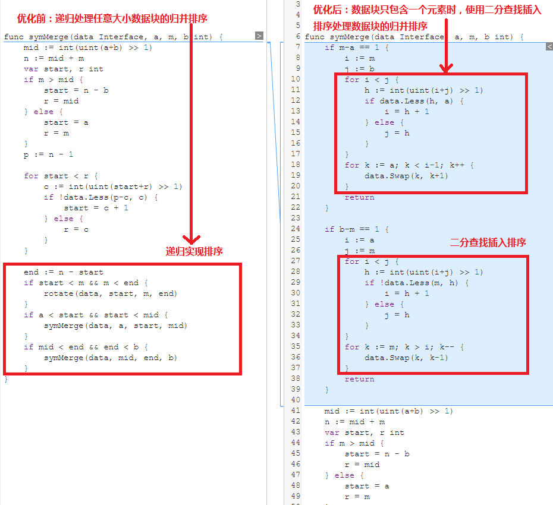

# 基于二分插入技术优化归并排序算法
> 排序算法是一种能将一系列数据按照特定顺序进行排列的算法，比如说一个学校的考试分数从高到低排名、一个公司的数据报表从大到小排列，都需要用到排序算法。常见的排序算法有冒泡排序、快速排序、字典排序、归并排序、堆排序等等，而[归并排序](https://zh.wikipedia.org/wiki/%E5%BD%92%E5%B9%B6%E6%8E%92%E5%BA%8F)是其中的一种较为稳定、高效的排序算法，时间复杂度N*log<sub>2</sub>N。  
> 本文通过Go语言开源社区的归并排序算法优化案例为例，讲解通用的算法分析、优化方法。

### 1. Go语言的归并排序算法
Go语言的sort包对插入排序、归并排序、快速排序、堆排序做了支持，[归并排序](https://zh.wikipedia.org/wiki/%E5%BD%92%E5%B9%B6%E6%8E%92%E5%BA%8F)是sort包实现的稳定排序算法。  
Go语言基于递归实现了归并排序算法，代码如下：

```go
// 优化前的归并排序代码，使用递归实现两个有序子序列data[a：m]和data [m：b]的合并 
func symMerge(data Interface, a, m, b int) {
	// 初始化mid,start,r的值，mid表示[a:b]的中位数，start表示[a:m]区间进行数据交换的开始下标，r表示[a:m]区间进行数据交换的最右下标
	mid := int(uint(a+b) >> 1) 
	n := mid + m
	var start, r int
	if m > mid {
		start = n - b
		r = mid
	} else {
		start = a
		r = m
	}
	p := n - 1

	// 折半查找对称比较数据块[a:m]和数据块[m:b],找出数据块[a:m]开始大于数据[m:b]的下标位置start
	for start < r {
		c := int(uint(start+r) >> 1)
		if !data.Less(p-c, c) {
			start = c + 1
		} else {
			r = c
		}
	}

	// 翻转数据块 [start:m] 和 [m:end], 使得数据块[start:end]有序
	end := n - start
	if start < m && m < end {
		rotate(data, start, m, end)
	}
	// 调用递归函数,排序两组子数据块 [a:start]和[start:mid]，[mid:end]和[end:b]
	if a < start && start < mid {
		symMerge(data, a, start, mid)
	}
	if mid < end && end < b {
		symMerge(data, mid, end, b) 
	}
}
```

### 2. 场景分析
归并排序算法的应用场景主要是数据块有序归并，比如说有序切片data[0:20]和data[20:40]的合并有序场景，主要处理过程如下：

1. 调用递归函数symMerge，初始化切片参数。
2. 经过折半查找、对称比较、翻转等方法使得切片data[0:20]整体小于切片data[20:40]
3. 再次调用递归函数symMerge归并排序子切片data[0:start]和data[start:20]，回到步骤1
4. 再次调用递归函数symMerge归并排序子切片data[20:end]和data[end:40]，回到步骤1
5. 直到排序完所有的子切片，使得整个切片data[0：40] 有序。

从这个常见的应用场景的处理过程中发现，归并排序需要不断调用递归函数处理子序列，而这也是归并排序算法的性能损耗的主要原因。在切片的归并排序场景中，如果能避免或减少调用递归处理子切片，算法的运行性能就可以得到提升。比如说在长度为1的子切片data[0]和长度为9的子切片data[1:10]进行归并排序的场景下，使用[插入排序](https://baike.baidu.com/item/%E4%BA%8C%E5%88%86%E6%B3%95%E6%8F%92%E5%85%A5%E6%8E%92%E5%BA%8F)来避免调用递归，可以减少算法的运行耗时，优化算法的性能。

### 3. 优化方案及实现
通过上述对Go语言归并排序算法的代码和场景分析，找到了一种优化方法，即在归并排序中，针对长度为1的数据块，使用插入排序算法处理数据块排序，可以减少函数递归的调用，提高算法的性能。    
Go语言开源社区也应用了这种优化方法，提升了归并排序算法的性能，优化前后的代码对比如下：   


优化代码如下：
```go
// 优化代码增加了对切片长度的判断，且当切片长度为1时，使用二分插入排序直接排序切片返回。
func symMerge(data Interface, a, m, b int) {
    // data[a:m]只有一个元素时，使用二分插入排序找到有序的插入点，插入data[a]到data[m:b] 
    // 避免调用递归，提高算法性能
    if m-a == 1 { 
        i := m
        j := b
        for i < j {
            h := int(uint(i+j) >> 1) 
            if data.Less(h, a) {
                i = h + 1
            } else {
                j = h
            }
        }
        for k := a; k < i-1; k++ {
            data.Swap(k, k+1)
        }
        return
    }

    // data[m:b]只有一个元素时，使用二分插入排序找到有序的插入点，插入data[m]到data[a:m]
    // 避免调用递归，提高算法性能
    if b-m == 1 { 
        i := a
        j := m
        for i < j { 
            h := int(uint(i+j) >> 1)
            if !data.Less(m, h) {
                i = h + 1
            } else {
                j = h
            }
        }
        for k := m; k > i; k-- {
            data.Swap(k, k-1)
        }
        return
    }
    
    // 归并排序的递归实现
    ......
}
```

### 4. 优化结果
使用[Go Benchmark](https://golang.org/pkg/testing/)测试优化前后的算法性能，再用[benchstat](https://godoc.org/golang.org/x/perf/cmd/benchstat)对比优化前后的性能测试结果，整理到如下表格： 

测试项 | 测试用例 |优化前每操作耗时 time/op |	优化后每操作耗时 time/op | 耗时对比
---|---|---|---|---|
BenchmarkStableString1K-8 | 长度1K的字符串切片 | 302278 ns/op | 288879 ns/op | 4.43%
BenchmarkStableInt1K-8 | 长度1K的整型切片 | 144207 ns/op | 139911 ns/op | 2.97%
BenchmarkStableInt1K_Slice-8 | 长度1K的整型切片 | 128033 ns/op | 127660 ns/op | 0.29%
BenchmarkStableInt64K-8 | 长度64K的整型切片 | 12291195 ns/op | 12119536 ns/op | 1.40%
BenchmarkStable1e2-8 | 长度1e2(100)的结构体切片 | 135357 ns/op | 124875 ns/op | 7.74%
BenchmarkStable1e4-8 | 长度1e4(10000)的结构体切片 | 43507732 ns/op | 40183173 ns/op | 7.64%
BenchmarkStable1e6-8 | 长度1e6(1000000)的结构体切片 | 9005038733 ns/op | 8440007994 ns/op | 6.27%

[注] `-8`表示函数运行时的GOMAXPROCS值，`ns/op`表示函数每次执行的平均纳秒耗时。

性能测试结果显示，使用二分插入技术优化归并排序算法后，算法每次执行的耗时减小，整体性能得到提升。

### 5. 总结
Go语言的归并排序算法优化案例，从一个具体的场景出发分析算法存在的性能问题，给出了基于二分插入技术的优化方案，并最终验证了优化结果，是一个值得学习借鉴的算法优化实践。
