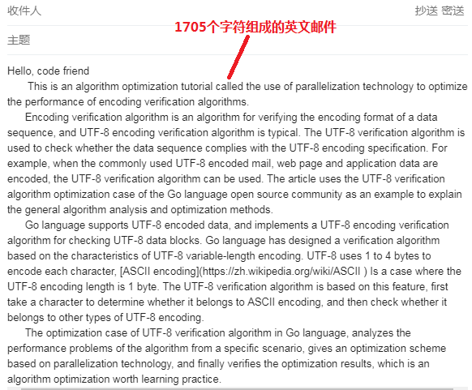
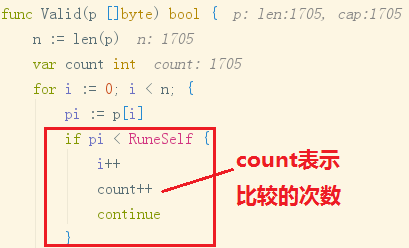
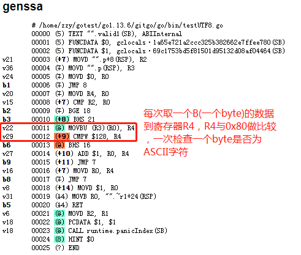
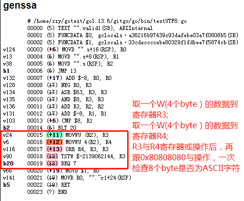

# 开源软件优化-并行化编程思想在编码验证算法的实践
> 编码验证算法是一种验证数据序列编码格式的算法，比较典型的有UTF-8编码验证算法。UTF-8验证算法用于检查数据序列是否符合UTF-8编码规范，比如说对常用UTF-8编码的邮件、网页及应用数据做编码验证时，就可以使用UTF-8验证算法。   
> 本文以Go语言开源社区的UTF-8验证算法优化案例为例，讲解通用的算法分析、优化方法。

### 1. Go语言的UTF-8编码验证算法
Go语言实现了UTF-8编码验证算法用于检查UTF-8编码数据，主要基于UTF-8的可变长编码特点设计了验证算法，[UTF-8编码](https://baike.baidu.com/item/UTF-8)使用1到4个字节为每个字符编码，[ASCII编码](https://baike.baidu.com/item/ASCII)属于UTF-8编码长度为1个字节的情况。
UTF-8验证算法针对这个特点，先取一个字符判断是否属于ASCII编码，再检查是否属于其他类型的UTF-8编码。代码如下：
```go 
// 优化前的UTF-8验证算法，先取一个字节检查是否为ASCII，再验证字符是否属于其他类型的UTF-8编码
func Valid(p []byte) bool {
	n := len(p)
	for i := 0; i < n; {
		// 验证byte字符是否属于ASCII编码，当ASCII编码数量很多时，算法运算效率会很慢。
		pi := p[i]
		if pi < RuneSelf { 
			i++
			continue
		} 
		
		// 验证byte字符是否属于其他类型的UTF8编码
		x := first[pi]
		if x == xx {
			return false // Illegal starter byte.
		}
		size := int(x & 7)
		if i+size > n {
			return false // Short or invalid.
		}
		accept := acceptRanges[x>>4]
		if c := p[i+1]; c < accept.lo || accept.hi < c {
			return false
		} else if size == 2 {
		} else if c := p[i+2]; c < locb || hicb < c {
			return false
		} else if size == 3 {
		} else if c := p[i+3]; c < locb || hicb < c {
			return false
		}
		i += size
	}
	return true
}
```

### 2. 场景及问题分析
通过分析Go语言优化前的UTF-8验证算法，发现它也用于ASCII字符的检查。在长篇的英文电子邮件中，连续出现大量的ASCII编码也是常见的，下图这篇英文邮件包含1705个ASCII字符。  
  
   
使用上述的UTF-8验证算法对英文邮件内容进行编码检查时，需要进行1705次比较操作，如下图：  
  
由此可见，在需要验证大量ASCII编码数据的场景下，优化前的UTF-8编码验证算法采用单个字符比较的方式检查编码，直到循环检查完整个数据，算法的运行耗时大，性能有待提升。

### 3. 优化方案及实现
针对UTF-8编码验证算法中处理ASCII编码字符检查次数多、运行耗时大的问题，可以利用并行化编程思想，一次同时处理多个ASCII编码字符的检查，减少比较的次数，加快验证速度，提升算法性能。  
Go语言的UTF-8验证算法应用了基于并行化编程思想的算法优化方案，一次同时检查8个ASCII编码，大大提升了算法的运行性能。   
算法优化前后的代码对比如下：   


优化后的代码分析如下:  
```go
// 优化后的代码，基于并行化编程思想，一次检查8个byte是否为ASCII字符
func Valid(p []byte) bool {
	// 每个轮次同时检查8个byte是否为ASCII字符
	for len(p) >= 8 {
		// 使用两个 uint32 变量 first32 和 second32，分别存储了4个byte数据
		first32 := uint32(p[0]) | uint32(p[1])<<8 | uint32(p[2])<<16 | uint32(p[3])<<24
		second32 := uint32(p[4]) | uint32(p[5])<<8 | uint32(p[6])<<16 | uint32(p[7])<<24
		// 任一个ASCII字符与0x80的与结果都是0，通过(first32|second32)与0x80808080的与操作实现了8个byte的ASCII字符检验。
		if (first32|second32)&0x80808080 != 0 {
			break
		}
		p = p[8:]
	}
	
	// 每次验证一个byte是否为UTF-8编码
	......
}
```
为了进一步分析并行化的优化技术，使用反汇编的方法得到了算法优化前后的汇编代码。优化前的汇编代码如下：  
  
优化后的汇编代码如下：  
  

分析发现，优化前的代码，使用1个unit8变量存储数据进行编码验证，对应到汇编代码使用`MOVBU`指令取一个B(1个byte)的数据到寄存器R4，一次验证1个byte数据的编码。
优化后的代码，使用2个unit32变量存储数据进行编码验证，对应到汇编代码使用`MOVWU`指令分别取一个W(4个byte)的数据到寄存器R3和R4，一次验证8个byte数据的编码。
该优化方法**通过在Go语言代码中使用存储数据更多的unit32变量类型，增加了汇编指令中寄存器存储的数据量，在寄存器做比较操作时，实现了更多编码数据的并行化验证**。

### 4. 优化结果
使用[Go benchmark](https://golang.google.cn/pkg/testing/)测试优化前后的算法性能，再用[Go benchstat](https://github.com/golang/perf/tree/master/cmd/benchstat)对比优化前后的性能测试结果，整理到如下表格： 

测试项 | 测试用例 |优化前每操作耗时 time/op |	优化后每操作耗时 time/op | 耗时对比
---|---|---|---|---|
BenchmarkValidTenASCIIChars-8 | 长度为10的byte切片 | 15.8 ns/op | 8.00 ns/op | -49.37%
BenchmarkValidStringTenASCIIChars-8 | 长度为10的字符串 | 12.8 ns/op | 8.04 ns/op | -37.19%

[注] `-8`表示函数运行时的GOMAXPROCS值，`ns/op`表示函数每次执行的平均纳秒耗时。

性能测试结果显示，UTF-8编码验证算法优化后，验证ASCII编码的平均耗时减小，性能提升明显最高达49%。

### 5. 总结
Go语言的UTF-8验证算法优化案例，从一个具体的场景出发分析算法存在的性能问题，给出了基于并行化编程思想的优化方案，并最终验证了优化结果，是一个值得学习借鉴的算法优化实践。
案例中的并行化编程思想不仅可以用于优化数据的编码验证，更是能用于优化数据的编码、解码、压缩和存储等多种场景。
