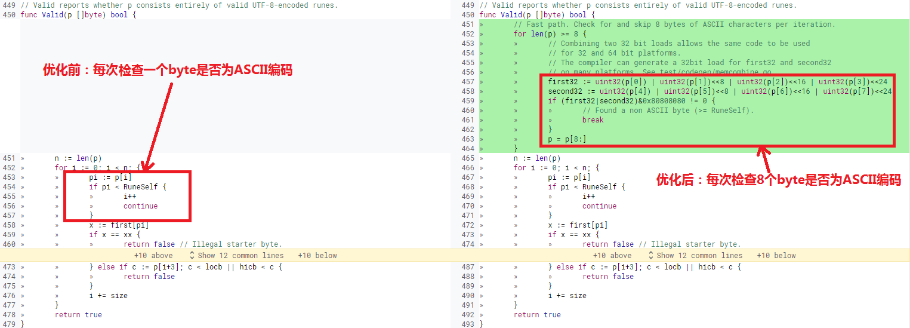

# 使用并行化技术优化UTF-8验证算法的性能
> [UTF-8](https://zh.wikipedia.org/wiki/UTF-8)是一种常见的支持中文的可变长编码方式，目前大部分的网页、电子邮件、APP数据都优先采用UTF-8编码。
UTF-8验证算法用于检查字符序列是否为符合UTF-8编码规范，比如说需要对中文邮件的编码方式做检验时，可以使用UTF-8验证算法检查中文邮件。   
> 本文通过Go语言开源社区的UTF-8验证算法优化案例为例，讲解通用的算法分析、优化方法。

### 1. Go语言的UTF-8编码验证算法
Go语言支持UTF-8编码的数据，且实现了UTF-8编码验证算法用于检查UTF-8数据块。Go语言基于UTF-8可变长编码特点设计了验证算法，UTF-8使用1到4个字节为每个字符编码，[ASCII编码](https://zh.wikipedia.org/wiki/ASCII)属于UTF-8编码长度为1个字节的情况。
UTF-8验证算法针对这个特点，先取一个字符判断是否属于ASCII编码，再检查是否属于其他类型的UTF-8编码。代码如下：
```go 
// 优化前的UTF-8验证算法，先取一个字节检查是否为ASCII，再验证字符是否属于其他类型的UTF-8编码
func Valid(p []byte) bool {
	n := len(p)
	for i := 0; i < n; {
		// 验证byte字符是否属于ASCII编码，当ASCII编码数量很多时，算法运算效率会很慢。
		pi := p[i]
		if pi < RuneSelf { 
			i++
			continue
		} 
		
		// 验证byte字符是否属于其他类型的UTF8编码
		x := first[pi]
		if x == xx {
			return false // Illegal starter byte.
		}
		size := int(x & 7)
		if i+size > n {
			return false // Short or invalid.
		}
		accept := acceptRanges[x>>4]
		if c := p[i+1]; c < accept.lo || accept.hi < c {
			return false
		} else if size == 2 {
		} else if c := p[i+2]; c < locb || hicb < c {
			return false
		} else if size == 3 {
		} else if c := p[i+3]; c < locb || hicb < c {
			return false
		}
		i += size
	}
	return true
}
```

### 2. 场景分析
通过分析Go语言优化前的UTF-8验证算法，发现它也用于ASCII字符的检查。在长篇的英文电子邮件中，连续出现大量的ASCII编码也是常见的。
在数据出现大量的ASCII编码的场景下，当前的算法采用单个字符检查的方式，循环检查整个数据，运行耗时会很长。如果可以针对UTF-8编码，并行化处理多个字符的检查，算法的运行耗时应该会减小。

### 3. 优化方案及实现
通过上述对UTF-8验证算法的代码和场景分析，可以优化算法对ASCII编码的检查。即一次处理多个ASCII编码的检查，加快验证速度。  
在Go语言开源社区也应用了这种优化方法，优化了UTF-8验证算法代码，提升了UTF-8验证算法的运行性能，优化前后的代码对比如下：


优化代码如下:
```go
// 优化代码，基于并行化技术，一次检查8个byte是否为ASCII字符
func Valid(p []byte) bool {
	// 采用并行化方法，每个轮次检查8个byte是否为ASCII字符
	for len(p) >= 8 {
		first32 := uint32(p[0]) | uint32(p[1])<<8 | uint32(p[2])<<16 | uint32(p[3])<<24
		second32 := uint32(p[4]) | uint32(p[5])<<8 | uint32(p[6])<<16 | uint32(p[7])<<24
		if (first32|second32)&0x80808080 != 0 {
			break
		}
		p = p[8:]
	}
	
	// 每次验证一个byte是否为UTF-8编码
	......
}
```

### 4. 优化结果
使用[Go Benchmark](https://golang.org/pkg/testing/)测试优化前后的算法性能，再用[benchstat](https://godoc.org/golang.org/x/perf/cmd/benchstat)对比优化前后的性能测试结果，整理到如下表格： 

测试项 | 测试用例 |优化前每操作耗时 time/op |	优化后每操作耗时 time/op | 耗时对比
---|---|---|---|---|
BenchmarkValidTenASCIIChars-8 | 长度为10的byte切片 | 15.8 ns/op | 8.00 ns/op | 49.37%
BenchmarkValidStringTenASCIIChars-8 | 长度为10的字符串 | 12.8 ns/op | 8.04 ns/op | 37.19%

[注] `-8`表示函数运行时的GOMAXPROCS值，`ns/op`表示函数每次执行的平均纳秒耗时。

性能测试结果显示，UTF-8编码验证算法优化后，验证ASCII编码的平均耗时减小，性能提升明显最高达49%。

### 5. 总结
Go语言的UTF-8验证算法优化案例，从一个具体的场景出发分析算法存在的性能问题，给出了基于并行化技术的优化方案，并最终验证了优化结果，是一个值得学习借鉴的算法优化实践。
