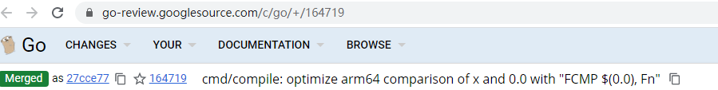
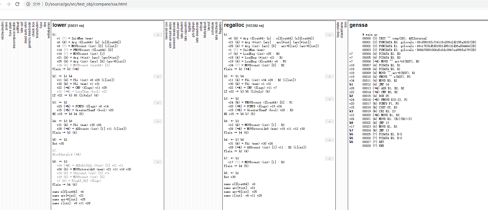
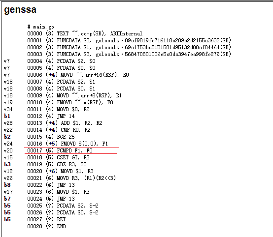
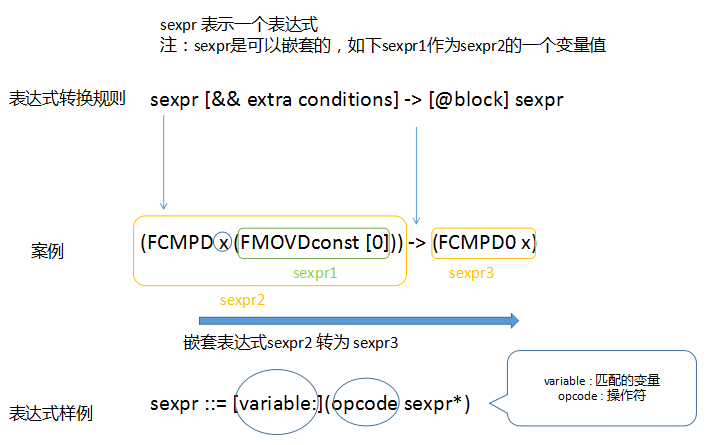
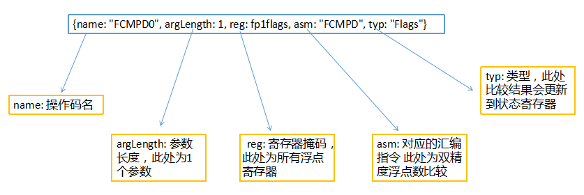
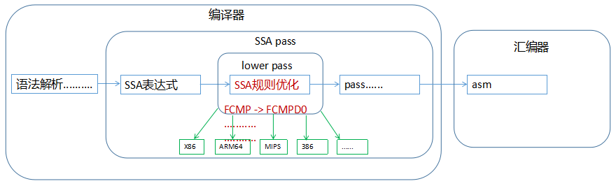
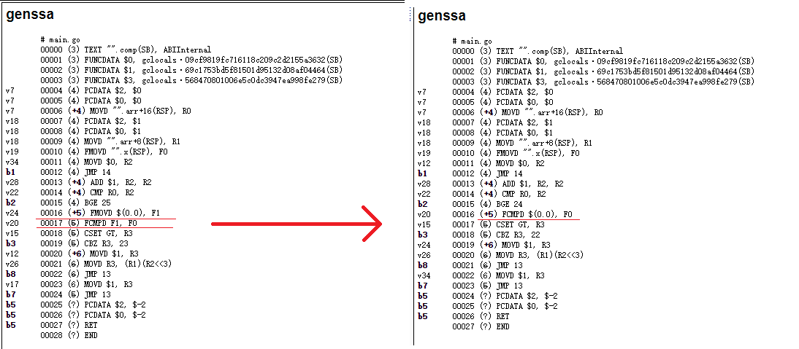

# 开源优化案例-优化编译规则提升变量比较性能
[编译器](https://baike.baidu.com/item/%E7%BC%96%E8%AF%91%E5%99%A8/8853067?fr=aladdin)的作用是将高级语言的源代码翻译为低级语言的目标代码。通常为了便于优化处理，编译器会将源代码转换为中间表示形式([Intermediate representation](http://wanweibaike.com/wiki-%E4%B8%AD%E9%96%93%E8%AA%9E%E8%A8%80))，很多编译优化过程都是作用在这个形式上，如下面将介绍的优化编译规则。  

在使用go编程时通常使用[go语言原生编译器](https://github.com/golang/go/blob/master/src/cmd/compile/README.md)，它包括[语法分析](https://baike.baidu.com/item/%E8%AF%AD%E6%B3%95%E5%88%86%E6%9E%90)、[AST变换](https://baike.baidu.com/item/%E6%8A%BD%E8%B1%A1%E8%AF%AD%E6%B3%95%E6%A0%91/6129952?fr=aladdin)、[静态单赋值SSA PASS](https://github.com/golang/go/tree/master/src/cmd/compile/internal/ssa)、机器码生成等多个编译过程。其中在生成SSA中间表示形式后进行了多个编译优化过程[Compiler PASS](https://github.com/golang/go/tree/master/src/cmd/compile/internal/ssa#compiler-passes)，每个PASS都会对SSA形式的函数做转换，如[deadcode elimination](https://github.com/golang/go/blob/master/src/cmd/compile/internal/ssa/deadcode.go)会检测并删除不会被执行的代码和无用的变量。在所有pass中[lower](https://github.com/golang/go/blob/master/src/cmd/compile/internal/ssa/lower.go)会根据编写好的优化规则将SSA中间表示从与体系结构(如[X86](https://baike.baidu.com/item/Intel%20x86?fromtitle=x86&fromid=6150538)、[ARM](https://baike.baidu.com/item/ARM%E6%9E%B6%E6%9E%84/9154278)等)无关的转换为体系结构相关的，转换后的形式在对应的体系结构上才是真正有效的。  

本文以go原生编译器中ARM64架构下浮点值变量与0比较的编译规则优化为例，讲解如何编写一个优化规则来帮助编译器生成更高质量的代码，进而提升程序的运行速度。

### 1. 浮点变量比较场景
[浮点数](https://baike.baidu.com/item/%E6%B5%AE%E7%82%B9%E6%95%B0/6162520)在应用开发中有广泛的应用，如用来表示一个带小数的金额或积分，经常会出现浮点数与0比较的情况，如向数据库录入一个商品时，为防止商品信息错误，可以检测录入的金额是否大于0，当用户购买产品时，可能需要先做一个验证，检测账户上金额是否大于0，如果满足再去查询商品信息、录入订单等，这样可以在交易的开始阶段排除一些无效或恶意的请求。

很多直播网站会举行年度活动，通过榜单展现用户活动期间累计送出礼物的金额，排名靠前的用户会登上榜单。经常用浮点数表示累计金额，活动刚开始时，需要屏蔽掉积分小于等于0的条目，可能会用到如下函数：

```go
func comp(x float64, arr []int) {
    for i := 0; i < len(arr); i++ {
        if x > 0 {
            arr[i] = 1
        }
    }
}
```

使用如下compile命令查看该函数的汇编代码(为便于理解，省略了部分无用代码)：
```bash
go tool compile -S main.go
```
```assembly
"".comp STEXT size=80 args=0x20 locals=0x0 leaf
        0x0000 00000 (main.go:3)        TEXT    "".comp(SB), LEAF|NOFRAME|ABIInternal, $0-32
#-------------------------将栈上数据取到寄存器中------------------------------
..................................
        0x0000 00000 (main.go:4)        MOVD    "".arr+16(FP), R0         // 取数组arr长度信息到寄存器R0中
..................................
        0x0004 00004 (main.go:4)        MOVD    "".arr+8(FP), R1          // 取数组arr地址值到寄存器R1中
        0x0008 00008 (main.go:4)        FMOVD   "".x(FP), F0              // 将参数x放入F0寄存器
        0x000c 00012 (main.go:4)        MOVD    ZR, R2                    // ZR表示0，此处R2 清零
#---------------------------for循环执行逻辑----------------------------------
        0x0010 00016 (main.go:4)        JMP     24                        // 第一轮循环直接跳到条件比较 不增加i
        0x0014 00020 (main.go:4)        ADD     $1, R2, R2                // i++
        0x0018 00024 (main.go:4)        CMP     R0, R2                    // i < len(arr) 比较
        0x001c 00028 (main.go:4)        BGE     68                        // i == len(arr) 跳转到末尾
#--------if x > 0---------
        0x0020 00032 (main.go:5)        FMOVD   ZR, F1                    // 将0复制到浮点寄存器F1
        0x0024 00036 (main.go:5)        FCMPD   F1, F0                    // 将浮点寄存器F0和F1中的值进行比较
#--------arr[i] = 1-------
        0x0028 00040 (main.go:5)        CSET    GT, R3                    // 如果F0 > F1 : R3 = 1
        0x002c 00044 (main.go:5)        CBZ     R3, 60                    // R3 == 1 即 x <= 0 跳转到60
        0x0030 00048 (main.go:6)        MOVD    $1, R3                    // x > 0
        0x0034 00052 (main.go:6)        MOVD    R3, (R1)(R2<<3)           // 将切片中值赋值为1
        0x0038 00056 (main.go:6)        JMP     20                        // 跳转到20 即循环操作i++处
#--------x <= 0 跳到i++----
        0x003c 00060 (main.go:6)        MOVD    $1, R3                    // x <= 0
        0x0040 00064 (main.go:5)        JMP     20
...........................................................................
...........................................................................
```
可以看到对于浮点数与0的比较，上述代码首先将0放入F1寄存器，之后使用FCMPD命令将F0寄存器中的变量值x与F1寄存器中的0值进行比较，对于长度为100的arr数组性能如下：

用例名-核心数|执行次数|每操作耗时 time/op
---|---|---|
FloatCompare-8   |  100000000  |  13.1ns ± 0%  

这里对汇编性能优化有一定基础的读者可能会产生疑问，为什么与常数0的比较还要都放入寄存器才能进行，这里需要了解[ARMV8](https://baike.baidu.com/item/ARMv8%E6%9E%B6%E6%9E%84/10103499)的浮点数比较指令[FCMP](http://infocenter.arm.com/help/index.jsp?topic=/com.arm.doc.dui0068b/Bcfejdgg.html)，有两种用法：
1. 将两个浮点寄存器中的值进行比较；
2. 将一个浮点寄存器中的值与数值0比较；  
  
可以看到对于FCMP指令，虽然浮点数与几乎所有常量比较都必须先放入寄存器中，但与0比较是一个特例，不需要将0放入一个浮点寄存器中，可以直接使用FCMP F0, $(0) 进行比较，因此上述生成的汇编代码并不是最优的

### 2. 优化编译规则提升浮点变量比较性能
看起来是个不复杂但大量出现的问题，编译器却做不到最优化，让代码爱好者倍感失望，怎么解决呢？下面是go社区浮点值变量与0比较的编译规则优化案例，它通过简单地增加编译规则给编译器赋能:    



优化后所有的浮点值变量在与0的比较运算中都会受益。为便于读者直观的看到具体的SSA中间表示和优化前后的变化，下面通过[go编译器工具](https://golang.org/src/cmd/compile/doc.go?h=go+tool+compile)查看详细的编译过程，编译器会将SSA PASS的详细过程记录到一个ssa.html文件，使用浏览器打开后能够直观的看到每个SSA PASS对中间表示形式的修改，先看下编译规则优化前的效果图:    

  

SSA PASS过程很多，主要关注最后一幅图，它是SSA PASS执行完的最终形式，注意图中v24和v20处，优化前将常量0放入寄存器F1中，将数组元素放入寄存器F0中，然后才会调用FCMPD浮点比较指令比较F1和F0中的值，并根据比较结果更新状态寄存器:  



现在问题已经很清晰了，优化的目的就是期望将两条指令：FMOVD $(0.0), F1 和 FCMPD F1, F0 转变为一条指令 FCMPD $(0.0), F0    

在这个优化中让编译器更智能的技术就是如下的[SSA编译规则](https://github.com/golang/go/blob/master/src/cmd/compile/internal/ssa/gen/generic.rules)，采用[S-表达式](https://baike.baidu.com/item/S-%E8%A1%A8%E8%BE%BE%E5%BC%8F/4409560?fr=aladdin)形式，它的作用就是找到匹配的表达式并转换为编译器期望的另一种效率更高或体系结构相关的表达式，如下图所示:     

    

上述优化中让编译器变得更聪明是因为他新学习到了下面的转换规则:  
```bash
// 将浮点数与0比较优化为表达式"FCMP $(0.0), Fn"
(FCMPS x (FMOVSconst [0])) -> (FCMPS0 x)                // 32位浮点数x与常数0比较 -> FCMPS0 x
(FCMPS (FMOVSconst [0]) x) -> (InvertFlags (FCMPS0 x))  // 常数0与32位浮点数x比较 -> (FCMPS0 x) 结果取反
(FCMPD x (FMOVDconst [0])) -> (FCMPD0 x)                // 64位浮点数x与常数0比较 -> FCMPD0 x
(FCMPD (FMOVDconst [0]) x) -> (InvertFlags (FCMPD0 x))  // 常数0与64位浮点数x比较 -> (FCMPD0 x) 结果取反
-------------------比较结果取反规则-----------------------
(LessThanF (InvertFlags x)) -> (GreaterThanF x)         // 取反(a < b) -> a > b
(LessEqualF (InvertFlags x)) -> (GreaterEqualF x)       // 取反(a <= b) -> a >= b
(GreaterThanF (InvertFlags x)) -> (LessThanF x)         // 取反(a > b) -> a < b
(GreaterEqualF (InvertFlags x)) -> (LessEqualF x)       // 取反(a >= b) -> a <= b
```
`注：由于不涉及，为便于理解，在上述例子中忽略了 <type>-类型、[auxint]-变量值、{aux}-非数值变量值、 [&& extra conditions]:-条件表达式等常用的表达式类型字段，感兴趣的读者可以根据上文列举的资料进一步探究`

细致的读者可能已经意识到另一个问题了，规则里面有两个精简的操作码FCMPS0和FCMPD0，他们为什么更优呢？首先根据名字也许已经猜到他们分别表示单精度浮点数(32bit)与0比较和双精度浮点数(64bit)与0比较，具体含义如下图所示：

 

现在读者已经了解了编译器SSA规则优化的各个组成部分，整理一下思路，将各部分串联起来可以画出如下精简的架构图，在go原生编译器中编译规则优化是SSA PASS的重要组成部分，他帮助编译器将一些体系结构无关的通用表达式转换为更高效的表达式，如对于冗余的条件判断取反表达式，去掉取反操作，并直接对判断条件取反，如invert(<=)转变为>，体系结构无关表达式转为与体系结构(ARM64、X86等)相关的表达式：  

 

将编译器更新到最新版，再生成SSA PASS执行结果图，可以看到两条指令变成了一条：  



### 3. 代码详解
下面是优化代码详解：
1. 操作码定义，这里增加了两个新的浮点数与0比较操作码：

```go
//--------------定义一个寄存器的输入参数掩码，此处fp表示所有浮点数寄存器----------------
fp1flags  = regInfo{inputs: []regMask{fp}}              
..............................
//--------------------------增加两个浮点数与0比较的操作码----------------------------
// 定义操作FCMPS0，将浮点寄存器中的参数(float32)与0进行比较,使用汇编指令FCMPS
{name: "FCMPS0", argLength: 1, reg: fp1flags, asm: "FCMPS", typ: "Flags"},   
// 定义操作FCMPD0，将浮点寄存器中的参数(float64)与0进行比较,使用汇编指令FCMPD
{name: "FCMPD0", argLength: 1, reg: fp1flags, asm: "FCMPD", typ: "Flags"},  
```

2. 根据操作码自动生成的opGen.op：

```go
{
    name:   "FCMPS0",                 // 操作名
    argLen: 1,                        // 参数个数
    asm:    arm64.AFCMPS,             // 对应的机器指令，此处为ARM64平台的FCMPS
    reg: regInfo{
        inputs: []inputInfo{          // 支持的输入参数寄存器
            {0, 9223372034707292160}, // F0 F1 F2 F3 F4 F5 F6 F7 F8 F9 F10 F11 F12 F13 F14 F15 F16 F17 F18 F19 F20 F21 F22 F23 F24 F25 F26 F27 F28 F29 F30 F31
        },
    },
},
{
    name:   "FCMPD0",                 // 操作名
    argLen: 1,                        // 参数个数
    asm:    arm64.AFCMPD,             // 对应的机器指令，此处为ARM64平台的FCMPD
    reg: regInfo{
        inputs: []inputInfo{          // 支持的输入参数寄存器
            {0, 9223372034707292160}, // F0 F1 F2 F3 F4 F5 F6 F7 F8 F9 F10 F11 F12 F13 F14 F15 F16 F17 F18 F19 F20 F21 F22 F23 F24 F25 F26 F27 F28 F29 F30 F31
        },
    },
},
```

3. 操作码FCMPS0和FCMPD0转为[prog](https://github.com/golang/go/blob/master/src/cmd/internal/obj/link.go)形式，每个prog对应具体的一条指令，链接时会用到。

```go
   case ssa.OpARM64FCMPS0,                     // FCMPS0 -> FCMPS $(0.0), F0
        ssa.OpARM64FCMPD0:                     // FCMPD0 -> FCMPD $(0.0), F0
        p := s.Prog(v.Op.Asm())                // FCMPS | FCMPD
        p.From.Type = obj.TYPE_FCONST          // $(0.0) 的类型为常数
        p.From.Val = math.Float64frombits(0)   // 比较的数 $(0.0)
        p.Reg = v.Args[0].Reg()                // 第二个源操作数，即用于比较的浮点数寄存器F0
```
   
4. 根据ARM64.rules自动生成的转换规则：

```bash
//--------------在lower pass中以下规则会挨个进行匹配，匹配后执行转换----------------
case OpARM64FCMPD:
    return rewriteValueARM64_OpARM64FCMPD_0(v)
case OpARM64FCMPS:
    return rewriteValueARM64_OpARM64FCMPS_0(v)
case OpARM64GreaterEqualF:
    return rewriteValueARM64_OpARM64GreaterEqualF_0(v)
case OpARM64GreaterThanF:
    return rewriteValueARM64_OpARM64GreaterThanF_0(v)
case OpARM64LessEqualF:
    return rewriteValueARM64_OpARM64LessEqualF_0(v)
case OpARM64LessThanF:
    return rewriteValueARM64_OpARM64LessThanF_0(v)

//------------------------x(float64)与0比较 转为 FCMPD0 x------------------------
func rewriteValueARM64_OpARM64FCMPD_0(v *Value) bool {
    b := v.Block
    _ = b
    // match: (FCMPD x (FMOVDconst [0]))
    // cond:
    // result: (FCMPD0 x)
    for {
        _ = v.Args[1]
        x := v.Args[0]
        v_1 := v.Args[1]
        if v_1.Op != OpARM64FMOVDconst {
            break
        }
        if v_1.AuxInt != 0 {                                      // 如果不是与0比较，则退出
            break
        }
        v.reset(OpARM64FCMPD0)                                    // 修改OpARM64FCMPD指令为OpARM64FCMPD0
        v.AddArg(x)
        return true
    }
    // match: (FCMPD (FMOVDconst [0]) x)
    // cond:
    // result: (InvertFlags (FCMPD0 x))
    for {
        _ = v.Args[1]
        v_0 := v.Args[0]
        if v_0.Op != OpARM64FMOVDconst {
            break
        }
        if v_0.AuxInt != 0 {                                      // 如果不是与0比较，则退出
            break
        }
        x := v.Args[1]
        v.reset(OpARM64InvertFlags)                               // 修改OpARM64FCMPD指令为OpARM64InvertFlags
        v0 := b.NewValue0(v.Pos, OpARM64FCMPD0, types.TypeFlags)  // 添加一个表示OpARM64FCMPD0指令的value(SSA表示一个值)
        v0.AddArg(x)
        v.AddArg(v0)
        return true
    }
    return false
}

//------------------------x(float32)与0比较 转为 FCMPS0 x------------------------
func rewriteValueARM64_OpARM64FCMPS_0(v *Value) bool {
    b := v.Block
    _ = b
    // match: (FCMPS x (FMOVSconst [0]))
    // cond:
    // result: (FCMPS0 x)
    for {
        _ = v.Args[1]
        x := v.Args[0]
        v_1 := v.Args[1]
        if v_1.Op != OpARM64FMOVSconst {
            break
        }
        if v_1.AuxInt != 0 {              // 如果操作数不为0，退出
            break
        }
        v.reset(OpARM64FCMPS0)            // 修改OpARM64FCMPS指令为OpARM64FCMPS0
        v.AddArg(x)
        return true
    }
    // match: (FCMPS (FMOVSconst [0]) x)
    // cond:
    // result: (InvertFlags (FCMPS0 x))
    for {
        _ = v.Args[1]
        v_0 := v.Args[0]
        if v_0.Op != OpARM64FMOVSconst {
            break
        }
        if v_0.AuxInt != 0 {
            break
        }
        x := v.Args[1]
        v.reset(OpARM64InvertFlags)
        v0 := b.NewValue0(v.Pos, OpARM64FCMPS0, types.TypeFlags)
        v0.AddArg(x)
        v.AddArg(v0)
        return true
    }
    return false
}

//--------------带反转标志的浮点数比较：invert(x >= 0) 转为 x <= 0----------------
func rewriteValueARM64_OpARM64GreaterEqualF_0(v *Value) bool {
    // match: (GreaterEqualF (InvertFlags x))
    // cond:
    // result: (LessEqualF x)
    for {
        v_0 := v.Args[0]
        if v_0.Op != OpARM64InvertFlags { // 不需反转，此转换规则不适用，退出继续后面的规则
            break
        }
        x := v_0.Args[0]
        v.reset(OpARM64LessEqualF)        // 修改OpARM64GreaterEqualF指令为OpARM64LessEqualF
        v.AddArg(x)
        return true
    }
    return false
}

//--------------带反转标志的浮点数比较操作：invert(x > 0) 转换 x < 0-----------------
func rewriteValueARM64_OpARM64GreaterThanF_0(v *Value) bool {
    // match: (GreaterThanF (InvertFlags x))
    // cond:
    // result: (LessThanF x)
    for {
        v_0 := v.Args[0]
        if v_0.Op != OpARM64InvertFlags { // 不需反转，此转换规则不适用，退出继续后面的规则
            break
        }
        x := v_0.Args[0]
        v.reset(OpARM64LessThanF)         // 修改OpARM64GreaterThanF指令为OpARM64LessThanF
        v.AddArg(x)
        return true
    }
    return false
}

//-------------带反转标志的浮点数比较操作：invert(x <= 0) 转为 x >= 0----------------
func rewriteValueARM64_OpARM64LessEqualF_0(v *Value) bool {
    // match: (LessEqualF (InvertFlags x))
    // cond:
    // result: (GreaterEqualF x)
    for {
        v_0 := v.Args[0]
        if v_0.Op != OpARM64InvertFlags { // 不需反转，此转换规则不适用，退出继续后面的规则
            break
        }
        x := v_0.Args[0]
        v.reset(OpARM64GreaterEqualF)     // 修改OpARM64LessEqualF指令为OpARM64GreaterEqualF
        v.AddArg(x)
        return true
    }
    return false
}

//-------------带反转标志的浮点数比较操作：invert(x < 0) 转为 x > 0----------------
func rewriteValueARM64_OpARM64LessThanF_0(v *Value) bool {
    // match: (LessThanF (InvertFlags x))
    // cond:
    // result: (GreaterThanF x)
    for {
        v_0 := v.Args[0]
        if v_0.Op != OpARM64InvertFlags { // 不需反转，此转换规则不适用，退出继续后面的规则
            break
        }
        x := v_0.Args[0]
        v.reset(OpARM64GreaterThanF)      // 替换OpARM64LessThanF指令为OpARM64GreaterThanF
        v.AddArg(x)
        return true
    }
    return false
}
```

### 4. 动手实验

感兴趣的读者可以按照本章自己动手执行一遍，体验编译规则优化如何帮助编译器变得更聪明：
- 环境准备
1. 硬件配置：鲲鹏(ARM64)云Linux服务器-[通用计算增强型KC1 kc1.2xlarge.2(8核|16GB)](https://www.huaweicloud.com/product/ecs.html)
2. [Golang发行版 1.12.1 — 1.12.17](https://golang.org/dl/)，此处开发环境准备请参考文章：[Golang 在ARM64开发环境配置](https://github.com/OptimizeLab/docs/blob/master/tutorial/environment/go_dev_env/go_dev_env.md)
3. [Golang github源码仓库](https://github.com/golang/go)下载，此处通过[Git安装和使用](https://git-scm.com/book/zh/v2)进行版本控制。
4. [测试代码](https://github.com/OptimizeLab/sample)
5. [编译规则代码生成工具](https://github.com/golang/go/blob/master/src/cmd/compile/internal/ssa/gen/README)

- 操作步骤
```bash
# 准备一个测试目录如/usr/local/src/
cd /usr/local/src
# 拉取测试用例代码
git clone https://github.com/OptimizeLab/sample
# 进入compile/ssa/opt_float_cmp_0_by_SSA_rule/src
cd /usr/local/src/sample/compile/ssa/opt_float_cmp_0_by_SSA_rule/src
# go发行版1.12没有包含这个优化的编译规则，因此直接使用发行版自带的go编译器
# 使用系统配置的go编译器，获取并查看优化前的ssa.html
GOSSAFUNC=comp go tool compile main.go
# 使用go benchmark命令测试性能并记录在文件before-ssa-bench.txt中
go test -bench BenchmarkFloatCompare -count=5 > before-ssa-bench.txt

# 接下来使用优化后的go编译器获取ssa.html
# 找到一个放置go源码仓的目录，如/usr/local/src/exp
mkdir /usr/local/src/exp
cd /usr/local/src/exp
# 通过git工具拉取github代码托管平台上golang的代码仓
git clone https://github.com/golang/go
# 拉取的最新源码已经包含了这个优化，因此可以直接编译获得最新的go编译器
# 进入源码目录
cd /usr/local/src/exp/go/src
# 编译go源码，生成go开发环境
bash ./make.bash
# 切换回测试代码目录
cd /usr/local/src/sample/compile/ssa/opt_float_cmp_0_by_SSA_rule/src
# 指定GOROOT目录，GOSSAFUNC关键字选择要展示的函数，本文中是comp，生成优化后的ssa.html
GOROOT=/usr/local/src/exp/go; GOSSAFUNC=comp go tool compile main.go
# 使用go benchmark命令测试性能并记录在文件after-ssa-bench.txt中
GOROOT=/usr/local/src/exp/go; go test -bench BenchmarkFloatCompare -count=5 > after-ssa-bench.txt
# benchstat 对比结果
benchstat before-ssa-bench.txt after-ssa-bench.txt

# 值得一提的是开发新的编译规则时，只需要编写.rules和Ops.go文件，并通过[编译规则代码生成工具]生成规则转换执行代码
# 自动生成的文件包括opGen.go 和 rewriteARM64.go
cd /usr/local/src/exp/go/src/cmd/compile/internal/ssa/gen
go run *.go
```

### 5. 结果对比
按[动手实验]章节操作，可以看到对于长度为100的切片耗时下降了6.11%：对比结果如下：

用例名/(字节数组大小-核心数)|优化前每操作耗时 time/op|优化后每操作耗时 time/op|耗时对比(p:偏差 n:执行次数)
---|---|---|---|
FloatCompare-8   |   13.1ns ± 0%   |   12.3ns ± 0%   |  -6.11%  (p=0.008 n=5+5) 

`[注]ns/op:每次函数执行耗费的纳秒时间;`
