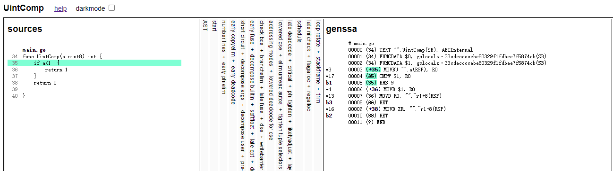
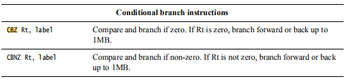
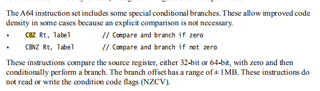
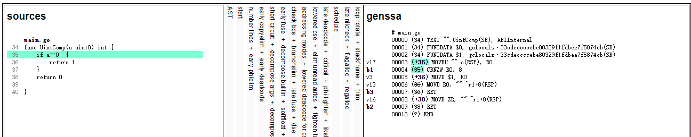

# 通过优化无符号整数与0/1对比提升软件性能
> 本文基于分析go社区在[ARM64无符号整型数对0/1比较](https://go-review.googlesource.com/c/go/+/246857)的优化方案，使用更好的指令组合，提升软件性能。

### 1.无符号整型与0/1对比和无符号普通对比有什么差别

无符号普通对比,以unit8举例子，unit16,unit32,unit64一样适用。
```go
func UintComp(a uint8) int {
	if a < 1 {
		return 1
	}
	return 0
}
```
通过GOSSAFUNC查看genssa编译阶段生成的指令。

可以看到指令
```
MOVBU "".a(RSP), R0 #MOVBU指令是将a的值读到寄存器R0中
CMPW $1, R0         #通过CMPW指令将1和R0放到一个逻辑运算寄存器中
BHS 9               #BHS是用做无符号整型数大于等于对比，相当于a>=1时就不进入判断语句
```


而BHS、CBZ等条件分支指令[ARM64汇编指令](https://developer.arm.com/documentation/den0024/a/the-a64-instruction-set/data-processing-instructions/conditional-instructions?lang=en)在ARM64Ops.go是这样声明的。
```go
//这里的代码是对应这ARM64手册中的条件分支指令
blocks := []blockData{
	{name: "EQ", controls: 1},//这个相当于 a==b
	{name: "NE", controls: 1},//这个相当于 a!=b
	{name: "LT", controls: 1},//有符号数，相当于a<b
	{name: "LE", controls: 1},
	{name: "GT", controls: 1},
	{name: "GE", controls: 1},
	{name: "ULT", controls: 1},//而ULT对比LT加了个U相当于无符号小于D
	{name: "ULE", controls: 1},
	{name: "UGT", controls: 1},
	{name: "UGE", controls: 1},//而UGE就相当于我们上面所展示出来的BHS
	{name: "Z", controls: 1},                  // Control == 0 (take a register instead of flags)
	{name: "NZ", controls: 1},                 // Control != 0
	{name: "ZW", controls: 1},                 // Control == 0, 32-bit
	{name: "NZW", controls: 1},                // Control != 0, 32-bit
	{name: "TBZ", controls: 1, aux: "Int64"},  // Control & (1 << AuxInt) == 0
	{name: "TBNZ", controls: 1, aux: "Int64"}, // Control & (1 << AuxInt) != 0
	{name: "FLT", controls: 1},
	{name: "FLE", controls: 1},
	{name: "FGT", controls: 1},
	{name: "FGE", controls: 1},
	{name: "LTnoov", controls: 1}, // 'LT' but without honoring overflow
	{name: "LEnoov", controls: 1}, // 'LE' but without honoring overflow
	{name: "GTnoov", controls: 1}, // 'GT' but without honoring overflow
	{name: "GEnoov", controls: 1}, // 'GE' but without honoring overflow
	}	
```
而ARM64给我们提供了一个[条件分支指令](https://developer.arm.com/documentation/den0024/a/the-a64-instruction-set/flow-control?lang=en)可以直接和0对比后直接跳转分支，不需要将数值放到逻辑寄存器中在进行判断，因此可以减少使用一个指令。



### 2.如何进行优化
对于一个无符号整型x，我们可以把他判断式转化一下，因为无符号整型最小值为0。
```
0 <  x  =>  x != 0  #当x大于0时，为x不等于0
x <= 0  =>  x == 0  #当x小于或等于0时，为x等于0
x <  1  =>  x == 0  #当x小于1时，为x等于0
1 <= x  =>  x != 0  #当x大于等于1时，为x不等于0
```



可以清楚的看到当a==0时只用了一条指令就完成了判断。

### 3.代码实现
现在思路已经很明确，就是将上面的式子转化成与0做判断。

在这个优化中让编译器更智能的技术就是如下的[SSA编译规则](https://github.com/golang/go/blob/master/src/cmd/compile/internal/ssa/gen/generic.rules)，采用[S-表达式](https://baike.baidu.com/item/S-%E8%A1%A8%E8%BE%BE%E5%BC%8F/4409560?fr=aladdin)形式，它的作用就是找到匹配的表达式并转换为编译器期望的另一种效率更高或体系结构相关的表达式。


在cmd/internal/ssa/gen/ARM64.rules中加入新的SSA编译规则
```
// 0 <  x  =>  x != 0
// x <= 0  =>  x == 0
// x <  1  =>  x == 0
// 1 <= x  =>  x != 0
(Less(8U|16U|32U|64U) zero:(MOVDconst [0]) x) => (Neq(8|16|32|64) zero x)
 //0是否小于无符号整型x => 无符号整型x是否不等于0
(Leq(8U|16U|32U|64U) x zero:(MOVDconst [0]))  => (Eq(8|16|32|64) x zero)
 //无符号整型x是否小于或等于0 => 无符号整型x是否等于0
(Less(8U|16U|32U|64U) x (MOVDconst [1])) => (Eq(8|16|32|64) x (MOVDconst [0]))
 //无符号整型x是否小于1 => 无符号整型x是否等于0
(Leq(8U|16U|32U|64U) (MOVDconst [1]) x)  => (Neq(8|16|32|64) (MOVDconst [0]) x)
 //1是否小于无符号整型x => 无符号整型x是否不等于0
```
然后再cmd/internal/ssa/gen这个路径下输入
```
go run *.gon
```
编译器会在根据ARM64.rules中之前写的编译规则在ARM64Ops.go自动生成go的代码

### 4.结论
上述优化利用了无整型数与0或1的对比的特殊性，根据ARM64独有的指令进行了优化。使得符合以下该情况 0 <  x , x <= 0 , x < 1 , 1 <= x 都会得到优化。使得这些情况下做判断的时候，比以往做对比的时候少用了一条指令。虽然优化较小，但是可以使海量的代码有速度的提升，这是一个很有价值的优化。


