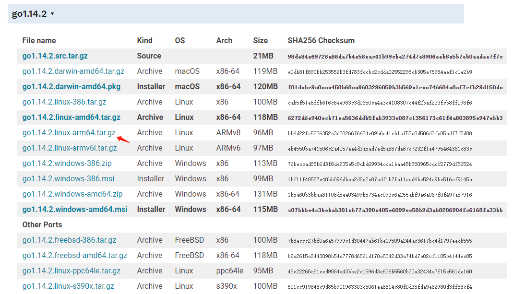
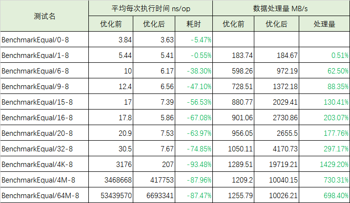

# Golang 在ARM64开发环境配置

### 1. 在ARM64服务器上配置开发环境

Go语言开发包是go语言的实现，内容包括版本的语法、编译、运行、标准库以及其他一些必要资源。

1） Goland语言包官网：http://goland.org/dl/。

2） 下载打开页面之后根据自己的需求选择对应平台下载，本次安装选择[go1.14.2.linux-arm64](https://dl.google.com/go/go1.14.2.linux-arm64.tar.gz) ,是发行版1.14.2对应linux系统、arm64处理器架构的特定版本。如下图所示：



3） 进入你的linux平台，进入你存放安装包的目录下，输入命令：

```linux
wget https://dl.google.com/go/go1.14.2.linux-arm64.tar.gz
```

进行下载，下载结果如图所示。


4） 执行tar解压到/usr/local目录下（官方推荐)，得到go文件夹。

```linux
tar -C /usr/local -zxvf go1.14.2.linux-arm64.tar.gz
```

得到go文件夹内容，结果如图所示：


5） 配置环境变量，输入命令：

```linux
export GOROOT=/usr/loacl/go
export PATH=$PATH:$GOROOT/bin
```

6） 输入以下命令就可以得到你的版本号：

```linux
go version
```

7） 新建一个工作目录并且创建第一个工程目录：

```linux
#创建工作空间
mkdir $HOME/go
#编辑 ~/.bash_profile 文件
#将你的工作目录声明到环境变量中
export GOPATH=$HOME/go
#保存退出后source一下
source ~./bash_profile
#之后创建并进入你的第一个目录
mkdir -p $GOPATH/hello && cd $GOPATH/src/hello
```

8） 在工作目录下创建名为hello.go 的文件。内容如下：

```go
package main

import "fmt"

func main() {
	fmt.Printf("hello, world\n")
}
```

9） 使用命令：go build hello.go，来构建然后使用命令：./hello来运行。


10） 到这里Golang开发环境就准备完毕了

### 2. Golang官方仓库准备

Golang是一个开源的项目，每个人都可以贡献代码，下面我们讲解如何获取官方仓库

```bash
$ git clone https://go.googlesource.com/go
$ cd go/src
```

根据Commit ID可以自由创建分支进行测试，如下通过ID: 0c68b79创建了名称为test-simd的分支

```bash
$ git checkout -b test-simd 0c68b79
```

从源码编译并测试Golang

```bash
$ cd go/src
$ bash all.bash 
```

编译后我们将在go/bin目录下获得go工具。

### 3 .使用benchmark获取性能分析

benchmark基准测试是测量一个程序在固定工作负载下的性能。在Go语言中，基准测试以Benchmark为前缀并且带有一个 *testing.B 类型的参数。

#### 1，Go源码包中有对应的基准测试程序

基准测试的代码文件必须以_test.go结尾，基准测试的函数必须以Benchmark开头。

首先进入文件目录：

```
go/src
```

在对标准库的函数进行基准测试的时候可以在命令行执行以下命令，就可以执行你指定的包中所有以Benchmark开头的测试文件：

```
go test xxx/yyy -v -bench ^Benchmark -benchmem -count n -run ^$ >> zzz.txt
```

`注：`

`xxx/yyy：表示进行基准测试的包所在的目录文件，例如：math/bits；`

`n：表示对测试执行几次基准测试`

`zzz.txt：表示将计算得到的信息保存在zzz.txt文件中；`

#### 2，Go源码包中没有对应的基准测试程序

如果在Go标准库中并没有指定函数的基准测试，或者你需要自己写一个函数的基准测试，那么你需要满足以下规则：

1. 基准测试的代码文件必须以_test.go结尾，基准测试函数以Benchmark开头；

2. 基准测试函数只有一个参数，即b *testing.B，且无返回值，那么基准测试名为：

   ```
   func BenchmarkFUNCNAME(b *testing.B)
   ```

3. 将被测试的代码放在最后的循环中

4. 自己编写基准测试程序举例如下：

   ```go
   package test
   
   import (
       "testing"
   )
   
   func add(a, b int) int {
       return a + b
   }
   
   func BenchmarkAdd(b *testing.B) {
       for i := 0; i < b.N; i++ {
           _ = add(i, i)
       }
   }
   ```

然后保存文件。

进入文件所在目录下，在命令行输入以下命令：

```
go test -v -bench ^Benchmark . -benchmem -count n -run ^$ >> xxx.txt
```

`注：`

`n：表示测试样本数据`

`xxx.txt：表示将测试结果存储在xxx.txt文件中`

### 4  使用pprof工具进一步分析性能

通过 go 提供的性能分析工具 pprof 操作 cpu.out 文件，我们可以轻松查看并分析对 cpu 性能消耗大的函数。

```bash
$ go tool pprof cpu.out
File: bytes.test
Type: cpu
Time: Apr 16, 2020 at 6:20pm (CST)
Duration: 19.97s, Total samples = 19.93s (99.81%)
Entering interactive mode (type "help" for commands, "o" for options)
(pprof) top 3
Showing nodes accounting for 19.75s, 99.10% of 19.93s total
Dropped 14 nodes (cum <= 0.10s)
Showing top 3 nodes out of 8
      flat  flat%   sum%        cum   cum%
    14.32s 71.85% 71.85%     14.32s 71.85%  bytes.Equal /home/chan/go/src/runtime/asm_arm64.s
     4.06s 20.37% 92.22%     17.49s 87.76%  bytes_test.bmEqual.func1 /home/chan/go/src/bytes/bytes_test.go
     1.37s  6.87% 99.10%      2.31s 11.59%  bytes_test.BenchmarkEqual.func1 /home/chan/go/src/bytes/bytes_test.go
```

此处 " top 3 " 列出了 cpu 消耗前 3 的函数。其中各项含义如下：

- flat：当前函数占用CPU的耗时  
- flat%: 当前函数占用CPU的耗时百分比  
- sun%：函数占用CPU的耗时累计百分比  
- cum：当前函数加上调用当前函数的函数占用CPU的总耗时  
- cum%：当前函数加上调用当前函数的函数占用CPU的总耗时百分比  
- 最后一列：函数名称  

我们通过 pprof 的 list 命令可以查看 bytes.Equal 方法内部的详细耗时信息：

```bash
(pprof) list bytes.Equal
Total: 19.93s
ROUTINE ======================== bytes.Equal in /home/xxx/go/src/runtime/asm_arm64.s
    14.32s     14.32s (flat, cum) 71.85% of Total
         .          .    865:   MOVD    R0, ret+24(FP)
         .          .    866:   RET
         .          .    867:
         .          .    868:// TODO: share code with memequal?
         .          .    869:TEXT bytes·Equal(SB),NOSPLIT,$0-49
     140ms      140ms    870:   MOVD    a_len+8(FP), R1
     410ms      410ms    871:   MOVD    b_len+32(FP), R3
      70ms       70ms    872:   CMP     R1, R3          // unequal lengths are not equal
         .          .    873:   BNE     notequal
     490ms      490ms    874:   MOVD    a+0(FP), R0
     300ms      300ms    875:   MOVD    b+24(FP), R2
         .          .    876:   ADD     R0, R1          // end
         .          .    877:loop:
     2.63s      2.63s    878:   CMP     R0, R1
      10ms       10ms    879:   BEQ     equal           // reaches the end
     5.72s      5.72s    880:   MOVBU.P 1(R0), R4
        4s         4s    881:   MOVBU.P 1(R2), R5
         .          .    882:   CMP     R4, R5
      40ms       40ms    883:   BEQ     loop
         .          .    884:notequal:
         .          .    885:   MOVB    ZR, ret+48(FP)
         .          .    886:   RET
         .          .    887:equal:
     380ms      380ms    888:   MOVD    $1, R0
     130ms      130ms    889:   MOVB    R0, ret+48(FP)
         .          .    890:   RET
         .          .    891:
         .          .    892:TEXT runtime·return0(SB), NOSPLIT, $0
         .          .    893:   MOVW    $0, R0
         .          .    894:   RET
```

上面结果展示的是 bytes.Equal 汇编代码的耗时情况，该汇编代码在 runtime 包的 asm_arm64.s 文件中，可以看到主要的耗时热点是 CMP 指令和 MOVBU.P 指令

### 5. 使用benchstat对比优化前后的性能数据

有时我们做了一个优化，希望比较下优化前后两组benchmark数据，这时候我们可以使用benchstat，

```bash
benchstat before-optimize after-optimize
```

获得类似如下的性能对比结果
  
