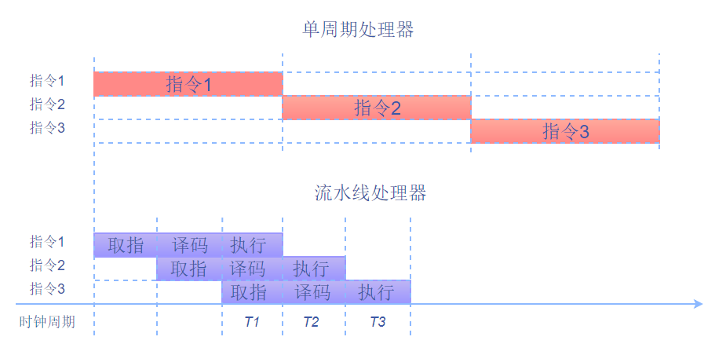

# 开源优化案例讲解 - 消除CPU流水线气泡提升软件并行化处理能力

[流水线技术](https://zh.wikipedia.org/wiki/%E6%B5%81%E6%B0%B4%E7%BA%BF_(%E8%AE%A1%E7%AE%97%E6%9C%BA))通过使用多个硬件并行工作，提高处理器的运行效率和吞吐率，成为提高处理器性能的重要技术。

对一组数据进行计算时，处理所需的总时间为每一个数据处理所用的时间和。如果将数据处理的每一个操作分割为若干个子过程，然后每一个子过程并行执行，那么程序的执行效率将会提高，所需时间就会减少。并行计算可以很大程度上提高程序的运行速度，从本质上讲，流水线技术是一种准并行处理技术，在程序执行时多条指令重叠操作的一种准并行处理技术。

以ARM三级流水线为例，处理器将每条指令分为取指、译码、执行三个阶段，分别在不同的部件上完成。未进行流水线优化时，完成三条指令所需的时间是每个指令执行的时间和；使用流水线之后，三条指令的执行是重叠的。实际上，流水线并不会缩短单条指令的执行时间，而是会提高指令的吞吐量。在下图中，从T1开始，用3个时钟周期就可以完成执行3条指令。

本文通过Go语言结合ARM硬件提升性能，介绍应用流水线技术的方法。



`注：寄存器是CPU内用来暂存指令、数据和地址的。寄存器的存贮容量有限，读写速度非常快。寄存器的种类包括通用寄存器、浮点寄存器等。在ARM架构下拥有31个通用寄存器。`


### 1，程序性能提升问题

在一些场景下，对程序的性能有极致的要求，需要最大化的提升程序的性能。在这种极端的场景下，可以适当的牺牲代码可读性，结合硬件优化技术来满足极致的性能提升。比如，当你需要求一个整型数组内所有元素的和时，你可能会写成下面的程序。如果在一些场景下，需要你继续提高这段代码的性能，那么你就可以结合CPU流水线技术对代码进行优化。

```go
// 求数组arr中所有元素的和
func Cumsum(arr []int) (count int) {
	for i := 0; i < len(arr); i++ {
		count += arr[i]     
	}
	return
}
```


### 2，性能问题以及优化方案分析

上面的程序在计算时，每次循环完成一个元素的计算。整体的耗时为所有元素的计算时间之和。因为上面的程序是顺序执行的，在上面的程序中，通过遍历数组元素，每次循环将一个元素累加到count，循环结束得到最终结果。

每次循环完成一个元素的读取、计算、写入，并且每一个元素的计算都需要加在count变量中，当上一个数据没有计算完成，后一个数据就不能进行计算，因为后一个数据的计算结果依赖于上一个数据的计算结果count。这样就是数据依赖。此外，由于数据依赖，当前数据没有计算完成，后面的指令不能进行，导致CPU等待，产生延迟，影响执行效率。

如果在程序运行时，通过一次完成多个数据的计算，提高硬件（寄存器）利用率那么就可以达到减少对前一个计算数据的依赖以及并行化处理的目的，从而提高程序的性能。

由对上面的程序在极端场景下的性能问题分析以及流水线技术我们可以得出一个优化方案，当数组的长度大于8时，可以批量处理计算8个元素的和；当数组长度大于4且小于8时，每次处理4个数值的操作，以此类推。


### 4，优化代码

按照上面的优化思路，在一些极端场景下我们可以写成下面的Go代码进行运算（现实中我们为了程序的可读不会这样写，这里为了演示减少数据依赖以及流水线优化技术）。

   ```go
   func CumsumChunk8(arr []int) (count int) {
	if len(arr) == 0 {
		return
	}

    // ------------处理8个元素------------
    // 数组长度 >= 8时，批量处理8个元素 
	for len(arr) >= 8 {
		a := arr[0] + arr[1]        // 每两个元素相加存储在一个变量中，减少数据依赖 
		b := arr[2] + arr[3]
		c := arr[4] + arr[5]
		d := arr[6] + arr[7]
		a += c					  // 变量相加，完成4个元素的计算
		b += d
		count += a + b			   // 将最后的结果存储在count中
		arr = arr[8:]               // 更新数组大小
	}

    // ------------处理4个元素------------
	if len(arr) >= 4 {
		a := arr[0] + arr[1]
		b := arr[2] + arr[3]
		count += a + b
		arr = arr[4:]
	}

    // ------------处理2个元素------------
	if len(arr) >= 2 {
		count += arr[0] + arr[1]
		arr = arr[2:]
	}
	// ------------处理1个元素------------
	if len(arr) == 1 {
		count += arr[0]
	}
	return
   }
   ```

在Go语言的层面，并不能看到底层指令的使用以及硬件部件（寄存器）的利用率。我们将代码进行编译得到底层汇编程序，在汇编的层面可以看到对硬件部件的使用以及指令变化，代码优化前的汇编程序如下所示：

   

在上面的汇编代码中，可以发现对每一个元素的计算相加用到的寄存器有R3和R5，每一次的计算结果都保存在寄存器R3中，下一个元素的计算依赖于R3中的数据，每次循环完成一个元素的计算和写入。在上面的程序中，指令使用不合理导致CPU等待执行，产生延迟效果，影响执行效率。这个延迟的过程即为CPU气泡。并且，寄存器的使用率也不高。我们将优化后的代码编译一下得到汇编程序，看一下在优化之后的数据依赖以及寄存器的使用，代码优化后的汇编程序如下所示：

   

在优化后的汇编程序中，可以看到，在对8个元素进行批量处理的时候使用了寄存器R4，R5，R6，R7，R8。指令在执行时并不完全是遵守顺序执行，当前指令的运行结果不影响后续指令的运行，那么就可以执行乱序执行。

[乱序执行](https://zh.wikipedia.org/wiki/%E4%B9%B1%E5%BA%8F%E6%89%A7%E8%A1%8C)（out-of-order execution）是指CPU采用了允许将多条指令不按程序规定的顺序分开发送给各相应电路单元处理的技术。比如，当前有若干条指令，此时CPU将根据各单元的空闲状态和指令能否提前执行的情况，将能提前执行的指令立即发送给相应电路执行。  

在计算时不依赖上一个元素的计算结果，8个元素计算完成功之后进行4个变量的计算，最后将结果保存在寄存器R3中。本次计算中的8个元素使用了更多的寄存器用于存放数据从而没有依赖关系。但是，接下来的元素计算与本次的计算是有依赖关系的，但是依赖强度相对优化前变弱。


### 5，优化结果

我们对比优化前后的性能，使用[benchstat工具](https://godoc.org/golang.org/x/perf/cmd/benchstat)进行性能对比，结果如下：

   ```bash
   name            old time/op    new time/op    delta
   Cumsum/0-8        5.01ns ± 0%    3.86ns ± 0%  -22.95%  (p=0.002 n=8+10)
   Cumsum/1-8        5.40ns ± 0%    5.40ns ± 0%     ~     (all equal)
   Cumsum/7-8        10.6ns ± 0%     7.1ns ± 0%  -33.44%  (p=0.000 n=7+10)
   Cumsum/8-8        11.4ns ± 0%     7.7ns ± 0%  -32.25%  (p=0.000 n=9+10)
   Cumsum/15-8       16.7ns ± 0%    10.4ns ± 0%  -37.43%  (p=0.000 n=10+10)
   Cumsum/16-8       17.4ns ± 0%    10.7ns ± 1%  -38.33%  (p=0.000 n=10+10)
   Cumsum/127-8      88.8ns ± 0%    45.4ns ± 0%  -48.86%  (p=0.000 n=9+8)
   Cumsum/4095-8     3.17µs ± 0%    1.28µs ± 0%  -59.66%  (p=0.000 n=10+9)
   Cumsum/99999-8    86.3µs ± 3%    53.4µs ±15%  -38.11%  (p=0.000 n=10+10)
   ```

优化后的代码性能提升高了 **30% +**，经过优化之后，性能得到提升，很显然，这和我们的预期是一致的。

`注：`

`Cumsum/4095-8：Cumsum表示测试项；4095表示数据大小；8表示函数运行时的GOMAXPROCS值`

`ns ： 表示每次操作的耗时；`

`x%：表示样本的离散值；`

`(p = 0.002, n = 8 + 10)：P表示结果的可信程度，P值越大可信程度越低；n表示样本数量；`


### 6，动手实践

如果你想手动体验优化前后的效果，可以按照以下环境配置进行实践操作。

- 硬件配置：鲲鹏(ARM64)云Linux服务器-[通用计算增强型KC1 kc1.2xlarge.2(8核|16GB)](https://www.huaweicloud.com/product/ecs.html)

- [Golang发行版 >= 1.12.1](https://golang.org/dl/)，此处开发环境准备请参考文章：[Golang 在ARM64开发环境配置](https://github.com/OptimizeLab/docs/blob/master/tutorial/environment/go_dev_env/go_dev_env.md)

环境准备完毕之后，在命令行输入命令新建测试文件：

```
touch xxxx.go		// 这样就新建了一个xxxx.go文件
```

然后将想要测试的代码输入到文件中，保存后关闭。

然后在命令行输入以下命令然后运行：

```
GOSSAFUNC=yyyy go build xxxx.go
```

`注：`

`yyyy：表示你想要测试的函数名`

`xxxx：表示测试函数所在的Go文件的名字`

这时会在目录下生成一个ssa.html的链接文件，用浏览器打开后就可以看到在ARM下的汇编指令程序以及寄存器的使用情况。

### 7，总结

由上面的分析可知，当操作相同、各操作间无相关性时，流水线技术可以大大提高程序的执行效率，但是流水线并不能减少（一般略有增加）单条指令的执行时间，但是通过提高指令的吞吐量可以来提高程序的执行效率。若想提高流水线的性能，需要尽量减少数据相关，增加一次处理的指令数量。流水线优化对于程序在ARM上的优化十分重要。