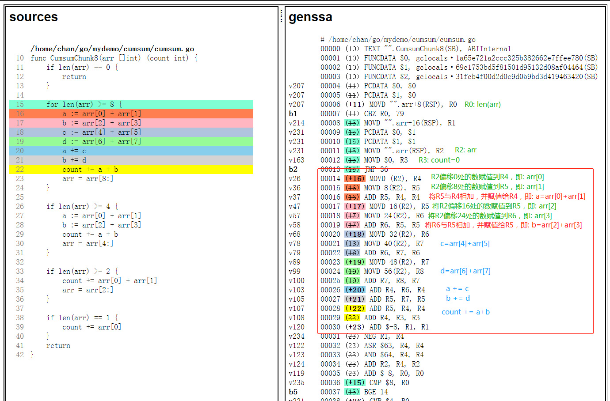

# 结合ARM流水线技术进行程序性能优化

### 关于流水线技术

对一组数据进行计算时，每一个数据处理所用的时间的和为处理这组数据所需要的的时间。如果将执行的操作分割为若干个子过程，然后每一个子过程并行执行，那么程序的执行效率将会提高。并行计算可以很大程度上提高程序的运行速度，现今的并行技术可以分为资源共享、资源重复、时间重叠三个方面。从本质上讲，流水线技术是一种时间重叠技术，在程序执行时多条指令重叠操作的一种准并行处理技术。在很多使用场景下，通过使用流水线技术可以使程序的性能更好。流水线执行相比于顺序执行，使用了更多的硬件（寄存器），并且后一个数据的计算不依赖于前一个数据。这样在一次操作中就可以执行多个动作。

### 1，极端场景下的数组求和问题

当你需要求一个整型数组内所有元素的和时，你可能会写成下面的程序。但是在一些极端场景下，当数组的长度很大时，由于在一次循环中只完成了一个元素的计算，那么完成整个数组的计算会消耗大量的时间。。

```go
// 求切片arr中所有元素的和
func Cumsum(arr []int) (count int) {
	for i := 0; i < len(arr); i++ {
		count += arr[i]     
	}
	return
}
```

### 2，性能问题以及优化方案分析

上面的程序在计算时，每次循环完成一个元素的读取、计算、写入。整体的耗时为所有元素的计算时间之和。在一些极端情况下，比如数据量很大时的效率很低。此外，在上面的程序中，通过遍历切片元素，每次循环将一个元素累加到count，循环结束得到最终结果。每次循环完成一个元素的读取、计算、写入，并且每一个元素的计算都需要加在count变量中，当上一个数据没有计算完成，后一个数据就不能进行计算，因为后一个数据的计算结果依赖于上一个数据的计算结果count。这样就形成了数据依赖。

如果在程序运行时，通过一次完成多个数据的计算，提高硬件（寄存器）利用率那么就可以达到减少对前一个计算数据的依赖以及并行化处理的目的，从而提高程序的性能。由对上面的程序在极端场景下的性能问题分析以及流水线技术我们可以得出一个优化方案，当数组的长度大于8时，可以批量处理计算8个元素的和；当数组长度大于4且小于8时，每次处理4个数值的操作，以此类推。

### 4，优化代码

按照上面的优化思路，在一些极端场景下我们可以写成下面的Go代码进行运算（现实中我们为了程序的可读性不会这样写，这里为了演示减少数据依赖以及提高硬件部件的利用率）。

   ```go
   func CumsumChunk8(arr []int) (count int) {
	if len(arr) == 0 {
		return
	}

    // ------------处理8个元素------------
    // 数组长度 >= 8时，批量处理8个元素 
	for len(arr) >= 8 {
		a := arr[0] + arr[1]        // 每两个元素相加存储在一个变量中，减少数据依赖 
		b := arr[2] + arr[3]
		c := arr[4] + arr[5]
		d := arr[6] + arr[7]
		a += c			    // 变量相加，完成4个元素的计算
		b += d
		count += a + b	            // 将最后的结果存储在count中
		arr = arr[8:]               // 更新数组大小
	}

    // ------------处理4个元素------------
	if len(arr) >= 4 {
		a := arr[0] + arr[1]
		b := arr[2] + arr[3]
		count += a + b
		arr = arr[4:]
	}

    // ------------处理2个元素------------
	if len(arr) >= 2 {
		count += arr[0] + arr[1]
		arr = arr[2:]
	}
	// ------------处理1个元素------------
	if len(arr) == 1 {
		count += arr[0]
	}
	return
   }
   ```

在Go语言的层面，并不能看到底层指令的使用以及硬件部件（寄存器）的利用率。我们将代码进行编译得到底层汇编程序，在汇编的层面可以看到对硬件部件的使用以及指令变化，代码优化前的汇编程序如下所示：

   

在上面的汇编代码中，可以发现对每一个元素的计算相加用到的寄存器有R3和R5，每一次的计算结果都保存在寄存器R3中，下一个元素的计算依赖于R3中的数据，每次循环完成一个元素的计算和写入。并且，寄存器的使用率也不高。我们将优化后的代码编译一下得到汇编程序，看一下在优化之后的数据依赖以及寄存器的使用，代码优化后的汇编程序如下所示：

   

在优化后的汇编程序中，可以看到，在对8个元素进行批量处理的时候使用了寄存器R4，R5，R6，R7，R8。在计算时不依赖上一个元素的计算结果，8个元素计算完成功之后进行4个变量的计算，最后将结果保存在寄存器R3中。本次计算中的8个元素使用了更多的寄存器用于存放数据从而没有依赖关系。但是，接下来的元素计算与本次的计算是有依赖关系的，但是依赖关系变弱。

### 5，优化结果

我们对比优化前后的性能，使用[benchstat工具](https://godoc.org/golang.org/x/perf/cmd/benchstat)进行性能对比，结果如下：

   ```bash
   name            old time/op    new time/op    delta
   Cumsum/0-8        5.01ns ± 0%    3.86ns ± 0%  -22.95%  (p=0.002 n=8+10)
   Cumsum/1-8        5.40ns ± 0%    5.40ns ± 0%     ~     (all equal)
   Cumsum/7-8        10.6ns ± 0%     7.1ns ± 0%  -33.44%  (p=0.000 n=7+10)
   Cumsum/8-8        11.4ns ± 0%     7.7ns ± 0%  -32.25%  (p=0.000 n=9+10)
   Cumsum/15-8       16.7ns ± 0%    10.4ns ± 0%  -37.43%  (p=0.000 n=10+10)
   Cumsum/16-8       17.4ns ± 0%    10.7ns ± 1%  -38.33%  (p=0.000 n=10+10)
   Cumsum/127-8      88.8ns ± 0%    45.4ns ± 0%  -48.86%  (p=0.000 n=9+8)
   Cumsum/4095-8     3.17µs ± 0%    1.28µs ± 0%  -59.66%  (p=0.000 n=10+9)
   Cumsum/99999-8    86.3µs ± 3%    53.4µs ±15%  -38.11%  (p=0.000 n=10+10)
   ```

注：

[ns]:表示每次操作的耗时
[x%]:表示样本离散值
[(p=...   n=...)]:p表示结果的可信程度，p值越大可信程度越低；n表示样本数量

优化后的代码性能提升高了 **30% +**，经过优化之后，性能得到提升，很显然，这和我们的预期是一致的。

### 6，环境要求

如果你想手动体验优化前后的效果，可以按照以下环境配置进行实践操作。

硬件配置：鲲鹏(ARM64)云Linux服务器-[通用计算增强型KC1 kc1.2xlarge.2(8核|16GB)](https://www.huaweicloud.com/product/ecs.html)

[Golang发行版 >= 1.12.1](https://golang.org/dl/)，此处开发环境准备请参考文章：[Golang 在ARM64开发环境配置](https://github.com/OptimizeLab/docs/blob/master/tutorial/environment/go_dev_env/go_dev_env.md)

