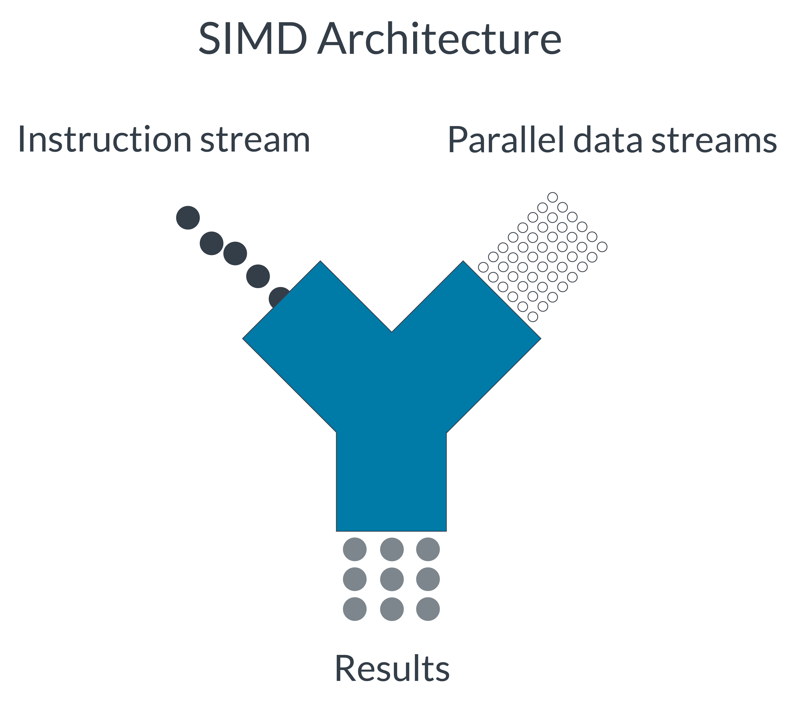
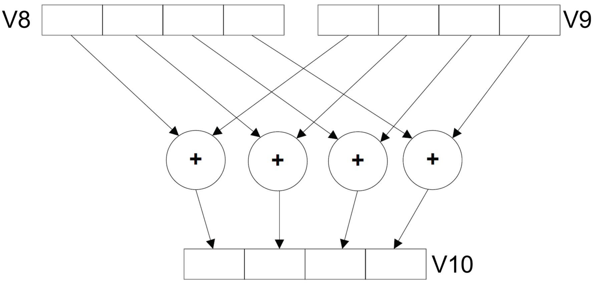
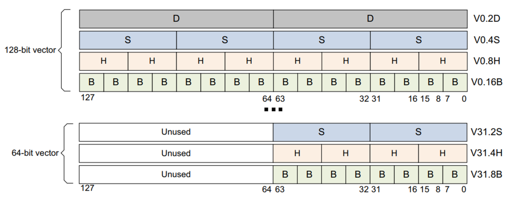
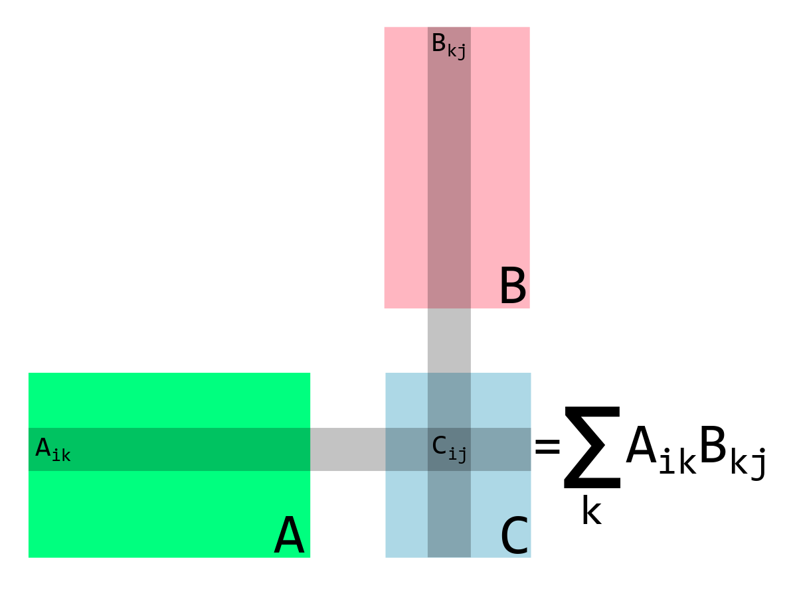

<summary><font size=5> SIMD优化与NEON指令集</font></summary>

// this part was reference to ARM official document [introducing-neon-for-armv8-a](https://developer.arm.com/architectures/instruction-sets/simd-isas/neon/neon-programmers-guide-for-armv8-a/introducing-neon-for-armv8-a)

### SIMD技术和NEON指令集结构
所谓的SIMD指令，指的是single instruction multiple data，即单指令多数据运算，其目的就在于帮助CPU实现数据并行，提高运算效率。  
  
而NEON是SIMD技术在ARM结构系列芯片上的实现，其提供了原有ARM 指令集结构之外的拓展指令集及结构（额外的NEON寄存器）。NEON指令集结构将对多媒体领域的音视频编解码、用户接口、2D/3D图形或游戏进行加速，提示用户体验。同时，Neon还可以加速信号处理算法和功能，以加快诸如音频和视频处理，语音和面部识别，计算机视觉和深度学习之类的应用程序。  
从软件开发者的角度来看，主要有四种方法将NEON技术应用到我们的项目中：  
1.使用ARM的开源计算库，如 Arm Compute Library .   
2.使用编译器的自动向量化选项，支持的编译器:Arm Compiler 6、Arm C/C++ Compiler、LLVM-clang 、GCC  
3. NEON intrinisic  
4. hand-coded NEON assembler

### SISD VS SIMD
SISD:大多数Arm指令都是单指令单数据（SISD）。每条指令在单个数据源上执行其指定的操作。因此，处理多个数据项需要多个指令。例如，要执行四个加法运算，需要四个指令来对四对寄存器的值进行相加： 
```
ADD w0, w0, w5
ADD w1, w1, w6
ADD w2, w2, w7
ADD w3, w3, w8
```
此方法相对较慢,为了提高性能和效率，通常使用专用处理器（如GPU）来处理多媒体数据任务，这些处理器可以用一条指令处理多个数据值。如果您要处理的值小于最大位大小，则SISD指令会浪费该额外的潜在带宽。例如，将8位值相加时，需要将每个8位值加载到单独的64位寄存器中。由于处理器，寄存器和数据路径都是为64位计算而设计的，因此在小数据量上执行大量的单独操作无法有效利用机器资源。   
SIMD:单指令多数据（SIMD）指令对多个数据项同时执行相同的操作。这些数据项在较大的寄存器中打包为单独的通道。例如，以下指令将四对单精度（32位）值相加。但是，在这种情况下，将值打包到两对128位寄存器中的单独通道中。然后，将第一个源寄存器中的每个通道添加到第二个源寄存器中的相应通道，然后再存储在目标寄存器中的同一通道中：
```
ADD V10.4S, V8.4S, V9.4S
// This operation adds two 128-bit (quadword) registers, V8 and V9,
// and stores the result in V10.
// Each of the four 32-bit lanes in each register is added separately.
// There are no carries between the lanes.
```
  

该图显示了128位寄存器，每个寄存器包含四个32位值，但是Neon寄存器也可以使用其他组合：

* Sixteen 8-bit elements (operand suffix .16B, where B indicates byte)
* Eight 16-bit elements (operand suffix .8H, where H indicates halfword)
* Four 32-bit elements (operand suffix .4S, where S indicates word)
* Two 64-bit elements (operand suffix .2D, where D indicates doubleword)
 
也可以只使用Neon寄存器的低64位，在这种情况下，未使用Neon寄存器的高64位：
* Eight 8-bit elements (operand suffix .8B, where B indicates byte)
* Four 16-bit elements (operand suffix .4H, where H indicates halfword)
* Two 32-bit elements (operand suffix .2S, where S indicates word)  



注意，图中所示的加法运算对于每个通道来说都是真正独立的。通道0的任何溢出或进位都不会影响通道1，这是完全独立的计算。

### NEON intrinsic
Neon intrinsic是NEON的C/C++接口，这些函数在arm_neon.h中定义，通过使用intrinsic函数开发者可以通过c/c++编程的方式而无需直接编写汇编代码来使用neon技术（register allocation and pipeline optimization are handled by the compiler）。此外，intrinsic函数在编译时会被内联到调用代码中，减少了函数调用的额外开支，可以达到近乎hand-coded assembler的优化效果。使用Neon内部函数有很多好处：     
* 强大：内在的特性使程序员可以直接访问Neon指令集，而无需手写的汇编代码。
* 便携式：可能需要针对不同的目标处理器重新编写NEON assembler指令。Neon intrinsic的C/C++代码可以为新目标或新的执行状态（例如，从AArch32迁移到AArch64）进行编译，而只需很少的代码更改或没有代码更改。
* 灵活：程序员可以在需要时使用Neon，在不需要时使用C/C++，同时避免了许多底层工程问题。

但是，内在函数可能并非在所有情况下都是最好的选择：
* 与导入库或依赖编译器相比，NEON intrinsic学习成本更高。
* 手工优化的汇编代码可能会提供最大的性能改进范围，即使其更难编写。

使用NEON intrinsic 重写上面的加法运算为：
```
// type of a and b both float32x4_t 
float32x4_t result ;
result = vaddq_f32 (a, b);
```
### Macros
NEON intrinsic 需要硬件和编译器的支持，在不同情况下编译时使用的不同选项也影响着intrinsic函数是否可用，因此我们通常根据宏定义来判断当前环境下是否支持neon intrinsic：
* __ARM_NEON || \_\_ARM_NEON\_\_
    * Advanced SIMD is supported by the compiler
    * Always 1 for AArch64
* __ARM_NEON_FP
    * Neon floating-point operations are supported
    * Always 1 for AArch64
* __ARM_FEATURE_CRYPTO
    * Crypto instructions are available.
    * Cryptographic Neon intrinsics are therefore available.
* __ARM_FEATURE_FMA
    * The fused multiply-accumulate instructions are available.
    * Neon intrinsics which use these are therefore available.

### 矩阵相乘实例



对于单精度浮点数（float32）类型的矩阵相乘c/c++ 实现如下：
```c++
// assumed a column-major layout of the matrices in memory.
// That is, an n x m matrix M is represented as an array M_array where Mij = M_array[n*j + i].
void matrix_multiply_c(float32_t *A, float32_t *B, float32_t *C, uint32_t n, uint32_t m, uint32_t k) {
    for (int i_idx=0; i_idx < n; i_idx++) {
        for (int j_idx=0; j_idx < m; j_idx++) {
            C[n*j_idx + i_idx] = 0;
            for (int k_idx=0; k_idx < k; k_idx++) {
                C[n*j_idx + i_idx] += A[n*k_idx + i_idx]*B[k*j_idx + k_idx];
            }
        }
    }
}
```
由于NEON 寄存器为128bit大小，可同时对四个float32数据进行操作，因此可将矩阵乘法分解为多个4x4大小矩阵进行计算，NEON intrinsic实现如下：
```c++
void matrix_multiply_4x4_neon(float32_t *A, float32_t *B, float32_t *C) {
	// these are the columns A
	float32x4_t A0;
	float32x4_t A1;
	float32x4_t A2;
	float32x4_t A3;
	
	// these are the columns B
	float32x4_t B0;
	float32x4_t B1;
	float32x4_t B2;
	float32x4_t B3;
	
	// these are the columns C
	float32x4_t C0;
	float32x4_t C1;
	float32x4_t C2;
	float32x4_t C3;
	
	A0 = vld1q_f32(A);
	A1 = vld1q_f32(A+4);
	A2 = vld1q_f32(A+8);
	A3 = vld1q_f32(A+12);
	
	// Zero accumulators for C values
	C0 = vmovq_n_f32(0);
	C1 = vmovq_n_f32(0);
	C2 = vmovq_n_f32(0);
	C3 = vmovq_n_f32(0);
	
	// Multiply accumulate in 4x1 blocks, i.e. each column in C
	B0 = vld1q_f32(B);
	C0 = vfmaq_laneq_f32(C0, A0, B0, 0);
	C0 = vfmaq_laneq_f32(C0, A1, B0, 1);
	C0 = vfmaq_laneq_f32(C0, A2, B0, 2);
	C0 = vfmaq_laneq_f32(C0, A3, B0, 3);
	vst1q_f32(C, C0);
	
	B1 = vld1q_f32(B+4);
	C1 = vfmaq_laneq_f32(C1, A0, B1, 0);
	C1 = vfmaq_laneq_f32(C1, A1, B1, 1);
	C1 = vfmaq_laneq_f32(C1, A2, B1, 2);
	C1 = vfmaq_laneq_f32(C1, A3, B1, 3);
	vst1q_f32(C+4, C1);
	
	B2 = vld1q_f32(B+8);
	C2 = vfmaq_laneq_f32(C2, A0, B2, 0);
	C2 = vfmaq_laneq_f32(C2, A1, B2, 1);
	C2 = vfmaq_laneq_f32(C2, A2, B2, 2);
	C2 = vfmaq_laneq_f32(C2, A3, B2, 3);
	vst1q_f32(C+8, C2);
	
	B3 = vld1q_f32(B+12);
	C3 = vfmaq_laneq_f32(C3, A0, B3, 0);
	C3 = vfmaq_laneq_f32(C3, A1, B3, 1);
	C3 = vfmaq_laneq_f32(C3, A2, B3, 2);
	C3 = vfmaq_laneq_f32(C3, A3, B3, 3);
	vst1q_f32(C+12, C3);
}
```
最终的矩阵乘法NEON intrinsic实现如下（矩阵大小需为4的整数倍，如不满足，可通过扩充0达到要求）：
```cpp
void matrix_multiply_neon(float32_t  *A, float32_t  *B, float32_t *C, uint32_t n, uint32_t m, uint32_t k) {
	/* 
	 * Multiply matrices A and B, store the result in C. 
	 * It is the user's responsibility to make sure the matrices are compatible.
	 */	

	int A_idx;
	int B_idx;
	int C_idx;
	
	// these are the columns of a 4x4 sub matrix of A
	float32x4_t A0;
	float32x4_t A1;
	float32x4_t A2;
	float32x4_t A3;
	
	// these are the columns of a 4x4 sub matrix of B
	float32x4_t B0;
	float32x4_t B1;
	float32x4_t B2;
	float32x4_t B3;
	
	// these are the columns of a 4x4 sub matrix of C
	float32x4_t C0;
	float32x4_t C1;
	float32x4_t C2;
	float32x4_t C3;
	
	for (int i_idx=0; i_idx<n; i_idx+=4) {
            for (int j_idx=0; j_idx<m; j_idx+=4){
                 // zero accumulators before matrix op
                 C0=vmovq_n_f32(0);
                 C1=vmovq_n_f32(0);
                 C2=vmovq_n_f32(0); 
                 C3=vmovq_n_f32(0);
                 for (int k_idx=0; k_idx<k; k_idx+=4){
                    // compute base index to 4x4 block
                    A_idx = i_idx + n*k_idx;
                    B_idx = k*j_idx + k_idx;

                    // load most current a values in row
                    A0=vld1q_f32(A+A_idx);
                    A1=vld1q_f32(A+A_idx+n);
                    A2=vld1q_f32(A+A_idx+2*n);
                    A3=vld1q_f32(A+A_idx+3*n);

                    // multiply accumulate 4x1 blocks, i.e. each column C
                    B0=vld1q_f32(B+B_idx);
                    C0=vfmaq_laneq_f32(C0,A0,B0,0);
                    C0=vfmaq_laneq_f32(C0,A1,B0,1);
                    C0=vfmaq_laneq_f32(C0,A2,B0,2);
                    C0=vfmaq_laneq_f32(C0,A3,B0,3);

                    B1=vld1q_f32(B+B_idx+k);
                    C1=vfmaq_laneq_f32(C1,A0,B1,0);
                    C1=vfmaq_laneq_f32(C1,A1,B1,1);
                    C1=vfmaq_laneq_f32(C1,A2,B1,2);
                    C1=vfmaq_laneq_f32(C1,A3,B1,3);

                    B2=vld1q_f32(B+B_idx+2*k);
                    C2=vfmaq_laneq_f32(C2,A0,B2,0);
                    C2=vfmaq_laneq_f32(C2,A1,B2,1);
                    C2=vfmaq_laneq_f32(C2,A2,B2,2);
                    C2=vfmaq_laneq_f32(C2,A3,B3,3);

                    B3=vld1q_f32(B+B_idx+3*k);
                    C3=vfmaq_laneq_f32(C3,A0,B3,0);
                    C3=vfmaq_laneq_f32(C3,A1,B3,1);
                    C3=vfmaq_laneq_f32(C3,A2,B3,2);
                    C3=vfmaq_laneq_f32(C3,A3,B3,3);
                }
   //Compute base index for stores
   C_idx = n*j_idx + i_idx;
   vst1q_f32(C+C_idx, C0);
   vst1q_f32(C+C_idx+n,C1);
   vst1q_f32(C+C_idx+2*n,C2);
   vst1q_f32(C+C_idx+3*n,C3);
  }
 }
}
```
### Benchmark
```
Running ./matrix_multiplication_benchmark
Run on (8 X 2600 MHz CPU s)
CPU Caches:
  L1 Data 64 KiB (x8)
  L1 Instruction 64 KiB (x8)
  L2 Unified 512 KiB (x8)
  L3 Unified 32768 KiB (x1)
Load Average: 0.13, 0.33, 1.10
--------------------------------------------------------
Benchmark              Time             CPU   Iterations
--------------------------------------------------------
matrix_mul4_c        541 ns          540 ns      1296600
matrix_mul4_n        268 ns          268 ns      2624494
matrix_mul8_c       4111 ns         4109 ns       170248
matrix_mul8_n       2044 ns         2043 ns       335616
```