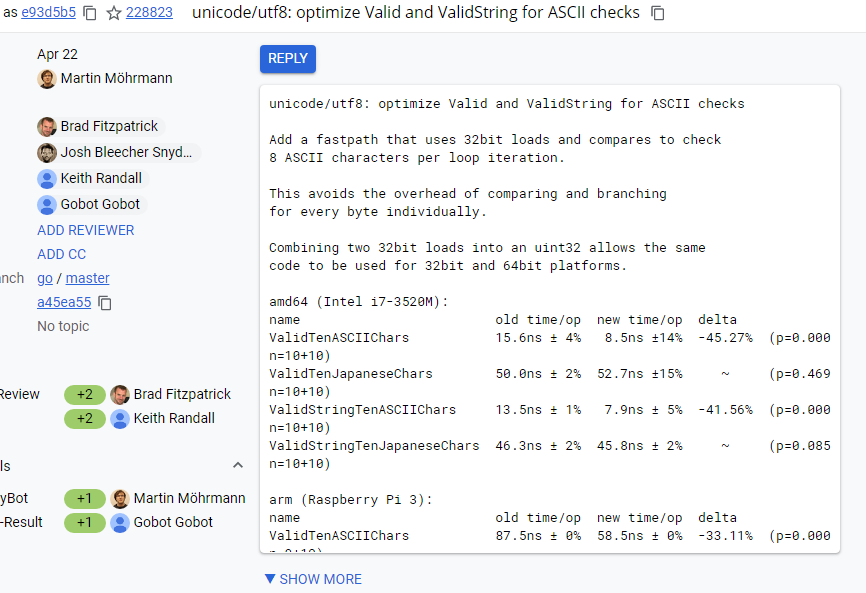

## 算法优化案例
### 1. 归并排序算法优化
### 1.1	算法介绍

- 归并排序：建立在归并操作上的一种有效的排序算法,该算法是采用分治法（Divide and Conquer）的一个非常典型的应用。将已有序的子序列合并，得到完全有序的序列；即先使每个子序列有序，再使子序列段间有序。若将两个有序表合并成一个有序表，称为二路归并，归并排序是一种稳定的排序方法。
  

- 二分插入排序：简称二分排序，是在插入第i个元素时，对前面的0～i-1元素进行折半，先跟他们中间的那个元素比，如果小，则对前半再进行折半，否则对后半进行折半，直到left<right，然后再把第i个元素前1位与目标位置之间的所有元素后移，再把第i个元素放在目标位置上。  
 
### 1.2 优化归并排序  

- 优化点：  
    当数据块大小为1时，使用二分插入排序可以提高性能。归并排序的两个数据块为有序序列，当任一个数据块大小为1时，归并排序问题可以转换为数据插入有序序列问题，故可使用二分插入排序实现，插入排序可快速提升排序性能。  
    我们选用Golang官网的优化样例来介绍该优化点，CL链接为：https://go-review.googlesource.com/c/go/+/2219   打开CL界面显示，优化后的归并算法的性能提升了2.29%~6.90%。   
     
 

- 优化代码解读  
    data[a:m]和data[m:b]是两个待归并的有序切边，若 `m-a==1` ，直接将data[a] 插入有序的data[m:b]切片；如果 `b-m==1`，直接将data[b]插入有序的data[m:b]切片，并使用二分查找法找到插入位置，实现插入排序。此时，单个数据插入到有序序列，二分插入排序的时间复杂度可以达到log<sub>2</sub>N，而归并排序的时间复杂度为nlog<sub>2</sub>N，所以使用插入排序处理数据块为1的情况，排序性能得以优化。
    ```go
    func symMerge(data Interface, a, m, b int) {
    	// Avoid unnecessary recursions of symMerge
    	// by direct insertion of data[a] into data[m:b]
    	// if data[a:m] only contains one element.
    	if m-a == 1 {
    		// Use binary search to find the lowest index i
    		// such that data[i] >= data[a] for m <= i < b.
    		// Exit the search loop with i == b in case no such index exists.
    		i := m
    		j := b
    		for i < j {
    			h := int(uint(i+j) >> 1)
    			if data.Less(h, a) {
    				i = h + 1
    			} else {
    				j = h
    			}
    		}
    		// Swap values until data[a] reaches the position before i.
    		for k := a; k < i-1; k++ {
    			data.Swap(k, k+1)
    		}
    		return
    	}
    
    	// Avoid unnecessary recursions of symMerge
    	// by direct insertion of data[m] into data[a:m]
    	// if data[m:b] only contains one element.
    	if b-m == 1 {
    		// Use binary search to find the lowest index i
    		// such that data[i] > data[m] for a <= i < m.
    		// Exit the search loop with i == m in case no such index exists.
    		i := a
    		j := m
    		for i < j {
    			h := int(uint(i+j) >> 1)
    			if !data.Less(m, h) {
    				i = h + 1
    			} else {
    				j = h
    			}
    		}
    		// Swap values until data[m] reaches the position i.
    		for k := m; k > i; k-- {
    			data.Swap(k, k-1)
    		}
    		return
    	}
        ......
    }
    ```
### 1.3 性能验证
代码优化后，需要进行源码编译构建，使改进应用到go中。
```bash
$ cd {Go源码目录}/src
# 从源码编译 Go
$ bash make.bash
# 设置临时环境变量，使用新编译的 Go 执行测试用例
$ GOROOT=`pwd`/..; $GOROOT/bin/go test sort/ -v -bench=BenchmarkStable -run=none
goos: linux
goarch: arm64
pkg: sort
BenchmarkStableString1K
BenchmarkStableString1K-8           4119            288879 ns/op
BenchmarkStableInt1K
BenchmarkStableInt1K-8              8559            139911 ns/op
BenchmarkStableInt1K_Slice
BenchmarkStableInt1K_Slice-8        9463            127660 ns/op
BenchmarkStableInt64K
BenchmarkStableInt64K-8               98          12119536 ns/op
BenchmarkStable1e2
BenchmarkStable1e2-8                9544            124875 ns/op
BenchmarkStable1e4
BenchmarkStable1e4-8                  28          40183173 ns/op
BenchmarkStable1e6
BenchmarkStable1e6-8                   1        8440007994 ns/op
PASS
ok      sort    17.973s
```

对比优化之前的性能数据 

测试项|优化前性能|优化后性能|性能提升
---|---|---|---|
BenchmarkStableString1K-8 | 302278 ns/op | 288879 ns/op | 4.43%
BenchmarkStableInt1K-8 | 144207 ns/op | 139911 ns/op | 2.97%
BenchmarkStableInt1K_Slice-8 | 128033 ns/op | 127660 ns/op | 0.29%
BenchmarkStableInt64K-8 | 12291195 ns/op | 12119536 ns/op | 1.40%
BenchmarkStable1e2-8 | 135357 ns/op | 124875 ns/op | 7.74%
BenchmarkStable1e4-8 | 43507732 ns/op | 40183173 ns/op | 7.64%
BenchmarkStable1e6-8 | 9005038733 ns/op | 8440007994 ns/op | 6.27%

算法优化后，性能普遍提升，性能提升的幅度在10%以内。
	
## 2. UTF-8编码验证算法优化

### 2.1 ASCII编码和UTF-8编码

- ASCII编码：
    ASCII编码包含128个符号编码，占用一个字节，8bit位，最高位为0


- UTF-8编码：
    UTF-8 最大的一个特点，就是它是一种变长的编码方式。它可以使用1~4个字节表示一个符号，根据不同的符号而变化字节长度。
    UTF8编码有以下规则：  
    1）对于单字节的符号，字节的第一位设为0，后面7位为这个符号的 Unicode 码。因此对于英语字母，UTF-8 编码和 ASCII 码是相同的。

    2）对于n字节的符号（n > 1），第一个字节的前n位都设为1，第n + 1位设为0，后面字节的前两位一律设为10。剩下的没有提及的二进制位，全部为这个符号的 Unicode 码。

    下表总结了UTF-8编码规则，字母x表示可用编码的位
    ```    
    0XXXXXXX  
    110XXXXX 10XXXXXX  
    1110XXXX 10XXXXXX 10XXXXXX  
    1111XXXX 10XXXXXX 10XXXXXX 10XXXXXX  
    ```
    如果一个字节的第一位是0，则这个字节单独就是一个字节；如果第一位是1，则连续有多少个1，就表示当前字符占用多少个字节。
    
    2003年11月UTF-8被RFC 3629重新规范，以下值无法出现在UTF-8序列中：
    0xF5,0xF6,0xF7,0xC0,0xC1

### 2.2 优化[]byte和字符串的UTF-8验证算法

- UTF-8验证原理：
    每次取一个字节，先判断字节是否为ASCII，如果不是，根据字节的前4个bit位，判断字符的字节长度。然后验证字符是否在UTF-8编码规定的范围内，如果在范围内，则属于UTF-8字符，通过验证，循环判断后续字符，如果不属于UTF-8字符，验证失败，返回false。

- 优化方法：
    对于ASCII编码，先进行ASCII验证，避开直接做复杂的UTF-8验证。在进行UTF-8验证前，取4个字节（UTF8字符最多占用4个字节），先判断4个字节的字符是否属于ASCII编码（ASCII的验证是简单的，只要字节的首位非1，则可以认为是ASCII)。如果属于，继续循环判断。如果不属于，跳转到UTF-8验证。
   
   我们选用golang社区的UTF-8编码验证算法优化案例来进行分析，CL链接为：https://go-review.googlesource.com/c/go/+/228823 打开CL界面显示，优化后的验证算法的性能最高提升了45%。  
      

   优化代码解读：
    字符的ASCII验证，一个字符占用1~4个字节，取byte数组的4个字节，组成32位。再跟byte数组的后4个字节做或操作(或操作会保留1), 操作结果再跟`0x80808080`做与操作。若4个字节中有字节最高位为1的情况，则与操作结果非0，表示字符非ASCII字符，则进入后面的UTF-8判断。如果连续4个字节中都没有字节最高位为1的情况，则与操作为0，表示字符为ASCII字符，也就符合UTF-8编码，无需再做UTF-8验证。代码实现如下。

    ```go
    func Valid(p []byte) bool {
    	// Fast path. Check for and skip 8 bytes of ASCII characters per iteration.
    	for len(p) >= 8 {
    		// Combining two 32 bit loads allows the same code to be used
    		// for 32 and 64 bit platforms.
    		// The compiler can generate a 32bit load for first32 and second32
    		// on many platforms. See test/codegen/memcombine.go.
    		first32 := uint32(p[0]) | uint32(p[1])<<8 | uint32(p[2])<<16 | uint32(p[3])<<24
    		second32 := uint32(p[4]) | uint32(p[5])<<8 | uint32(p[6])<<16 | uint32(p[7])<<24
    		if (first32|second32)&0x80808080 != 0 {
    			// Found a non ASCII byte (>= RuneSelf).
    			break
    		}
    		p = p[8:]
    	}
    	......
    }
    func ValidString(s string) bool {
    	// Fast path. Check for and skip 8 bytes of ASCII characters per iteration.
    	for len(s) >= 8 {
    		// Combining two 32 bit loads allows the same code to be used
    		// for 32 and 64 bit platforms.
    		// The compiler can generate a 32bit load for first32 and second32
    		// on many platforms. See test/codegen/memcombine.go.
    		first32 := uint32(s[0]) | uint32(s[1])<<8 | uint32(s[2])<<16 | uint32(s[3])<<24
    		second32 := uint32(s[4]) | uint32(s[5])<<8 | uint32(s[6])<<16 | uint32(s[7])<<24
    		if (first32|second32)&0x80808080 != 0 {
    			// Found a non ASCII byte (>= RuneSelf).
    			break
    		}
    		s = s[8:]
    	}
    	......
    }
    ```
### 2.3 性能验证
代码优化后，需要进行源码编译构建，使改进应用到go中
```bash
$ cd {Go源码目录}/src
# 从源码编译 Go
$ bash make.bash
# 设置临时环境变量，使用新编译的 Go 执行测试用例
$ GOROOT=`pwd`/..; $GOROOT/bin/go test unicode/utf8/ -v -bench=BenchmarkValid. -run=none
goos: linux
goarch: arm64
pkg: unicode/utf8
BenchmarkValidTenASCIIChars
BenchmarkValidTenASCIIChars-8                   150031760                8.00 ns/op
BenchmarkValidTenJapaneseChars
BenchmarkValidTenJapaneseChars-8                21561394                55.2 ns/op
BenchmarkValidStringTenASCIIChars
BenchmarkValidStringTenASCIIChars-8             148894896                8.04 ns/op
BenchmarkValidStringTenJapaneseChars
BenchmarkValidStringTenJapaneseChars-8          21957844                54.2 ns/op
PASS
ok      unicode/utf8    6.737s
```
对比优化之前的性能数据  
测试项|优化前性能|优化后性能|性能提升
---|---|---|---
BenchmarkValidTenASCIIChars-8 | 15.8 ns/op | 8.00 ns/op | 49.37%
BenchmarkValidTenJapaneseChars-8 | 53.6 ns/op | 55.2 ns/op | 0 
BenchmarkValidStringTenASCIIChars-8 | 12.8 ns/op | 8.04 ns/op | 37.19%
BenchmarkValidStringTenJapaneseChars-8 | 54.7 ns/op | 54.2 ns/op | 0

上表中可以清晰的看到优化后，ASCII编码的用例性能提升明显，最高可达49%。