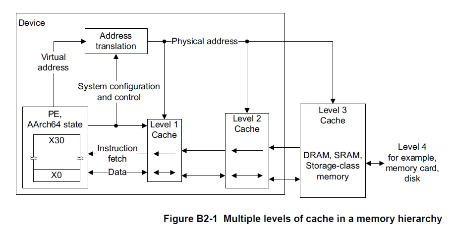

# Go-On-ARM Cache优化入门案例

### 1. 什么是Cache
本文所指的Cache是指在CPU和内存之间使用的，用于缓解CPU和内存之间速度差距的一种小而高速的缓存器。包含L1、L2、L3，通常L1和L2是每个Core独有的，L3由多Core‘共享，速度上L1>L2>L3，但在存储空间上L1<L2<L3，L1包含指令缓存和数据缓存，分别用于缓存指令和数据
#### 1.1 ARM64的Cache
  
这是在笔者机器上通过命令lscpu展示的CPU相关信息，可以看到
L1指令和数据缓存大小分别为64KB，L2缓存为512KB，L3缓存为32768KB
- 下图是ARM处理器的Cache层次体系

  
可以看到CPU是直接从L1获取数据和指令的，如果发生Cache Miss则会去下一级的L2继续找寻数据，直到内存
#### 1.2 Cache Line 
在Cache和内存间数据传输并不是每次只读取一个字节，而是以Cache line为单位，笔者机器的Cache line大小为64B，在我们优化时，要结合Cache line考虑内存对齐问题，尽量将运算所需的数据集中在少量Cache line范围内，减少加载次数
#### 1.3 Cache 的替换和写操作策略
如上所述，与CPU直接交互的L1大小64KB，这个是很容易占满的，当空间占满时会进行替换，常用的替换算法包括先进先出FIFO，最不经常使用LFU，最近最久未使用LRU，随机替换等。实际处理器设计中的替换策略会更复杂。
Cache的写策略是指发生对Cache的更改时如何和内存中的数据保持一致，包含写回法，写直达法和写一次法等
### 2. Cache优化案例
#### 2.1 Dgemm矩阵乘法
我们用一个双精度通用矩阵乘法(Dgemm)的优化来展示如何合理使用Cache提升性能，如下是一个矩阵乘法 matrix_c = matrix_a * matrix_b + matrix_c，参数是一维矩阵的形式，a矩阵中i行
j列的元素值为a[i+j*n]，n表示矩阵的维数。
```go
func Dgemm(a []float64, b []float64, c []float64, n int) {
	for i := 0; i < n; i++ {
		for j := 0; j < n; j++ {
			cij := c[i+j*n]
			for k := 0; k < n; k++ {
				cij += a[i+k*n] * b[k+j*n]
			}
			c[i+j*n] = cij
		}
	}
}
```
矩阵运算如图所示：
  
函数Dgemm中包含三个矩阵，a，b，c，我们按行列都为512计算，每个元素都是float64=8B，估算出三个矩阵所需内存大小为 
```bash
3 * (512 * 512) * 8B = 6144kb = 6MB
```
使用benchmark在我们机器上执行大概需要0.998 s
#### 2.2 分块优化示例
注意到，我们的机器上L1 Cache的容量为64KB，6MB是远大于64KB的，因此在L1 Cache无法保存全部矩阵元素的情况下，L1中会出现大量的替换操作，即部分数据被加载进L1参与运算后，按照替换算法被换出，但在后续执行中再次被换入L1参与运算的情况，为减少这种情况，我们通过矩阵分块的思路进行优化
- 代码如下：
```go
const blockSize int = 32

func opBlock(n, si, sj, sk int, a, b, c []float64) {
	for i := si; i < si + blockSize; i++ {
		for j := sj; j < sj + blockSize; j++ {
			cij := c[i+j*n]
			for k := sk; k < sk + blockSize; k++ {
				cij += a[i+k*n] * b[k+j*n]
			}
			c[i+j*n] = cij
		}
	}
}

func DgemmWithCache(a []float64, b []float64, c []float64, n int) {
	for i := 0; i < n; i+= blockSize {
		for j := 0; j < n; j+= blockSize {
			for k := 0; k < n; k+= blockSize {
				opBlock(n, i, j, k, a, b, c)
			}
		}
	}
}
```
blockSize 表示分块的大小，这里为32，即我们将矩阵拆分32 * 32的子矩阵，opBlock函数用于子矩阵运算，具体运算过程如下图，其中大写的A、B、C表示32 * 32 的子矩阵：
  
我们可以计算opBlock函数中三个矩阵参数所需内存大小为：
```bash
3 * (32 * 32) * 8B = 24kb
```
注意到这个值小于L1 Cache的64KB大小，按照上文所述不会占满L1，也就是说执行opBlock函数时被操作数可以常驻L1，不存在L1中数据被替换后再加载回L1使用的情况。跑benchmark发现总用时为0.336 s，性能提升了三倍。虽然这样的拆分会增加函数调用的开销，但是显然Cache优化带来了更高的性能提升
#### 2.3 性能对比图
- matrix-512*512 耗时对比图
 
- matrix1024*1024 耗时对比图
 
 在上图中可以看到，当矩阵分块小于64 * 64时，性能提升最大，且差别不明显，当>= 64 * 64后性能逐渐下降，不分块时性能是最差的。这个结论跟我们在上述矩阵占用空间计算结果是一致的，我们得出结论：需要合理使用L1 Cache(64KB)，尽量让参与计算的数据保持在在L1空间范围内，减少数据替换后再加载回来的情况。