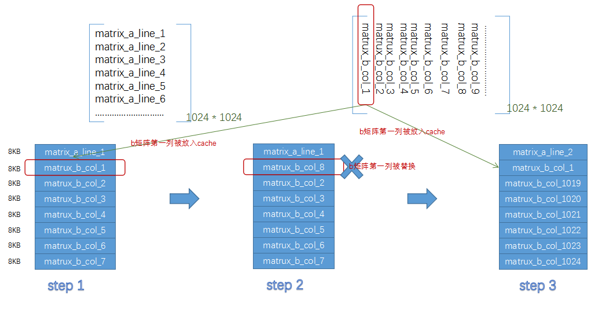
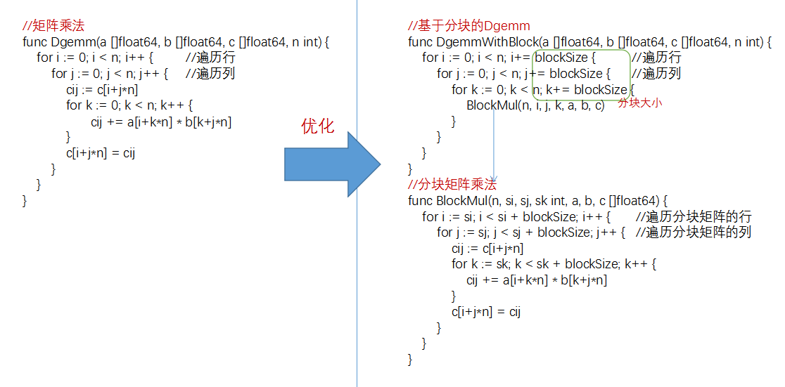
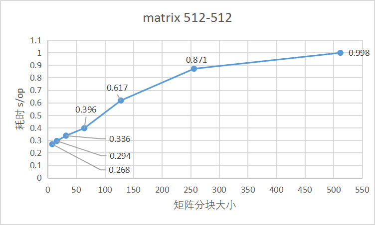
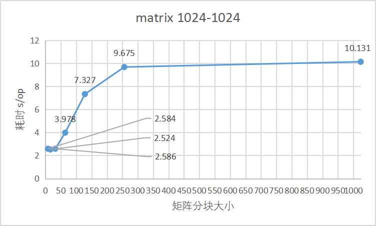

# 基于CPU Cache优化双精度通用矩阵乘法
### 安装包和硬件配置
- [Golang发行版安装 >= 1.12](https://golang.org/dl/)
- 硬件配置：鲲鹏(ARM64)服务器
### 1. Dgemm矩阵乘法性能问题
深度学习的卷积神经网络本质就是矩阵的运算，因此矩阵运算的性能直接影响深度学习的应用场景，如下是一个双精度通用[矩阵乘法(Dgemm)](https://zh.wikipedia.org/wiki/%E7%9F%A9%E9%99%A3%E4%B9%98%E6%B3%95)函数的Golang实现:
```go
func Dgemm(a []float64, b []float64, c []float64, n int) {
    for i := 0; i < n; i++ {
        for j := 0; j < n; j++ {
            cij := c[i+j*n]
            for k := 0; k < n; k++ {
            	cij += a[i+k*n] * b[k+j*n]
            }
            c[i+j*n] = cij
        }
    }
}
```
上述代码基于数学公式matrix_c = matrix_a * matrix_b + matrix_c，输入参数包含3个n*n的矩阵(a b c)，n表示矩阵维度，矩阵采用一维数组的形式，比如矩阵a中i行j列的元素值为a[i+j*n]。运算结果存储在矩阵c中，下图是矩阵运算的原理图：
  
通过[benchmark工具](https://golang.org/pkg/testing/)获得的性能数据，发现随着矩阵维度增长，性能下降非常大，当维度达到1024时，需要10s：
```bash
goos: linux
goarch: arm64
pkg: test_obj/testdgemm
BenchmarkDgemm-32*32                       100               0.056 ms/op
BenchmarkDgemm-64*64                       100               0.502 ms/op
BenchmarkDgemm-128*128                     100               4.667 ms/op
BenchmarkDgemm-256*256                     100              69.864 ms/op
BenchmarkDgemm-512*512                     100                0.998 s/op
BenchmarkDgemm-1024*1024                   100               10.131 s/op
```
### 2. 基于CPU Cache解决矩阵乘法性能问题
#### 2.1 问题分析
从算法的空间复杂度进行评估，每次运算包含3个矩阵，矩阵的维度是n，每个元素大小为float64=8B，按如下公式粗略计算参数占用的空间：
```bash
spaces = 3 * (n * n) * 8B
```
得出矩阵维度和占用空间的关系：
```bash
矩阵维数n         矩阵占用的空间      
32                   24KB
64                   96KB
128                 384KB
256                 1.5MB
512                   6MB
1024                 24MB
```
CPU在执行运算时直接操作[CPU Cache](https://zh.wikipedia.org/wiki/CPU%E7%BC%93%E5%AD%98)中的数据，因此在矩阵乘法运算时CPU需要将矩阵数据加载进CPU的Cache中，当空间不足时，Cache会基于替换算法(如LRU)替换Cache缓存的数据，如下表格是通过命令lscpu获得的本文所用鲲鹏服务器的三级CPU Cache信息：
```bash
Cache名称               空间
L1d Cache(数据)         64KB
L1i Cache(指令)         64KB
L2  Cache              512KB
L3  Cache              32768KB
```
- 关于CPU Cache的进一步理解可以参考[linux系统之arm架构的CPU与Cache](https://blog.csdn.net/eleven_xiy/article/details/70344594)

本文鲲鹏服务器上L1 Cache的容量为64KB，因此当矩阵参数占用空间超过64KB时，L1将无法保存全部矩阵元素，存在Cache缓存替换的情况，矩阵乘法运算是由行列相乘组成的，比如矩阵b的某一列数据matrix_b_col_n被加载进L1参与运算后，在运算的某个阶段，由于L1空间占满，按照替换算法被换出，但在后续运算中由于再次用到，matrix_b_col_n被重新加载进L1，本质上是由于CPU Cache空间不足导致的Cache Miss，Cache Miss的开销比通常的数学运算更高。如下示例图：

#### 2.2 分块矩阵乘法优化方案
根据上述分析，可以基于矩阵分块乘法的方案提高性能，使子矩阵乘法的大小不超过L1 Cache，提高CPU Cache的命中率，减少运算中Cache缓存数据的换入换出，使用[分块矩阵乘法](https://zh.wikipedia.org/wiki/%E5%88%86%E5%A1%8A%E7%9F%A9%E9%99%A3)重构上述代码：

如图所示优化后的方案在处理循环时，以块为基本单位，通过blockSize控制分块矩阵大小，使BlockMul函数占用空间小于L1 Cache，减少了Cache Miss。根据上节矩阵参数占用空间的分析，选择矩阵维度值<=32时，所需缓存空间24KB，当大于等于64时，优化效果减弱。用benchmark工具测试两个维度为512的矩阵乘法，按维度32分块，得出用时0.336 s，相比不分块性能提升了三倍。虽然重构增加了函数调用的开销，但是Cache优化带来了更高的性能提升
#### 2.3 优化后代码详解
```go
const blockSize int = 32
//分块矩阵乘法
func BlockMul(n, si, sj, sk int, a, b, c []float64) {
    for i := si; i < si + blockSize; i++ {       //遍历分块矩阵的行
        for j := sj; j < sj + blockSize; j++ {   //遍历分块矩阵的列
            cij := c[i+j*n]
            for k := sk; k < sk + blockSize; k++ {
                cij += a[i+k*n] * b[k+j*n]
            }
            c[i+j*n] = cij
        }
    }
}
//基于分块的Dgemm
func DgemmWithBlock(a []float64, b []float64, c []float64, n int) {
    for i := 0; i < n; i+= blockSize {          //遍历行
        for j := 0; j < n; j+= blockSize {      //遍历列
            for k := 0; k < n; k+= blockSize {  //分块大小
                BlockMul(n, i, j, k, a, b, c)   
            }
        }
    }
}
```
blockSize 表示分块的大小，这里为32，即将矩阵拆分32 * 32的子矩阵，BlockMul函数用于子矩阵运算，具体运算过程如下图，其中大写的A、B、C表示32 * 32 的子矩阵：

  

### 3. 结果验证
本文分别验证了维度为512和1024的矩阵：
- matrix-512*512 耗时对比图

 
- matrix1024*1024 耗时对比图

 
 
 在上图中可以看到，当矩阵分块维度< 64时，性能提升最大，且差别不明显，当分块维度>= 64后性能逐渐下降，不分块时性能是最差的。这个实验结果跟上述分析是一致的，因此得出结论：需要合理使用L1 Cache(64KB)，尽量让参与计算的数据保持在L1空间范围内，提升CPU Cache的命中率。