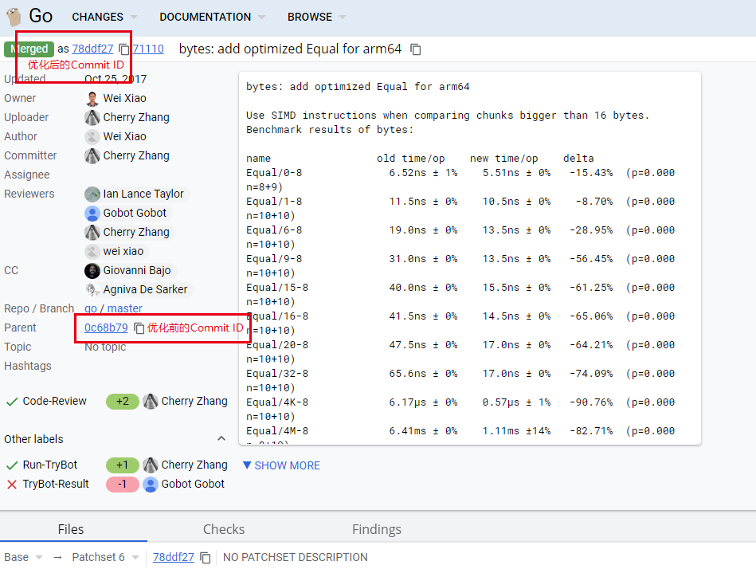
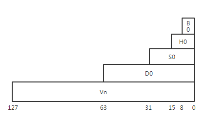

# Go-On-ARM SIMD优化入门案例
### 1. 什么是SIMD
SIMD技术全称Single Instruction Multiple Data，即单指令多数据流，通过单条指令并行操作一组数据替换原来的多条指令或循环操作，实现性能提升。ARM64支持的SIMD指令数约400个左右，包含数据加载和存储、数据处理、压缩、加解密等。ARM64包含32个SIMD向量寄存器用于SIMD操作，可以批量加载一组数据到向量寄存器中，使用SIMD指令对向量寄存器中的数据运算后，批量存到内存。SIMD技术常用于多媒体、数学库、加解密算法库等包含循环处理数组元素的场景，通过SIMD指令和向量寄存器的帮助减少其中数据加载和存储、数学运算、逻辑运算、移位等常用操作所需的指令条数。那什么时候可以使用SIMD进行优化呢？
### 2. 使用SIMD优化byte切片的equal操作
从SIMD的介绍可以看出，SIMD适用于大量重复、简单的运算。在这里我们选取Golang官方的一个SIMD优化案例来进行介绍，该CL地址为：
https://go-review.googlesource.com/c/go/+/71110
#### 2.1 代码获取
我们打开CL页面找到优化前后的Commit ID，如图  
  
优化前的Commit ID：0c68b79  
优化后的Commit ID：78ddf27  
```bash
$ git clone https://go.googlesource.com/go
$ cd go/src

# 根据优化前的Commit ID创建before-simd分支
$ git checkout -b before-simd 0c68b79

# 根据优化后的Commit ID创建after-simd分支
$ git checkout -b after-simd 78ddf27
```
#### 2.2 优化前的性能问题溯源
为了以后更好的发现和分析性能问题，我们在这里对优化前的代码进行一下性能问题溯源。
##### 2.2.1 编译并运行测试用例
```bash
# 切换到优化前的分支
$ git checkout before-simd

# 从源码编译 Go
$ bash make.bash 
   
# 设置临时环境变量（仅在本条命令中有效），并使用新编译的 Go 执行测试用例
$ GOROOT=`pwd`/..; $GOROOT/bin/go test bytes -v -bench ^BenchmarkEqual$ -run ^$ -cpuprofile=cpu.out
goos: linux
goarch: arm64
pkg: bytes
BenchmarkEqual/0-8      		500000000               3.84 ns/op
BenchmarkEqual/1-8      		300000000               5.44 ns/op       183.74 MB/s
BenchmarkEqual/6-8      		100000000               10.0 ns/op       598.26 MB/s
BenchmarkEqual/9-8      		100000000               12.4 ns/op       728.51 MB/s
BenchmarkEqual/15-8             100000000               17.0 ns/op       880.77 MB/s
BenchmarkEqual/16-8             100000000               17.8 ns/op       901.06 MB/s
BenchmarkEqual/20-8             100000000               20.9 ns/op       956.05 MB/s
BenchmarkEqual/32-8              50000000               30.5 ns/op      1050.11 MB/s
BenchmarkEqual/4K-8                500000               3176 ns/op      1289.51 MB/s
BenchmarkEqual/4M-8                   500            3468668 ns/op      1209.20 MB/s
BenchmarkEqual/64M-8                   20           53439570 ns/op      1255.79 MB/s
PASS
ok      bytes   18.907s
```
##### 2.2.2 分析
优化前的代码使用Golang汇编编写，实现在src/runtime/asm_arm64.s中，如下所示：
```go
//func Equal(a, b []byte) bool
TEXT bytes·Equal(SB),NOSPLIT,$0-49
	MOVD	a_len+8(FP), R1
	MOVD	b_len+32(FP), R3
	CMP	R1, R3		// unequal lengths are not equal
	BNE	notequal
	MOVD	a+0(FP), R0
	MOVD	b+24(FP), R2
	ADD	R0, R1		// end
loop:
	CMP	R0, R1
	BEQ	equal		// reaches the end
	MOVBU.P	1(R0), R4
	MOVBU.P	1(R2), R5
	CMP	R4, R5
	BEQ	loop
notequal:
	MOVB	ZR, ret+48(FP)
	RET
equal:
	MOVD	$1, R0
	MOVB	R0, ret+48(FP)
	RET
```
该函数的定义在文件src/bytes/bytes_decl.go中，定义如下所示
```go
func Equal(a, b []byte) bool
```
参数a, b是两个切片数组，该函数按顺序挨个比较两个数组中的元素是否相等，相等返回true. 
优化前代码逻辑简析见下图：


### 3. 字节块比较函数的SIMD优化

#### 3.1 SIMD优化原理图  
  
    
#### 3.2 字节块比较函数的SIMD指令优化详解
优化后的代码使用Golang汇编编写，实现在src/runtime/asm_arm64.s中。SIMD优化涉及的SIMD指令、SIMD寄存器，以及汇编代码解读如下：(代码中添加了关键指令注释）  

##### 3.2.1 SIMD寄存器
ARM64 SIMD 寄存器用Vn表示，其中n取值范围[0,31]，SIMD寄存器有128位。  
SIMD寄存器支持字节B、半字H、字S、双字D四种数据格式用于数据加载存储等处理，下图表示了Vn寄存器上D,S,H,B的所占的位关系。ARM64中SIMD寄存器的一般表示为Vn{.2D,.4S,.8H,.16B}。  
  

##### 3.2.2 SIMD指令

SIMD指令| 用法 | 含义
---|---|---
VLD1 | VLD1 { <Vt>.<T>..<Vt4>.<T> }, [<Rn>]  |  SIMD加载指令，加载内存数据到寄存器，支持加载到1~4个SIMD寄存器
VCMEQ | VCMEQ <Vd>.<T>, <Vn>.<T>, <Vm>.<T> |  SIMD比较指令，比较寄存器Vd和Vn的每个bit位，并保存结果寄存器Vm，若相等保存1，否则保存0
VADD | VADD <Vd>.<T>, <Vn>.<T>, <Vm>.<T> | SIMD与运算指令，Vd和Vn寄存器的bit位做与运算，并保存结果到寄存器Vm
VMOV | VMOV <Vd>.<T>, <Vn>.<T> | SIM转移指令，将源SIMD寄存器中的向量复制到目标SIMD寄存器中

##### 3.2.3 优化后的汇编代码详解
    
```go
// input:
// R0: pointer a
// R1: data len
// R2: pointer b
// R8: address to put result
TEXT runtime·memeqbody<>(SB),NOSPLIT,$0
   CMP    $1, R1
   // handle 1-byte special case for better performance
   BEQ    one
   CMP    $16, R1
   // handle specially if length < 16
   BLO    tail
   BIC    $0x3f, R1, R3  //位清除指令，清除R1的后6位存放到R3
   CBZ    R3, chunk16   //跳转指令，R3为0，跳转到chunk16
   // work with 64-byte chunks  R6为64byte块尾部指针
   ADD    R3, R0, R6 // end of chunks 
chunk64_loop: //循环处理64的byte块
   VLD1.P (R0), [V0.D2, V1.D2, V2.D2, V3.D2]
   VLD1.P (R2), [V4.D2, V5.D2, V6.D2, V7.D2]
	//先加载RO,R2指向的数据块到V0-V7寄存器,再将RO,R2指针偏移64
   VCMEQ  V0.D2, V4.D2, V8.D2
   VCMEQ  V1.D2, V5.D2, V9.D2
   VCMEQ  V2.D2, V6.D2, V10.D2
   VCMEQ  V3.D2, V7.D2, V11.D2
	//比较V0-V7SIMD寄存器中的数据，数据结果到V8-v11寄存器
   VAND   V8.B16, V9.B16, V8.B16
   VAND   V8.B16, V10.B16, V8.B16
   VAND   V8.B16, V11.B16, V8.B16  //数据比较的结果执行与操作，保存总比较结果在V8寄存器
   CMP    R0, R6  //比较指令，比较RO和R6的值，修改寄存器标志位，对应下面的BNE指令
   VMOV   V8.D[0], R4 
   VMOV   V8.D[1], R5  //转移V8寄存器保存的结果数据到R4,R5寄存器
   CBZ    R4, not_equal 
   CBZ    R5, not_equal  // 跳转指令，若R4,R5寄存器的bit位出现0，表示不相等，跳转not_equal
   BNE    chunk64_loop  //标志位不等于0，对应上面RO!=R6则跳转chunk64_loop
   AND    $0x3f, R1, R1  //仅保存R1的后6位
   CBZ    R1, equal  //R1为0,跳转equal，否则向下顺序执行
chunk16:
   // work with 16-byte chunks
   BIC    $0xf, R1, R3 //位清除指令，清除R1的后4位存到R3
   CBZ    R3, tail   //R3为0，表示R1块小于16byte，跳转到tail块
   ADD    R3, R0, R6 // end of chunks R6为16byte块尾部指针
chunk16_loop:  //循环处理16byte，处理过程类似chunk64_loop
	VLD1.P	(R0), [V0.D2] 
	VLD1.P	(R2), [V1.D2]
	VCMEQ	V0.D2, V1.D2, V2.D2
	CMP	R0, R6
	VMOV	V2.D[0], R4
	VMOV	V2.D[1], R5
	CBZ	R4, not_equal //判断是否有不等，如有0位，跳not-equal
	CBZ	R5, not_equal
	BNE	chunk16_loop //循环继续
	AND	$0xf, R1, R1
	CBZ	R1, equal //若无剩余块（小于16byte），则跳转equal，否则向下顺序执行
tail: //处理小于16byte块的尾部
	// special compare of tail with length < 16
	TBZ	$3, R1, lt_8  //跳转指令，若R1[3]==0,也就是R1小于8,跳转到lt_8
	MOVD.P	8(R0), R4
	MOVD.P	8(R2), R5
	CMP	R4, R5	
	BNE	not_equal 
lt_8://处理小于8的byte块
	TBZ	$2, R1, lt_4
	MOVWU.P	4(R0), R4
	MOVWU.P	4(R2), R5
	CMP	R4, R5
	BNE	not_equal
lt_4://处理小于4的byte块
	TBZ	$1, R1, lt_2
	MOVHU.P	2(R0), R4
	MOVHU.P	2(R2), R5
	CMP	R4, R5
	BNE	not_equal
lt_2://处理小于2的byte块
	TBZ     $0, R1, equal
one://处理一个byte的块
	MOVBU	(R0), R4
	MOVBU	(R2), R5
	CMP	R4, R5
	BNE	not_equal
equal:
	MOVD	$1, R0
	MOVB	R0, (R8)
	RET
not_equal:
	MOVB	ZR, (R8)
	RET
```
上述优化代码中，使用VLD1数据加载指令一次加载64byte数据到SIMD寄存器，再使用VCMEQ指令比较SIMD寄存器保存的数据内容得到结果，相比传统用的单字节比较方式，大大提高了大于64byte数据块的比较性能。大于16byte小于64byte块数据，使用一个SIMD寄存器一次处理16byte块的数据，小于16byte数据块使用普通寄存器保存数据，一次比较8\4\2\1byte的数据块。
 
### 4. 结果验证
#### 4.1 编译并执行性能测试用例
在进行了上面的汇编代码优化后，我们需要进行源码编译，使改进应用到go中。
```bash
$ cd {你的Go源码目录}/src
# 从源码编译 Go
$ bash make.bash 
   
# 设置临时环境变量（仅在本条命令中有效），并使用新编译的 Go 执行测试用例
$ GOROOT=`pwd`/..; $GOROOT/bin/go test bytes -v -bench ^BenchmarkEqual$ -run ^$ 
goos: linux
goarch: arm64
pkg: bytes
BenchmarkEqual/0-8      		500000000                3.63 ns/op
BenchmarkEqual/1-8      		300000000                5.41 ns/op      184.67 MB/s
BenchmarkEqual/6-8      		200000000                6.17 ns/op      972.19 MB/s
BenchmarkEqual/9-8      		200000000                6.56 ns/op     1372.18 MB/s
BenchmarkEqual/15-8             200000000                7.39 ns/op     2029.41 MB/s
BenchmarkEqual/16-8             300000000                5.86 ns/op     2730.86 MB/s
BenchmarkEqual/20-8             200000000                7.53 ns/op     2655.50 MB/s
BenchmarkEqual/32-8             200000000                7.67 ns/op     4170.73 MB/s
BenchmarkEqual/4K-8              10000000             	  207 ns/op    19719.21 MB/s
BenchmarkEqual/4M-8                  3000              417753 ns/op    10040.15 MB/s
BenchmarkEqual/64M-8                  200             6693341 ns/op    10026.21 MB/s
PASS
ok      bytes   22.805s
```
#### 4.2 对比运行结果
我们综合一下优化之前的数据，将结果统计到下表中，已便于我们查看  
  
上表中可以清晰的看到使用SIMD优化后，所有的用例都有所提升，其中处理4K的数据比较的提升率最高，耗时减少了93.48%；每秒数据处理量提升14.29倍
