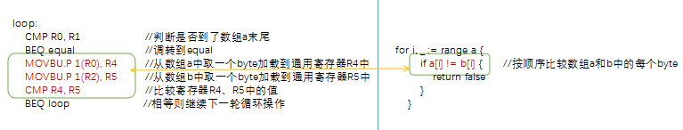

# 使用SIMD优化Golang汇编代码
### 1. byte数组比较的性能问题
在我们的项目管理系统中会存储文件中的一些信息，有时我们需要将这些信息以[]byte数组的形式进行比较，判断是否相等，我们实现了如下的算法:
```go
func EqualByteArrAB(a, b []byte) bool {
    if len(a) != len(b) {       //长度不等则返回false
        return false
    }
    for i, _ := range a {
        if a[i] != b[i] {       //按顺序比较数组a和数组b中的每个byte
            return false
        }
    }
    return true
}
```
在实际使用中我们发现随着数据增长，算法的性能变得非常差，影响了我们的正常使用，如下benchmark结果所示：
```bash
goos: linux
goarch: arm64
pkg: test_obj/testbyteequal
BenchmarkEqual/0-8             330669548                3.64 ns/op
BenchmarkEqual/1-8             227632882                5.27 ns/op           189.74 MB/s
BenchmarkEqual/6-8             132229749                9.09 ns/op           660.35 MB/s
BenchmarkEqual/9-8             100000000                10.1 ns/op           893.80 MB/s
BenchmarkEqual/15-8             83173801                14.4 ns/op          1041.32 MB/s
BenchmarkEqual/16-8             79955283                15.0 ns/op          1069.79 MB/s
BenchmarkEqual/20-8             67353938                17.8 ns/op          1124.26 MB/s
BenchmarkEqual/32-8             45706566                26.2 ns/op          1219.49 MB/s
BenchmarkEqual/4K-8               421956                2844 ns/op          1440.18 MB/s
BenchmarkEqual/4M-8                  334             3496666 ns/op          1199.52 MB/s
BenchmarkEqual/64M-8                  18            66481026 ns/op          1009.44 MB/s
```
正当我们束手无策的时候，我们发现在Golang官方源码中有一个EqualBytes函数优化案例，很好的解决了我们的性能问题，优化前的Equal函数跟我们的实现逻辑完全一致，唯一的区别是在实现层面，我们使用Golang语言，而优化方案是使用[Golang汇编](https://golang.org/doc/asm)，优化前的汇编函数和我们的代码对比如下，可以理解为是对等的：


### 2. 使用SIMD技术优化byte数组比较的性能问题
该优化由开源贡献者提供，是Golang官网上的优化CL：[bytes: add optimized Equal for arm64](https://go-review.googlesource.com/c/go/+/71110)
- 该优化使用了[SIMD技术](https://en.wikipedia.org/wiki/SIMD)
- 环境配置请参考案例[Golang在ARM64开发环境配置](../del-env-pre/del-env-pre.md)  

#### 2.1 SIMD优化前后对比  
如下是使用SIMD技术优化前后的对比图，优化前后的代码都是使用Golang汇编编写，从图中可以看到优化前代码非常简单，循环取1byte进行比较，使用SIMD指令优化后，代码变得非常复杂，这里可以先避免陷入细节，分块理解代码，变复杂的主要原因是对代码进行了分情况的分块处理，首先循环处理64byte大小的分块，当数组末尾不足64byte时，再将余下的按16byte分块处理，直到余下长度为1时的情况，详情请看下节源码和注释。
  
    
#### 2.2 优化前代码详解
优化前的代码使用Golang汇编编写，实现在src/runtime/asm_arm64.s中，该函数是循环从两个数组中取1 byte进行比较，每byte数据要耗费两个加载操作、1个byte比较操作、1个数组末尾判断操作，如下所示：
```assembly
//func Equal(a, b []byte) bool
TEXT bytes·Equal(SB),NOSPLIT,$0-49
    MOVD a_len+8(FP), R1      //取数组a的长度
    MOVD b_len+32(FP), R3     //取数组b的长度
    CMP R1, R3                //数组长度比较
    BNE notequal              //数组长度不同，跳到notequal
    MOVD a+0(FP), R0          //将数组a的地址加载到通用寄存器R0中
    MOVD b+24(FP), R2         //将数组b的地址加载到通用寄存器R2中
    ADD R0, R1                
loop:
    CMP R0, R1                //判断是否到了数组a末尾
    BEQ equal                 //调转到equal
    MOVBU.P 1(R0), R4         //从数组a中取一个byte加载到通用寄存器R4中
    MOVBU.P 1(R2), R5         //从数组b中取一个byte加载到通用寄存器R5中
    CMP R4, R5                //比较寄存器R4、R5中的值
    BEQ loop                  //相等则继续下一轮循环操作
notequal:
    MOVB ZR, ret+48(FP)       //数组不相等，返回0
    RET
equal:
    MOVD $1, R0               //数组相等，返回1
    MOVB R0, ret+48(FP)
    RET
```

#### 2.3 优化后代码详解
优化后的代码实现在src/runtime/asm_arm64.s中。SIMD优化涉及的SIMD指令、SIMD寄存器，以及汇编代码解读如下(代码中添加了关键指令注释）：
```assembly
// input:
// R0: pointer a
// R1: data len
// R2: pointer b
// R8: address to put result
TEXT runtime·memeqbody<>(SB),NOSPLIT,$0
    CMP    $1, R1
    BEQ    one
    CMP    $16, R1                       // 处理长度小于16的情况
    BLO    tail
    BIC    $0x3f, R1, R3                 //位清除指令，清除R1的后6位存放到R3
    CBZ    R3, chunk16                   //跳转指令，R3为0，跳转到chunk16
    ADD    R3, R0, R6                    //R6为64byte块尾部指针
chunk64_loop:                           //循环处理64的byte块
    VLD1.P (R0), [V0.D2, V1.D2, V2.D2, V3.D2]
    VLD1.P (R2), [V4.D2, V5.D2, V6.D2, V7.D2]
    VCMEQ  V0.D2, V4.D2, V8.D2           //先加载RO,R2指向的数据块到V0-V7寄存器,再将RO,R2指针偏移64
    VCMEQ  V1.D2, V5.D2, V9.D2
    VCMEQ  V2.D2, V6.D2, V10.D2
    VCMEQ  V3.D2, V7.D2, V11.D2          
    VAND   V8.B16, V9.B16, V8.B16        //比较V0-V7SIMD寄存器中的数据，数据结果到V8-v11寄存器
    VAND   V8.B16, V10.B16, V8.B16
    VAND   V8.B16, V11.B16, V8.B16       //数据比较的结果执行与操作，保存总比较结果在V8寄存器
    CMP    R0, R6                        //比较指令，比较RO和R6的值，修改寄存器标志位，对应下面的BNE指令
    VMOV   V8.D[0], R4 
    VMOV   V8.D[1], R5                   //转移V8寄存器保存的结果数据到R4,R5寄存器
    CBZ    R4, not_equal 
    CBZ    R5, not_equal                 // 跳转指令，若R4,R5寄存器的bit位出现0，表示不相等，跳转not_equal
    BNE    chunk64_loop                  //标志位不等于0，对应上面RO!=R6则跳转chunk64_loop
    AND    $0x3f, R1, R1                 //仅保存R1的后6位
    CBZ    R1, equal                     //R1为0,跳转equal，否则向下顺序执行
chunk16:                                //处理长度小于16的块
    BIC    $0xf, R1, R3                  //位清除指令，清除R1的后4位存到R3
    CBZ    R3, tail                      //R3为0，表示R1块小于16byte，跳转到tail块
    ADD    R3, R0, R6                    //R6为16byte块尾部指针
chunk16_loop:                           //循环处理16byte，处理过程类似chunk64_loop
    VLD1.P (R0), [V0.D2] 
    VLD1.P (R2), [V1.D2]
    VCMEQ    V0.D2, V1.D2, V2.D2
    CMP R0, R6
    VMOV V2.D[0], R4
    VMOV V2.D[1], R5
    CBZ R4, not_equal                  //判断是否有不等，如有0位，跳not-equal
    CBZ R5, not_equal
    BNE chunk16_loop                   //循环继续
    AND $0xf, R1, R1
    CBZ R1, equal                      //若无剩余块（小于16byte），则跳转equal，否则向下顺序执行
tail:                                  //处理小于16byte块的尾部
    TBZ $3, R1, lt_8                   //跳转指令，若R1[3]==0,也就是R1小于8,跳转到lt_8
    MOVD.P 8(R0), R4
    MOVD.P 8(R2), R5
    CMP R4, R5    
    BNE not_equal 
lt_8:                                  //处理小于8的byte块
    TBZ $2, R1, lt_4
    MOVWU.P 4(R0), R4
    MOVWU.P 4(R2), R5
    CMP R4, R5
    BNE not_equal
lt_4:                                  //处理小于4的byte块
    TBZ $1, R1, lt_2
    MOVHU.P 2(R0), R4
    MOVHU.P 2(R2), R5
    CMP R4, R5
    BNE not_equal
lt_2:                                  //处理小于2的byte块
    TBZ     $0, R1, equal
one:                                   //处理一个byte的块
    MOVBU (R0), R4
    MOVBU (R2), R5
    CMP R4, R5
    BNE not_equal
equal:
    MOVD $1, R0
    MOVB R0, (R8)
    RET
not_equal:
    MOVB ZR, (R8)
    RET
```
上述优化代码中，使用VLD1(数据加载指令)一次加载64byte数据到SIMD寄存器，再使用VCMEQ指令比较SIMD寄存器保存的数据内容得到结果，相比传统用的单字节比较方式，大大提高了大于64byte数据块的比较性能。大于16byte小于64byte块数据，使用一个SIMD寄存器一次处理16byte块的数据，小于16byte数据块使用通用寄存器保存数据，一次比较8\4\2\1byte的数据块。

### 3. 结果验证
我们使用benchstat进行性能对比，整理到表格后如下所示： 
  
上表中可以清晰的看到使用SIMD优化后，所有的用例性能都有所提升，其中数据大小为4K时性能提升率最高，耗时减少了93.48%；每秒数据处理量提升14.29倍
